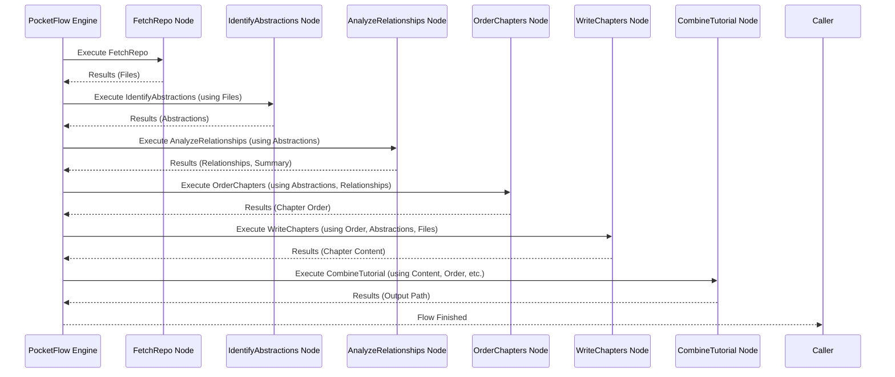

# Chapter 2: PocketFlow Workflow

Welcome back! In [Chapter 1: Code Fetching & Parsing](01_code_fetching___parsing.md), we learned how our tool gathers the raw ingredients – the source code files – needed to understand a project. We fetched them from GitHub or a local folder and filtered them to keep only the essentials.

But gathering ingredients is just the first step. Think about baking a cake. You have flour, sugar, eggs, etc. Now you need a **recipe** that tells you exactly what order to mix them in, when to preheat the oven, and how long to bake. Without a recipe, you'd just have a messy pile of ingredients!

This chapter introduces the "recipe" for our `LLM-CODEBASE-DOCUMENTOR`: the **PocketFlow Workflow**.

**Goal:** Understand how the tool organizes the different tasks (like fetching code, analyzing it, writing chapters) into a sequence, ensuring they run in the correct order and work together smoothly.

## The Problem: Too Many Steps!

Generating a helpful tutorial from code involves several distinct steps:

1.  **Get the Code:** Fetch and filter the source files (like we did in Chapter 1).
2.  **Understand the Big Picture:** Identify the main concepts or "abstractions" in the code.
3.  **See How Things Connect:** Figure out how these main concepts relate to each other.
4.  **Plan the Tutorial:** Decide the best order to explain these concepts.
5.  **Write the Chapters:** Generate the actual text for each concept.
6.  **Put it All Together:** Combine the chapters into a final, organized tutorial.

If we just wrote code for these steps randomly, how would we make sure step 2 runs *after* step 1? How would the results of step 2 be available for step 3? It would be chaos! We need a manager, an orchestrator, a recipe.

## The Solution: PocketFlow - Our Workflow Engine

This is where **PocketFlow** comes in. PocketFlow is the core engine that manages the entire tutorial generation process.

Think of it like an **assembly line** for creating documentation:

1.  **The Workflow:** This is the overall plan for the assembly line – what stations are there and in what order.
2.  **Nodes:** Each individual step (like "Fetch Code" or "Write Chapters") is a "Node". Think of these as the different stations on the assembly line. Each station performs one specific task.
3.  **Sequence:** PocketFlow defines the order in which these Nodes run. The output from one Node automatically becomes available for the next Node in the sequence. This is like the conveyor belt moving the product from one station to the next.

**Analogy:** Imagine a simple recipe:
1.  Crack eggs (Node 1)
2.  Whisk eggs (Node 2 - uses the cracked eggs from Node 1)
3.  Add sugar (Node 3 - uses the whisked eggs from Node 2)

PocketFlow ensures we follow these steps *in order*. You can't whisk eggs before you crack them!

## How it Looks in the Code (`flow.py`)

Let's peek into the `flow.py` file to see how this assembly line is defined. Don't worry if the details seem complex; focus on the overall structure.

1.  **Importing the Tools:**
    First, we need the `Flow` blueprint from the PocketFlow library and the specific "stations" (Nodes) we defined elsewhere (`nodes.py`).

    ```python
    # In flow.py
    from pocketflow import Flow # The blueprint for our assembly line

    # Import all the different task stations (Nodes)
    from nodes import (
        FetchRepo,              # Station 1: Get the code
        IdentifyAbstractions,   # Station 2: Find main concepts
        AnalyzeRelationships, # Station 3: See connections
        OrderChapters,        # Station 4: Plan the tutorial
        WriteChapters,        # Station 5: Write the content
        CombineTutorial       # Station 6: Put it all together
        # ... (other nodes for UI might be here too)
    )
    ```
    *Explanation:* This code brings in the necessary tools: `Flow` to define the assembly line itself, and each specific `Node` class (like `FetchRepo`, `IdentifyAbstractions`, etc.) which represents a task station.

2.  **Setting up the Stations (Nodes):**
    We create an instance of each Node class, like setting up the actual machines at each station.

    ```python
    # In flow.py, inside create_tutorial_flow() function

    # Create an instance of each Node (station)
    fetch_repo = FetchRepo()
    identify_abstractions = IdentifyAbstractions(...) # Some nodes might have settings
    analyze_relationships = AnalyzeRelationships(...)
    order_chapters = OrderChapters(...)
    write_chapters = WriteChapters(...)
    combine_tutorial = CombineTutorial()
    ```
    *Explanation:* Here, we're creating the specific workers or machines for our assembly line based on the blueprints we imported. `fetch_repo` is now our dedicated code-fetching station.

3.  **Connecting the Stations (Sequence):**
    This is the crucial part where we define the order using the `>>` operator. It literally means "the output of the left node flows into the right node".

    ```python
    # In flow.py, inside create_tutorial_flow() function

    # Connect the nodes in the desired order
    fetch_repo >> identify_abstractions    # Step 1 -> Step 2
    identify_abstractions >> analyze_relationships # Step 2 -> Step 3
    analyze_relationships >> order_chapters      # Step 3 -> Step 4
    order_chapters >> write_chapters         # Step 4 -> Step 5
    write_chapters >> combine_tutorial       # Step 5 -> Step 6
    ```
    *Explanation:* This is the recipe! We're explicitly telling PocketFlow: "Run `fetch_repo` first. When it's done, run `identify_abstractions`. Then run `analyze_relationships`, and so on." The `>>` connects them like a conveyor belt.

4.  **Starting the Assembly Line:**
    Finally, we tell PocketFlow which Node is the very *first* one in our sequence.

    ```python
    # In flow.py, inside create_tutorial_flow() function

    # Create the actual Flow object, specifying the starting point
    tutorial_flow = Flow(start=fetch_repo)

    # Return the defined flow so it can be run elsewhere
    return tutorial_flow, fetch_repo, combine_tutorial
    ```
    *Explanation:* We create the `Flow` object, telling it to begin the whole process at the `fetch_repo` station. Now, `tutorial_flow` represents our complete, ready-to-run documentation assembly line.

## How it Works Under the Hood (Simplified)

You don't need to know the deep magic of PocketFlow, but here's the basic idea of what happens when the `tutorial_flow` is executed (usually triggered from the main script):

1.  **Start:** PocketFlow looks at the `start` node (`fetch_repo`).
2.  **Execute:** It runs the `fetch_repo` node. This node performs its task (fetching code, as described in Chapter 1) and produces output (the list of files).
3.  **Follow the Arrow:** PocketFlow sees `fetch_repo >> identify_abstractions`.
4.  **Pass Data (Implicitly):** PocketFlow makes the output of `fetch_repo` (the files) available to `identify_abstractions`. (We'll see exactly *how* data is shared in a later chapter: [Shared Data Store](06_shared_data_store.md)).
5.  **Execute Next:** It runs the `identify_abstractions` node, which uses the files to find concepts.
6.  **Repeat:** It follows the `>>` arrows, executing each node in sequence (`AnalyzeRelationships`, `OrderChapters`, `WriteChapters`, `CombineTutorial`), implicitly passing the necessary data along the chain.
7.  **Finish:** Once the last node (`CombineTutorial`) finishes, the workflow is complete!

Here's a diagram showing this execution sequence:



## Connecting the Dots

*   The `FetchRepo` node we saw defined here is the *same* node we discussed in [Chapter 1: Code Fetching & Parsing](01_code_fetching___parsing.md). PocketFlow just tells it *when* to run.
*   Each of these steps (`IdentifyAbstractions`, `AnalyzeRelationships`, etc.) is its own "Node". We'll learn more about what makes a Node tick in [Chapter 5: Node Abstraction](05_node_abstraction.md).
*   The process of identifying abstractions and relationships involves using Large Language Models (LLMs). We'll dive into that in [Chapter 3: LLM Analysis & Generation](03_llm_analysis___generation.md).
*   The way data is passed between nodes relies on a [Shared Data Store](06_shared_data_store.md), which we'll explore soon.

## Conclusion

In this chapter, we learned about the **PocketFlow Workflow**, the "recipe" or "assembly line" that organizes how our `LLM-CODEBASE-DOCUMENTOR` works.

*   It defines a **sequence** of tasks called **Nodes**.
*   It ensures nodes run in the **correct order** using the `>>` connection in `flow.py`.
*   It manages the **flow of execution**, making the process structured and reliable.

PocketFlow acts as the conductor of our orchestra, making sure each instrument (Node) plays its part at the right time to create the final symphony (the tutorial).

Now that we understand *how* the steps are organized, let's look at *what* some of the most interesting steps actually *do*.

**Next Up:** Explore how the tool uses AI to understand the code in [Chapter 3: LLM Analysis & Generation](03_llm_analysis___generation.md).

---

Generated by TEG SINGH TIWANA: [Cloud Assignment 2:Github LLM Codebase Knowledge Building Summarizer using Openai/Gemini/Claud](https://github.com/tej172/cloud_indv_assignments/tree/main/ass_2)