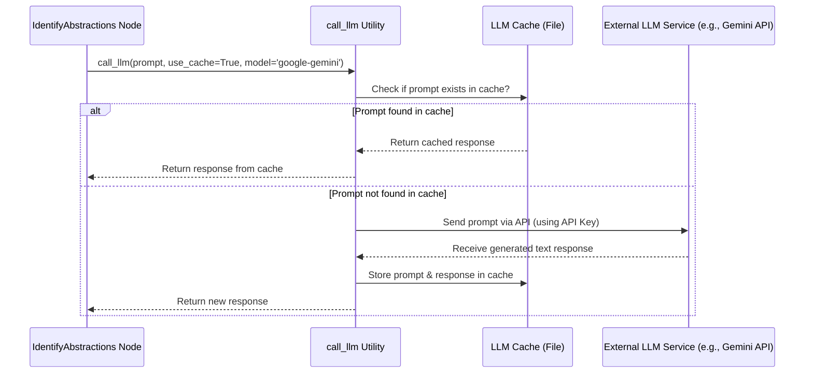

# Chapter 3: LLM Analysis & Generation

```markdown
# Chapter 3: LLM Analysis & Generation

Welcome back! In [Chapter 2: PocketFlow Workflow](02_pocketflow_workflow.md), we saw how our project uses a workflow (like an assembly line) to organize all the steps needed to create documentation. We learned that each step is a "Node" and they run in a specific order.

Now, let's dive into the most exciting part: the "magic" that happens inside some of those nodes. How does the tool actually *understand* the code and *write* the tutorial chapters? The answer lies in **Large Language Models (LLMs)**.

**Goal:** Understand what LLMs are and how `LLM-CODEBASE-DOCUMENTOR` uses them as the core "brain" to analyze code, figure out key concepts, structure the tutorial, and generate the text you read.

## The Challenge: Making Sense of Code Mountain ⛰️

Imagine being given a huge, complex software project with hundreds of files. How would you start explaining it to someone new? It's tough! You'd need to:

1.  Read through lots of code.
2.  Figure out the most important parts (the main ideas or "abstractions").
3.  Understand how these parts connect and work together.
4.  Decide the best order to explain them.
5.  Write clear, beginner-friendly explanations for each part.

Doing this manually takes a lot of time and expertise. This is exactly the problem our tool aims to solve using AI.

**Use Case:** We want to automatically generate a helpful, multi-chapter tutorial just by pointing the tool at a codebase.

## The Solution: Large Language Models (LLMs) - Our AI Expert 🧠

Think of a Large Language Model (LLM) like a super-smart assistant that has read *massive* amounts of text and code from the internet. Because of this training, it's incredibly good at:

*   **Understanding Language:** It gets what you're asking for in plain English.
*   **Understanding Code:** It can read code (like Python, JavaScript, etc.) and grasp its structure and purpose.
*   **Generating Text:** It can write human-like text, summaries, explanations, and even code snippets.

Popular examples of LLMs include Google's **Gemini**, Anthropic's **Claude**, and OpenAI's **GPT** models. Our tool is designed to work with these!

**Analogy:** An LLM is like having a very experienced programmer and a skilled technical writer rolled into one, ready to help you understand and explain code.

## How We Use LLMs in the Workflow

Remember the assembly line (PocketFlow workflow) from Chapter 2? Several stations (Nodes) on that line rely heavily on LLMs:

1.  **`IdentifyAbstractions` Node:**
    *   **Task:** Figure out the main concepts or building blocks of the code.
    *   **How LLM helps:** We feed the LLM the source code files we fetched in Chapter 1. We ask it: "Read this code. What are the 6-10 most important ideas someone needs to understand?" The LLM analyzes the code and provides a list of these concepts (abstractions) with brief descriptions.

2.  **`AnalyzeRelationships` Node:**
    *   **Task:** Understand how the identified concepts connect.
    *   **How LLM helps:** We give the LLM the list of abstractions (from the previous step) and relevant code snippets. We ask: "How do these concepts interact? Which ones use or depend on others? And can you give me a quick summary of the whole project?" The LLM analyzes the connections and provides a summary and a list of relationships.

3.  **`OrderChapters` Node:**
    *   **Task:** Decide the best order to explain these concepts in a tutorial.
    *   **How LLM helps:** We provide the LLM with the list of abstractions and their relationships. We ask: "What's the most logical order to teach these concepts to a beginner?" The LLM suggests an order, often starting with foundational or user-facing ideas and moving towards more detailed ones.

4.  **`WriteChapters` Node:**
    *   **Task:** Generate the actual text for each chapter.
    *   **How LLM helps:** For each concept (in the order decided above), we give the LLM the concept's description, relevant code snippets, and the overall tutorial structure. We ask: "Write a beginner-friendly tutorial chapter about this concept, explaining it clearly with analogies and code examples, and linking to other relevant chapters." The LLM generates the Markdown text for the chapter.

Essentially, we're using the LLM as an expert analyst and writer at multiple stages of our documentation assembly line.

## Choosing Your AI Brain (`--model`)

Our tool lets you choose which LLM provider you want to use. You might have access to one provider's API key but not another, or you might prefer the writing style of a specific model.

You tell the tool which LLM to use with the `--model` command-line argument when you run it:

```bash
# Example: Use Google Gemini (the default)
python main.py --repo <URL> --model google-gemini

# Example: Use Anthropic Claude
python main.py --repo <URL> --model anthropic-claude

# Example: Use OpenAI GPT
python main.py --repo <URL> --model openai-gpt
```

**Code Snippet (`main.py`):** This code sets up the `--model` argument.

```python
# In main.py
# Import the Enum that defines the choices
from utils.call_llm import LLMProvider_enum

parser = argparse.ArgumentParser(...)

# This adds the --model argument with specific choices
parser.add_argument("--model", type=str, 
                    choices=[e.value for e in LLMProvider_enum], # Choices are 'google-gemini', 'anthropic-claude', 'openai-gpt'
                    default=LLMProvider_enum.GOOGLE.value, # Default is Google Gemini
                    help="LLM provider to use...")

# Later, the chosen model is stored in the 'shared' dictionary
args = parser.parse_args()
shared = {
    # ... other inputs
    "model_used": args.model, # The string name like 'google-gemini'
    "llm_provider": LLMProvider_enum(args.model), # The Enum value used internally
    # ...
}
```
*Explanation:* The code defines the `--model` option, restricts the choices to the supported providers using `LLMProvider_enum`, sets a default (`google-gemini`), and stores the user's choice so the rest of the tool knows which AI to talk to.

**Quick Note on API Keys:** Using these LLMs requires API keys (like passwords) from the respective providers (Google, Anthropic, OpenAI). You'll need to set these up. We'll cover managing keys and other settings in [Chapter 8: Configuration & Environment Management](08_configuration___environment_management.md).

## Under the Hood: Talking to the LLM (`utils/call_llm.py`)

How does a Node like `IdentifyAbstractions` actually *talk* to the LLM? It uses a helper function called `call_llm`.

**Analogy:** Think of `call_llm` as the dedicated messenger service that knows how to contact the chosen AI expert (Google, Anthropic, or OpenAI), deliver our instructions (the prompt), and bring back the answer (the response).

1.  **Prepare the Message (Prompt):** The Node (e.g., `IdentifyAbstractions`) gathers all the necessary information (code, context, previous results) and carefully writes detailed instructions for the LLM. This instruction packet is called the "prompt".
2.  **Send the Message:** The Node calls the `call_llm` function, passing the prompt and specifying which LLM provider to use (based on the `--model` choice).
3.  **`call_llm` Takes Over:**
    *   It checks if caching is enabled (`use_cache=True`) and if we've asked this *exact* same question before. If yes, it returns the cached answer to save time and cost!
    *   If not cached, it figures out which LLM provider we want (Google, Anthropic, OpenAI).
    *   It uses the correct library and API key to connect to that provider's service over the internet.
    *   It sends the prompt to the LLM service.
4.  **LLM Does the Work:** The powerful LLM model processes the prompt and generates a text response.
5.  **Receive the Answer:** `call_llm` receives the response text from the LLM service.
6.  **Cache and Return:** If caching is enabled, `call_llm` saves the response for next time. It then returns the response text back to the Node that called it.
7.  **Node Processes the Answer:** The Node receives the LLM's response (e.g., the list of abstractions in YAML format, or the generated chapter text) and continues its task.

**Sequence Diagram: LLM Call Flow**

This diagram shows how a Node (like `IdentifyAbstractions`) uses `call_llm` to interact with an LLM:



**Code Snippet (`utils/call_llm.py`):** The core function signature.

```python
# In utils/call_llm.py

# Enum defines the choices for the model parameter
class LLMProvider_enum(str, Enum):
    ANTHROPIC = 'anthropic-claude'
    GOOGLE = 'google-gemini'
    OPENAI = 'openai-gpt'

# Simplified function definition
def call_llm(prompt: str, use_cache: bool = True, model: str = LLMProvider_enum.GOOGLE) -> str:
    print(f"Calling LLM with model: {model}")
    logger.info(f"PROMPT: {prompt}") # Log the request

    # 1. Check cache (if use_cache is True)
    if use_cache and prompt_in_cache(prompt):
        response_text = get_from_cache(prompt)
        logger.info(f"RESPONSE (cached): {response_text}")
        return response_text

    # 2. Call the appropriate LLM API based on 'model' value
    response_text = ""
    if model == LLMProvider_enum.GOOGLE:
        # Code to call Google Gemini API...
        response_text = # ... result from Gemini
    elif model == LLMProvider_enum.ANTHROPIC:
        # Code to call Anthropic Claude API...
        response_text = # ... result from Claude
    else: # Assume OpenAI
        # Code to call OpenAI GPT API...
        response_text = # ... result from OpenAI

    logger.info(f"RESPONSE (new): {response_text}") # Log the response

    # 3. Update cache (if use_cache is True)
    if use_cache:
        update_cache(prompt, response_text)

    return response_text
```
*Explanation:* This function takes the `prompt`, checks the `cache`, calls the selected `model`'s API if needed, logs the interaction, updates the `cache`, and returns the `response_text`.

**Code Snippet (`nodes.py` - `IdentifyAbstractions`):** How a Node prepares a prompt and uses `call_llm`.

```python
# In nodes.py, inside IdentifyAbstractions.exec method

# ... (code to prepare 'context', 'file_listing_for_prompt', 'project_name') ...
llm_provider = prep_res[-1] # Get the chosen LLM provider

print("Identifying abstractions using LLM...")
# Construct the detailed prompt for the LLM
prompt = f"""
For the project `{project_name}`:

Codebase Context:
{context}

Analyze the codebase context.
Identify the top 6-10 core most important abstractions...
... (rest of the instructions, asking for YAML output) ...

List of file indices and paths present in the context:
{file_listing_for_prompt}

Format the output as a YAML list of dictionaries:
```yaml
- name: AbstractionName
  description: Explanation...
  file_indices: [0, 3]
# ... other abstractions
```"""

# Call the messenger service!
response = call_llm(prompt=prompt, use_cache=True, model=llm_provider)

# Process the response (parse YAML, validate, etc.)
# ... (code to handle the YAML response from the LLM) ...
```
*Explanation:* The `IdentifyAbstractions` node carefully builds a detailed `prompt` telling the LLM exactly what to do and how to format the answer (as YAML). Then, it simply calls `call_llm` to get the AI's response. Other nodes like `AnalyzeRelationships` and `WriteChapters` follow a similar pattern, just with different prompts tailored to their specific tasks.

## Conclusion

In this chapter, we pulled back the curtain on the AI magic behind `LLM-CODEBASE-DOCUMENTOR`. We learned:

*   **LLMs (Large Language Models)** like Gemini, Claude, and GPT act as the "brain" of the tool.
*   They are used at multiple steps in the workflow (Nodes) to:
    *   Identify core code **abstractions**.
    *   Analyze their **relationships**.
    *   Determine the tutorial chapter **order**.
    *   **Write** the actual chapter content.
*   You can choose your preferred LLM using the `--model` argument.
*   The `utils/call_llm.py` helper function handles the communication with the chosen LLM service, including caching.
*   Nodes prepare specific **prompts** (instructions) to guide the LLM's analysis and generation.

By leveraging LLMs, the tool can automate the complex process of understanding a codebase and generating human-friendly documentation.

**Next Up:** Now that we know LLMs help identify concepts and relationships, let's look specifically at how the tool uses that information to plan the tutorial's structure in [Chapter 4: Tutorial Structure Generation](04_tutorial_structure_generation.md).
```

---

Generated by TEG SINGH TIWANA: [Cloud Assignment 2:Github LLM Codebase Knowledge Building Summarizer using Openai/Gemini/Claud](https://github.com/tej172/cloud_indv_assignments/tree/main/ass_2)