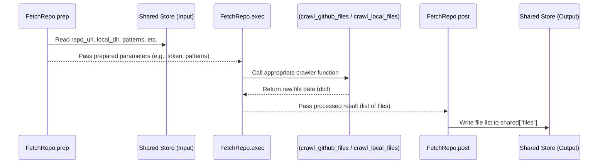

# Chapter 5: Node Abstraction

```markdown
# Chapter 5: Node Abstraction

Welcome back! In [Chapter 4: Tutorial Structure Generation](04_tutorial_structure_generation.md), we saw how the `CombineTutorial` step acts like a bookbinder, taking all the generated pieces – summaries, chapter text, diagrams – and assembling them into the final tutorial files.

Now, let's zoom out a bit. We've mentioned several specific steps like `FetchRepo`, `IdentifyAbstractions`, `AnalyzeRelationships`, `OrderChapters`, `WriteChapters`, and `CombineTutorial`. These are the core workers in our documentation "assembly line". How are these individual workers defined? What makes them tick?

This chapter dives into the fundamental building block of our workflow: the **Node Abstraction**.

**Goal:** Understand what a "Node" is in the PocketFlow workflow, learn about its three stages (`prep`, `exec`, `post`), and see how this structure helps keep our complex process organized, modular, and easier to manage.

## The Problem: Managing a Complex Recipe 🍝

Imagine trying to cook a complex multi-course meal. If you just had one giant page of instructions mixing everything together – chopping vegetables for the salad while boiling pasta and preheating the oven for dessert – it would be incredibly confusing and prone to errors.

Similarly, generating a code tutorial involves many different tasks: getting code, analyzing it with AI, figuring out relationships, deciding the order, writing text, formatting output. Trying to write one massive script to do all of this would be a nightmare!

**Use Case:** How can we break down the complex task of generating a tutorial into smaller, manageable, and reusable pieces? We need a way to define distinct steps, handle their inputs and outputs cleanly, and ensure they work together smoothly.

## The Solution: Nodes - The Specialized Workers 🧑‍🔧

In the `LLM-CODEBASE-DOCUMENTOR`, each specific task is handled by a **Node**. Think of our PocketFlow workflow (from [Chapter 2: PocketFlow Workflow](02_pocketflow_workflow.md)) as an assembly line, and each **Node** is a specialized station or worker on that line.

*   `FetchRepo` is the station that **gets the raw materials** (source code).
*   `IdentifyAbstractions` is the station that **inspects the materials** to find the main parts.
*   `AnalyzeRelationships` figures out **how the parts connect**.
*   `OrderChapters` decides the **assembly sequence**.
*   `WriteChapters` **builds each component** (writes the chapter text).
*   `CombineTutorial` performs the **final assembly and packaging**.

Each Node has a very specific job description. It knows what inputs it needs, what task it performs, and what output it produces.

## The Three Stages of a Node: Prep, Exec, Post

To make these workers efficient and organized, every Node follows a standard three-stage process:

1.  **`prep` (Prepare / Get Ready):**
    *   **What it does:** Gathers all the necessary inputs (ingredients and tools) needed for the main task. It usually reads data from the central `shared` data store (we'll cover this in [Chapter 6: Shared Data Store](06_shared_data_store.md)). It might also do some initial setup or validation.
    *   **Analogy:** A chef reading the recipe, gathering ingredients from the pantry, and getting out the right knives and bowls.
    *   **Output:** Passes the prepared inputs to the `exec` stage.

2.  **`exec` (Execute / Do the Work):**
    *   **What it does:** Performs the Node's main job. This is where the core logic happens – calling an external service (like the GitHub API or an LLM), running a calculation, processing data, etc.
    *   **Analogy:** The chef chopping the vegetables, mixing the batter, or putting the dish in the oven.
    *   **Output:** Returns the result of its work to the `post` stage.

3.  **`post` (Post-process / Clean Up & Store):**
    *   **What it does:** Takes the raw result from the `exec` stage, cleans it up or formats it if necessary, and most importantly, saves the final output back into the `shared` data store so that subsequent Nodes can use it.
    *   **Analogy:** The chef plating the finished dish, garnishing it, and putting the plate on the serving counter (the shared store) for the waiter (the next Node). They might also quickly clean their station.

This `prep -> exec -> post` structure ensures that each Node clearly separates gathering inputs, doing the work, and storing outputs.

## Example Walkthrough: The `FetchRepo` Node

Let's revisit the `FetchRepo` node, which is responsible for getting the source code. Here's how its `prep`, `exec`, and `post` stages work (simplified):

**1. `prep` Stage:**

*   **Goal:** Get the repository URL or local directory path, filtering rules, and GitHub token (if needed) from the shared store. Prepare these for the crawler functions.
*   **Analogy:** Get the cookbook (shared store), find the recipe source (URL or local path), check for ingredient preferences (filters), and get the special key to the pantry (token).

```python
# Simplified from nodes.py - FetchRepo.prep

def prep(self, shared):
    # 1. Read necessary info from the shared store
    repo_url = shared.get("repo_url")
    local_dir = shared.get("local_dir")
    github_token = shared.get("github_token")
    include_patterns = shared["include_patterns"]
    exclude_patterns = shared["exclude_patterns"]
    max_file_size = shared["max_file_size"]

    # (Determine project_name if not already set - omitted for simplicity)

    # 2. Prepare a dictionary of inputs for the 'exec' stage
    inputs_for_exec = {
        "repo_url": repo_url,
        "local_dir": local_dir,
        "token": github_token,
        "include_patterns": include_patterns,
        "exclude_patterns": exclude_patterns,
        "max_file_size": max_file_size,
        "use_relative_paths": True # Example setting
    }
    return inputs_for_exec # Pass prepared inputs to exec
```

**2. `exec` Stage:**

*   **Goal:** Based on the inputs from `prep`, call the correct utility function (`crawl_github_files` or `crawl_local_files`) to actually fetch the code.
*   **Analogy:** If you have a URL, call the "Online Shopper" service. If you have a local path, call the "Pantry Raider" service. Get the list of ingredients (files).

```python
# Simplified from nodes.py - FetchRepo.exec

# 'prep_res' contains the dictionary returned by the 'prep' stage
def exec(self, prep_res):
    # 1. Check if we are fetching from GitHub or local directory
    if prep_res["repo_url"]:
        print(f"Crawling repository: {prep_res['repo_url']}...")
        # Call the GitHub utility function with prepared inputs
        result = crawl_github_files(
            repo_url=prep_res["repo_url"],
            token=prep_res["token"],
            include_patterns=prep_res["include_patterns"],
            # ... other arguments ...
        )
    elif prep_res["local_dir"]:
        print(f"Crawling directory: {prep_res['local_dir']}...")
        # Call the local directory utility function
        result = crawl_local_files(
            directory=prep_res["local_dir"],
            include_patterns=prep_res["include_patterns"],
            # ... other arguments ...
        )
    else:
        # Handle case where neither is provided (should not happen normally)
        result = {"files": {}}

    # 2. Process the result (convert dict to list of (path, content))
    files_list = list(result.get("files", {}).items())
    print(f"Fetched {len(files_list)} files.")

    return files_list # Return the raw result (list of files) to post
```

**3. `post` Stage:**

*   **Goal:** Take the list of files returned by `exec` and save it into the shared store under the key `"files"`.
*   **Analogy:** Take the bag of ingredients (list of files) and place it neatly on the shared kitchen counter (shared store) labeled "Fetched Files".

```python
# Simplified from nodes.py - FetchRepo.post

# 'shared' is the shared data store
# 'prep_res' is the output of prep (not usually needed here)
# 'exec_res' is the list of files returned by exec
def post(self, shared, prep_res, exec_res):
    # 1. Save the result from 'exec' into the shared store
    shared["files"] = exec_res
    print("Saved fetched files list to shared store.")
    # (Could also save project_name here if prep determined it)
```

**Internal Node Flow Diagram:**

Here's how the data flows within a typical Node like `FetchRepo`:



This clear separation of concerns (`prep`, `exec`, `post`) makes each Node easier to understand and manage.

## Benefits of Node Abstraction

Using Nodes to structure our workflow provides several advantages:

*   **Modularity:** Each Node is a self-contained unit with a single responsibility. This makes the overall system easier to understand, as you can focus on one task at a time. Need to change how code is fetched? Just look at the `FetchRepo` node. Need to improve chapter writing? Focus on `WriteChapters`.
*   **Reusability:** While not heavily utilized in this specific project, Nodes designed for common tasks could potentially be reused across different workflows.
*   **Testability:** This is a huge benefit! You can test each Node individually. You can create fake input data (`shared` state before the node runs), run the Node's `prep`, `exec`, and `post` stages, and then check if the output in the `shared` store is what you expected. This makes debugging much easier.
*   **Clarity:** When you look at the workflow definition in `flow.py` (remember the `>>` connections from Chapter 2?), you see a high-level view of the process connecting these well-defined Nodes. It's like reading a flowchart of the main steps, rather than digging through one giant script.

```python
# From flow.py (Illustrating clarity)

# Define the stations (Nodes)
fetch_repo = FetchRepo()
identify_abstractions = IdentifyAbstractions(...)
# ... other nodes

# Connect them clearly
fetch_repo >> identify_abstractions >> analyze_relationships # ... etc

# Define the starting point
tutorial_flow = Flow(start=fetch_repo)
```

## Conclusion

In this chapter, we learned about the **Node Abstraction**, the core building block of the PocketFlow workflow used in `LLM-CODEBASE-DOCUMENTOR`.

*   A Node is like a **specialized worker** performing one specific task in the documentation generation process (e.g., `FetchRepo`, `WriteChapters`).
*   Each Node follows a three-stage lifecycle:
    *   **`prep`**: Gathers inputs from the shared store.
    *   **`exec`**: Performs the main task.
    *   **`post`**: Stores the results back into the shared store.
*   This structure promotes **modularity**, **reusability**, **testability**, and **clarity** in our complex workflow.

Nodes handle *what* gets done and *how* it's done internally. But how do they communicate? How does the output of `FetchRepo` actually become the input for `IdentifyAbstractions`? That's where the central communication hub comes in.

**Next Up:** Explore the mechanism that allows Nodes to share data with each other in [Chapter 6: Shared Data Store](06_shared_data_store.md).
```

---

Generated by TEG SINGH TIWANA: [Cloud Assignment 2:Github LLM Codebase Knowledge Building Summarizer using Openai/Gemini/Claud](https://github.com/tej172/cloud_indv_assignments/tree/main/ass_2)