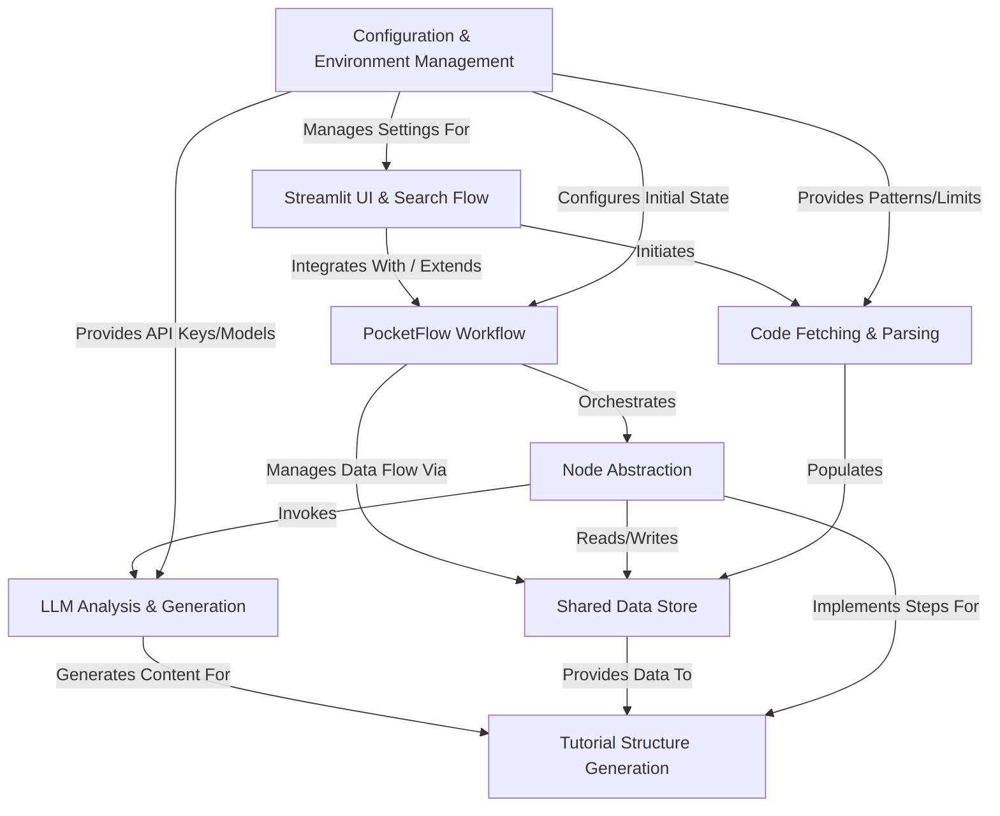

# Tutorial: LLM -CODEBASE-DOCUMENTOR

The `LLM-CODEBASE-DOCUMENTOR` project is designed to **automatically generate beginner-friendly tutorials** for software codebases. 
It leverages a *PocketFlow Workflow* (Abstraction 0) to orchestrate a series of *Nodes* (Abstraction 1) that handle tasks such as *Code Fetching* (Abstraction 2), *LLM Analysis* (Abstraction 3), and *Tutorial Structure Generation* (Abstraction 5). 
The project includes both a command-line interface and a *Streamlit UI* (Abstraction 6) for user interaction, search, and configuration. 
Data flows between steps via a *Shared Data Store* (Abstraction 4), configured by *Configuration & Environment Management* (Abstraction 7).

**Source Repository:** [None](None)

## Chapters

1. [Code Fetching & Parsing](01_code_fetching___parsing.md)
2. [PocketFlow Workflow](02_pocketflow_workflow.md)
3. [LLM Analysis & Generation](03_llm_analysis___generation.md)
4. [Tutorial Structure Generation](04_tutorial_structure_generation.md)
5. [Node Abstraction](05_node_abstraction.md)
6. [Shared Data Store](06_shared_data_store.md)
7. [Streamlit UI & Search Flow](07_streamlit_ui___search_flow.md)
8. [Configuration & Environment Management](08_configuration___environment_management.md)

---

Generated by TEG SINGH TIWANA: [Cloud Assignment 2:Github LLM Codebase Knowledge Building Summarizer using Openai/Gemini/Claud](https://github.com/tej172/cloud_indv_assignments/tree/main/ass_2)