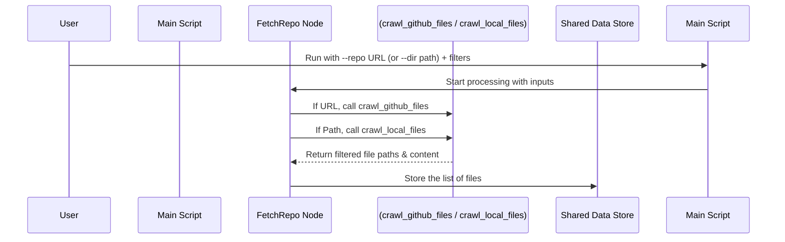

# Chapter 1: Code Fetching & Parsing

```markdown
# Chapter 1: Code Fetching & Parsing

Welcome to the `LLM-CODEBASE-DOCUMENTOR` tutorial! Imagine you want to write a cookbook about a complex dish. What's the very first thing you need? The ingredients! In our case, the "dish" is understanding a software project, and the "ingredients" are its source code files.

This first chapter is all about **getting those ingredients**: fetching the source code and doing some initial preparation (parsing/filtering).

**Goal:** Understand how the tool grabs the necessary code files, either from the internet (GitHub) or from your own computer, and filters them to keep only what's needed.

## Where Does the Code Come From?

Our tool needs the raw source code to analyze. It can get this code from two main places:

### 1. GitHub: The Online Treasure Chest 🌐

*   **What it is:** GitHub is a popular website where developers store and share their code publicly (or privately). Think of it like a huge online library for software projects.
*   **How we fetch:** If the code you want to document lives on GitHub, you can tell our tool its web address (URL). The tool then uses GitHub's official way of talking to computers (the GitHub API) to download the code files. It's like asking the librarian nicely for specific books.
*   **How to tell the tool:** You use the `--repo` command-line argument followed by the GitHub URL.

    ```bash
    python main.py --repo https://github.com/someuser/someproject
    ```
*   **Code Snippet (from `main.py`):** This code sets up the `--repo` option when you run the script.

    ```python
    # In main.py
    parser = argparse.ArgumentParser(...)
    source_group = parser.add_mutually_exclusive_group(required=True)
    
    # This line adds the --repo argument
    source_group.add_argument("--repo", 
        help="Specify the URL of a public GitHub repository...") 
        
    # Later, the code checks if args.repo was used
    shared = {
        "repo_url": args.repo,
        # ... other inputs
    }
    ```
*   **Quick Note on Tokens:** Sometimes, for private GitHub projects or to avoid download limits, you might need a special password called a GitHub Token (`--token` argument or `GITHUB_TOKEN` environment variable). We'll touch more on configuration later!

### 2. Your Local Folder: Your Personal Bookshelf 💻

*   **What it is:** Maybe you've already downloaded the code onto your computer, or it's a project you're working on locally. It lives in a folder (directory) on your machine.
*   **How we fetch:** Instead of going online, the tool can simply read the files directly from the folder you specify. It's like grabbing books directly off your own shelf.
*   **How to tell the tool:** You use the `--dir` command-line argument followed by the path to the folder on your computer.

    ```bash
    # Example on Linux/macOS
    python main.py --dir /home/user/my_projects/someproject
    
    # Example on Windows
    python main.py --dir C:\Users\User\Documents\someproject
    ```
*   **Code Snippet (from `main.py`):** Similar to `--repo`, this code sets up the `--dir` option.

    ```python
    # In main.py (within the same source_group)
    source_group.add_argument("--dir", 
        help="Provide a local directory path to analyze code...")

    # Later, the code checks if args.dir was used
    shared = {
        "local_dir": args.dir,
        # ... other inputs
    }
    ```

**Important:** You must choose *one* source – either `--repo` OR `--dir`. You can't use both at the same time!

## Filtering: Picking the Right Ingredients 🥕

Not all files in a codebase are equally important for understanding its core logic. Some are test files, documentation, configuration files, temporary build files, or just *huge* data files. Analyzing everything would be slow and might confuse the AI later.

Think about preparing carrots. You want the orange root, but you'd probably discard the leafy green tops. We do something similar with code:

*   **Include Patterns (`--include`):** Specify which types of files we *want* to keep. Patterns like `*.py` mean "keep all files ending in `.py`". If you don't specify any, the tool uses a helpful list of common code file types.
*   **Exclude Patterns (`--exclude`):** Specify files or folders we want to *ignore*. Patterns like `tests/*` mean "ignore everything inside any folder named `tests`". Again, there's a default list to ignore common clutter like test folders, build outputs, and Git files.
*   **Size Limit (`--max-size`):** Very large files can be difficult for the AI to process effectively. We set a maximum file size (default is about 300KB) and skip anything bigger.

**How to tell the tool:**

```bash
python main.py --repo <URL> \
               --include "*.py" "*.js" \
               --exclude "tests/*" "dist/*" \
               --max-size 500000 # Set max size to 500KB
```

**Code Snippet (Defaults in `main.py`):** This shows the default patterns used if you don't provide your own `--include` or `--exclude` arguments.

```python
# In main.py

# Default file types to INCLUDE
DEFAULT_INCLUDE_PATTERNS = {
    "*.py", "*.js", "*.jsx", "*.ts", "*.tsx", "*.go", "*.java", # Code files
    "*.md", "*.rst", # Documentation
    "Dockerfile", "Makefile", "*.yaml", "*.yml", # Config/Build
    # ... many more common types
}

# Default file/folder patterns to EXCLUDE
DEFAULT_EXCLUDE_PATTERNS = {
    "*test*", "tests/*", "docs/*", "examples/*", # Tests, docs, examples
    "dist/*", "build/*", # Build output folders
    ".git/*", ".github/*", "node_modules/*", # Version control, dependencies
    "*.log" # Log files
}

# ... later in main() ...

shared = {
    # ... other inputs
    "include_patterns": set(args.include) if args.include else DEFAULT_INCLUDE_PATTERNS,
    "exclude_patterns": set(args.exclude) if args.exclude else DEFAULT_EXCLUDE_PATTERNS,
    "max_file_size": args.max_size,
    # ...
}
```
These filtering steps ensure we feed the AI mostly relevant code, making the documentation process more efficient and accurate.

## How It Works Under the Hood (Simplified) 🕵️‍♀️

So, how does the tool actually *do* the fetching and filtering? Inside the project, there's a component responsible for this, which we call a "Node". The specific node for this job is named `FetchRepo`.

1.  **Check Arguments:** `FetchRepo` first looks at whether you provided `--repo` or `--dir`.
2.  **Choose Crawler:**
    *   If `--repo` was used, it calls a specialized helper function (`crawl_github_files`) designed to talk to the GitHub API, handle URLs, tokens, and download files, applying the include/exclude/size filters along the way.
    *   If `--dir` was used, it calls a different helper function (`crawl_local_files`) that knows how to walk through local folders, read files, and apply the same filters.
3.  **Collect Files:** Both helpers return a list of file paths and their content.
4.  **Store Result:** `FetchRepo` stores this collected list of files (our "ingredients") so that other parts of the tool can use them later.

**Code Snippet (Simplified logic in `nodes.py`):** This shows the core decision-making inside the `FetchRepo` node.

```python
# In nodes.py, inside the FetchRepo class

# This 'exec' method does the main work
def exec(self, prep_res): 
    # prep_res contains the prepared inputs like repo_url, local_dir, patterns etc.
    
    if prep_res["repo_url"]: # Did the user provide a GitHub URL?
        print(f"Crawling repository: {prep_res['repo_url']}...")
        # Use the GitHub crawler utility
        result = crawl_github_files( 
            repo_url=prep_res["repo_url"],
            token=prep_res["token"],
            include_patterns=prep_res["include_patterns"],
            exclude_patterns=prep_res["exclude_patterns"],
            max_file_size=prep_res["max_file_size"],
            # ... other options
        )
    elif prep_res["local_dir"]: # Did the user provide a local directory?
        print(f"Crawling directory: {prep_res['local_dir']}...")
        # Use the local directory crawler utility
        result = crawl_local_files(
            directory=prep_res["local_dir"],
            include_patterns=prep_res["include_patterns"],
            exclude_patterns=prep_res["exclude_patterns"],
            max_file_size=prep_res["max_file_size"],
            # ... other options
        )
    else:
        # Neither was provided (shouldn't happen due to argument requirement)
        print("No repository URL or local directory provided.")
        result = {"files": {}}

    # Convert the result into a list of (path, content) pairs
    files_list = list(result.get("files", {}).items())
    print(f"Fetched {len(files_list)} files.")
    return files_list # Return the list of files
```

**Visualizing the Flow:**

Here's a simple diagram showing the sequence:



## What Happens Next?

Now that we've successfully fetched and filtered the source code, these "ingredients" (the file paths and their content) are stored neatly. They are ready for the next stage where the AI will start analyzing them to understand the project's structure and key concepts.

This fetching and filtering is the crucial first step in our documentation journey!

## Conclusion

In this chapter, we learned how `LLM-CODEBASE-DOCUMENTOR` gets the source code it needs to analyze:

*   It can fetch code from a **GitHub repository** using its URL (`--repo`).
*   Or, it can read code from a **local directory** on your computer (`--dir`).
*   It intelligently **filters** files using include/exclude patterns and size limits (`--include`, `--exclude`, `--max-size`) to focus on the most relevant code.
*   The `FetchRepo` node orchestrates this process, using helper functions like `crawl_github_files` and `crawl_local_files`.

With the code successfully fetched and prepared, we're ready to move on to the next step: understanding how these different processing steps are organized and managed.

**Next Up:** Learn about the overall structure that manages these steps in [Chapter 2: PocketFlow Workflow](02_pocketflow_workflow.md).
```

---

Generated by TEG SINGH TIWANA: [Cloud Assignment 2:Github LLM Codebase Knowledge Building Summarizer using Openai/Gemini/Claud](https://github.com/tej172/cloud_indv_assignments/tree/main/ass_2)