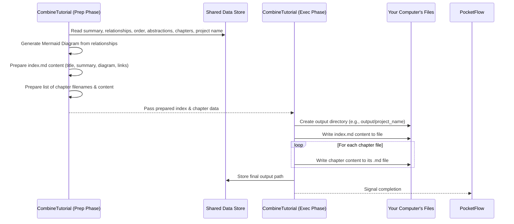

# Chapter 4: Tutorial Structure Generation

```markdown
# Chapter 4: Tutorial Structure Generation

Welcome back! In [Chapter 3: LLM Analysis & Generation](03_llm_analysis___generation.md), we saw how the "AI brain" (the LLM) helps us understand the code by identifying key concepts (abstractions), figuring out how they relate, deciding the best order to teach them, and even writing the first draft of each chapter's content.

Now, imagine you've written all the individual recipes for your cookbook. You have the text for the cake recipe, the cookie recipe, the bread recipe, etc., all on separate pieces of paper. You also have a summary of the whole cookbook and maybe a diagram showing which recipes use similar ingredients. What's the next step? You need to **assemble the cookbook**!

This chapter is all about that final assembly process: **Tutorial Structure Generation**.

**Goal:** Understand how the tool takes all the generated pieces – the project summary, the concept relationships, the chapter order, and the written chapter text – and organizes them into a final, polished tutorial structure, complete with an index file, diagrams, and correctly linked chapter files.

## The Problem: From Scattered Notes to a Polished Book 📚

After the previous steps, we have several valuable pieces of information floating around:

1.  **Abstractions:** The list of key concepts identified by the LLM (e.g., "Client Session", "Tools").
2.  **Relationships:** How these concepts connect, including a project summary (e.g., "Client Session calls Tools").
3.  **Chapter Order:** The best sequence to explain these concepts (e.g., explain "Client Session" first, then "Tools").
4.  **Chapter Content:** The actual Markdown text generated by the LLM for each concept.

But these are just separate bits of data inside the computer's memory. We need to transform them into something a human can actually use: a set of neatly organized Markdown files that form a coherent tutorial.

**Use Case:** We want to take all the intermediate results generated by the LLMs and the workflow and produce the final output directory. This directory should contain:
*   An `index.md` file acting as the table of contents, with a summary and a relationship diagram.
*   Individual chapter files (like `01_client_session.md`, `02_tools.md`) containing the generated text.
*   Proper links connecting the index to the chapters and the chapters to each other.

## The Solution: The `CombineTutorial` Node - Our Assembler 🛠️

The final step in our documentation assembly line ([Chapter 2: PocketFlow Workflow](02_pocketflow_workflow.md)) is handled by a specific node called `CombineTutorial`. Think of this node as the **final assembler** or the **bookbinder**. Its job is to take all the finished components and put them together correctly.

Here's what the `CombineTutorial` node does:

1.  **Gathers Inputs:** It collects all the necessary pieces created by the previous nodes:
    *   The project summary and relationship details (from `AnalyzeRelationships`).
    *   The list of abstractions (from `IdentifyAbstractions`).
    *   The determined chapter order (from `OrderChapters`).
    *   The generated Markdown content for each chapter (from `WriteChapters`).
    *   The project name and desired output location.

2.  **Generates the Relationship Diagram:** It uses the relationship data (which abstraction connects to which, and the label for that connection) to automatically create a visual flowchart using Mermaid syntax. This helps users see the connections at a glance.

3.  **Creates `index.md` Content:** It prepares the text for the main `index.md` file. This includes:
    *   The project title.
    *   The high-level summary generated earlier.
    *   A link to the source code repository (if available).
    *   The Mermaid diagram it just generated.
    *   An ordered list of chapters, with links to the corresponding chapter files (e.g., "1. [Client Session](01_client_session.md)").

4.  **Prepares Chapter Files:** For each chapter's generated Markdown content:
    *   It determines the correct filename based on the chapter number and a "safe" version of the abstraction name (e.g., replacing spaces with underscores).
    *   It adds a standard attribution line at the end.

5.  **Writes Everything to Disk:**
    *   It creates the final output directory (usually named after the project, inside an `output` folder).
    *   It writes the prepared `index.md` content to `index.md` inside that directory.
    *   It writes each chapter's prepared content to its corresponding filename (e.g., `01_client_session.md`, `02_tools.md`, etc.) inside the same directory.

## How It Works Under the Hood (Simplified Walkthrough) 🚶‍♀️

Let's follow the `CombineTutorial` node step-by-step:

1.  **Get Ready (`prep`):** The node first gathers all the ingredients it needs from the shared data store: the summary, relationship details (`relationships['details']`), chapter order (`chapter_order`), abstraction list (`abstractions`), chapter content (`chapters`), project name, and output directory path.
2.  **Draw the Map (`prep`):** It looks at the `relationships['details']` (which contains pairs like `from: 0, to: 1, label: "Calls"`) and generates the Mermaid code for the diagram.
3.  **Write the Introduction (`prep`):** It starts building the `index.md` text string, adding the title, summary, and the Mermaid diagram code.
4.  **Create the Table of Contents (`prep`):** It iterates through the `chapter_order` list. For each abstraction index in the order, it finds the abstraction's name, creates a safe filename (like `01_client_session.md`), and adds a numbered link like `1. [Client Session](01_client_session.md)` to the `index.md` text. It also prepares a list of all chapter filenames and their corresponding content (adding the attribution).
5.  **Build the Output Folder (`exec`):** The node creates the actual folder on your computer (e.g., `output/my_project/`).
6.  **Save the Index (`exec`):** It saves the complete `index.md` text string into the `index.md` file within the new folder.
7.  **Save the Chapters (`exec`):** It goes through the list of prepared chapter filenames and content, saving each one as a separate `.md` file in the folder.
8.  **Done! (`post`):** It records the path to the final output directory in the shared store and prints a success message.

**Visualizing the Flow:**

Here's a simple sequence diagram for the `CombineTutorial` node:



## Code Snippets (`nodes.py` - `CombineTutorial`)

Let's look at simplified snippets from the `CombineTutorial` node to see how it prepares and writes the files.

**1. Preparing the Index and Chapter Data (`prep` method):**

This part gathers data and builds the structure in memory *before* writing any files.

```python
# In nodes.py, inside CombineTutorial.prep method

# --- Assume these are loaded from shared data ---
# project_name = "My Cool Project"
# relationships_data = {"summary": "...", "details": [{"from": 0, "to": 1, "label": "Uses"}, ...]}
# chapter_order = [0, 1, 2] # Indices of abstractions in order
# abstractions = [{"name": "Core Logic", ...}, {"name": "Data Handler", ...}, {"name": "API Interface", ...}]
# chapters_content = ["Markdown for Core Logic...", "Markdown for Data Handler...", "..."]
# output_base_dir = "output"
# repo_url = "https://github.com/user/repo"
# -------------------------------------------------

output_path = os.path.join(output_base_dir, project_name) # e.g., "output/My Cool Project"

# --- Generate Mermaid Diagram ---
mermaid_lines = ["flowchart TD"]
# Add nodes (e.g., A0["Core Logic"])
for i, abstr in enumerate(abstractions):
    node_id = f"A{i}"
    node_label = abstr['name'].replace('"', '') # Sanitize
    mermaid_lines.append(f'    {node_id}["{node_label}"]')
# Add edges (e.g., A0 -- "Uses" --> A1)
for rel in relationships_data['details']:
    from_node_id = f"A{rel['from']}"
    to_node_id = f"A{rel['to']}"
    edge_label = rel['label'].replace('"', '') # Sanitize
    mermaid_lines.append(f'    {from_node_id} -- "{edge_label}" --> {to_node_id}')
mermaid_diagram = "\n".join(mermaid_lines)
# --- End Mermaid ---

# --- Prepare index.md content ---
index_content = f"# Tutorial: {project_name}\n\n"
index_content += f"{relationships_data['summary']}\n\n"
if repo_url:
    index_content += f"**Source Repository:** [{repo_url}]({repo_url})\n\n"
index_content += "```mermaid\n" + mermaid_diagram + "\n```\n\n"
index_content += "## Chapters\n\n"

chapter_files = [] # To store {filename, content} pairs
# Generate chapter links and prepare chapter file data
for i, abstraction_index in enumerate(chapter_order):
    abstraction_name = abstractions[abstraction_index]["name"]
    # Create safe filename (e.g., 01_core_logic.md)
    safe_name = "".join(c if c.isalnum() else '_' for c in abstraction_name).lower()
    filename = f"{i+1:02d}_{safe_name}.md"
    # Add link to index.md content
    index_content += f"{i+1}. [{abstraction_name}]({filename})\n"

    # Prepare chapter content (add attribution)
    chapter_content = chapters_content[i] + "\n\n---\n\nGenerated by ..." # Add attribution
    # Store filename and content for later writing
    chapter_files.append({"filename": filename, "content": chapter_content})

# Add attribution to index.md
index_content += "\n\n---\n\nGenerated by ..."

# Return all prepared data for the exec step
return {
    "output_path": output_path,
    "index_content": index_content,
    "chapter_files": chapter_files
}
```
*Explanation:* The `prep` method acts like the planning stage. It uses the data from previous steps (`relationships`, `chapter_order`, etc.) to generate the Mermaid diagram string and the full text content for `index.md`, including formatted links. It also prepares a list (`chapter_files`) containing the final filename and content for each chapter.

**2. Writing the Files (`exec` method):**

This part takes the prepared data and actually creates the files and folders.

```python
# In nodes.py, inside CombineTutorial.exec method

# Get the prepared data from the prep step
output_path = prep_res["output_path"]       # e.g., "output/My Cool Project"
index_content = prep_res["index_content"]   # The full text for index.md
chapter_files = prep_res["chapter_files"]   # List of {"filename": "...", "content": "..."}

print(f"Combining tutorial into directory: {output_path}")
# Create the directory if it doesn't exist
os.makedirs(output_path, exist_ok=True)

# Write index.md
index_filepath = os.path.join(output_path, "index.md")
with open(index_filepath, "w", encoding="utf-8") as f:
    f.write(index_content)
print(f"  - Wrote {index_filepath}")

# Write chapter files
for chapter_info in chapter_files:
    chapter_filepath = os.path.join(output_path, chapter_info["filename"])
    with open(chapter_filepath, "w", encoding="utf-8") as f:
        f.write(chapter_info["content"])
    print(f"  - Wrote {chapter_filepath}")

# Return the path where the tutorial was saved
return output_path
```
*Explanation:* The `exec` method is the action stage. It takes the `output_path`, `index_content`, and `chapter_files` prepared by `prep`. It creates the directory, then simply writes the `index_content` into `index.md` and loops through `chapter_files`, writing each chapter's content into its respective `.md` file.

## Connecting the Dots

*   This `CombineTutorial` node relies heavily on the outputs produced by previous nodes like `IdentifyAbstractions`, `AnalyzeRelationships`, `OrderChapters`, and `WriteChapters`. Without their results, it wouldn't have anything to assemble!
*   The use of indices throughout the process (identifying files, relationships, and order by index) makes it easier for `CombineTutorial` to correctly link everything together at the end.

## Conclusion

In this chapter, we learned about the final assembly step: **Tutorial Structure Generation**.

*   The `CombineTutorial` node acts as the "bookbinder" for our project.
*   It takes the project summary, relationship data, chapter order, and chapter content generated in earlier steps.
*   It creates the final output directory.
*   It generates a **Mermaid diagram** visualizing the relationships between concepts.
*   It writes the main **`index.md`** file, including the summary, diagram, and an ordered, linked list of chapters.
*   It writes the individual **chapter `.md` files** with the LLM-generated content and proper filenames.

This node transforms the intermediate data into a usable, structured set of documentation files, ready for a developer to read!

**Next Up:** We've seen several "Nodes" mentioned (`FetchRepo`, `IdentifyAbstractions`, `CombineTutorial`, etc.). What exactly *is* a Node, and how are they defined? Let's explore the building blocks of our workflow in [Chapter 5: Node Abstraction](05_node_abstraction.md).
```

---

Generated by TEG SINGH TIWANA: [Cloud Assignment 2:Github LLM Codebase Knowledge Building Summarizer using Openai/Gemini/Claud](https://github.com/tej172/cloud_indv_assignments/tree/main/ass_2)