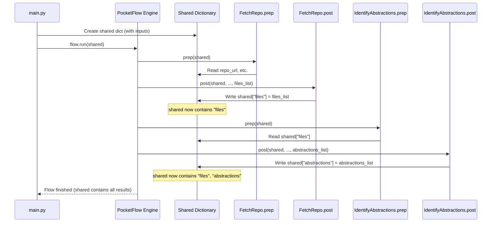

# Chapter 6: Shared Data Store

Welcome back! In [Chapter 5: Node Abstraction](05_node_abstraction.md), we learned about the specialized workers, called "Nodes," that perform specific tasks like fetching code (`FetchRepo`) or writing chapters (`WriteChapters`). We saw how each Node has a `prep -> exec -> post` lifecycle.

But how do these workers talk to each other? How does the `FetchRepo` node hand off the list of code files it found to the `IdentifyAbstractions` node that needs them? If they couldn't share information, our assembly line would grind to a halt!

This chapter introduces the central communication hub: the **Shared Data Store**.

**Goal:** Understand the central Python dictionary (`shared`) that acts as a shared workspace, allowing different Nodes in the workflow to read inputs left by previous Nodes and write their results for subsequent Nodes.

## The Problem: Workers Need to Communicate! 📢

Imagine our documentation assembly line again ([Chapter 2: PocketFlow Workflow](02_pocketflow_workflow.md)).
*   Station 1 (`FetchRepo`) gathers the ingredients (code files).
*   Station 2 (`IdentifyAbstractions`) needs those ingredients to figure out the main concepts.
*   Station 3 (`AnalyzeRelationships`) needs the concepts from Station 2 to see how they connect.
*   ...and so on.

If each station worked in complete isolation, how would the ingredients get from Station 1 to Station 2? How would the list of concepts get from Station 2 to Station 3? The whole process relies on **passing information** between steps.

**Use Case:** We need a mechanism to make the output of one Node (like the list of files from `FetchRepo`) available as input to the next Node in the sequence (like `IdentifyAbstractions`), enabling the entire workflow defined in `flow.py` to function.

## The Solution: The `shared` Dictionary - Our Shared Whiteboard ⚪

The `LLM-CODEBASE-DOCUMENTOR` solves this communication problem with a simple yet effective approach: a central **Python dictionary** called `shared`.

Think of this `shared` dictionary as a **shared whiteboard** or a central **project binder** that gets passed along the assembly line.

Here's how it works:

1.  **Initialization:** When you start the `main.py` script, a dictionary named `shared` is created. It's initially filled with the inputs you provided (like the repo URL, model choice, include/exclude patterns) and some empty placeholders for results.
2.  **Passing Along:** The PocketFlow engine takes this *single* `shared` dictionary and passes it to *every* Node as it runs through the workflow sequence (`FetchRepo >> IdentifyAbstractions >> ...`).
3.  **Reading Inputs (`prep`):** When a Node starts its `prep` stage, it looks at the `shared` dictionary to find the information it needs (e.g., `IdentifyAbstractions` reads the `"files"` key).
4.  **Writing Outputs (`post`):** After a Node finishes its `exec` stage, its `post` stage takes the results and writes them *back into the same* `shared` dictionary under specific keys (e.g., `FetchRepo` writes the list of files into `shared["files"]`).
5.  **Flowing Data:** Because every Node reads from and writes to the *exact same* dictionary object, the data automatically flows. When `IdentifyAbstractions` runs, the `shared` dictionary it receives already contains the `"files"` list written by `FetchRepo`.

**Analogy:** Imagine a team building a car.
*   The `shared` dictionary is the main blueprint and parts checklist that gets passed from team to team.
*   Team 1 (`FetchRepo`) gets the blueprint, gathers the chassis and engine parts, and checks them off on the list (`shared["files"] = ...`).
*   They pass the updated blueprint/checklist to Team 2 (`IdentifyAbstractions`).
*   Team 2 reads the checklist (`files = shared["files"]`), identifies which major components they are (`abstractions = ...`), and adds *that* information to the blueprint (`shared["abstractions"] = ...`).
*   This continues until the final team (`CombineTutorial`) uses all the collected information on the blueprint to assemble the final car documentation.

## How It Looks in the Code

Let's see how the `shared` dictionary is used in practice.

**1. Initialization in `main.py`:**

The `shared` dictionary is created right at the beginning, populated with command-line arguments and defaults.

```python
# Simplified from main.py

def main():
    # ... (argparse setup to get args like args.repo, args.model, etc.) ...
    args = parser.parse_args()

    # Get GitHub token (example of combining arg and env var)
    github_token = args.token or os.environ.get('GITHUB_TOKEN')

    # Initialize the shared dictionary
    shared = {
        # Inputs from user or defaults
        "repo_url": args.repo,
        "local_dir": args.dir,
        "project_name": args.name, # Might be None initially
        "github_token": github_token,
        "output_dir": args.output,
        "model_used": args.model,
        "llm_provider": LLMProvider_enum(args.model),
        "include_patterns": set(args.include) if args.include else DEFAULT_INCLUDE_PATTERNS,
        "exclude_patterns": set(args.exclude) if args.exclude else DEFAULT_EXCLUDE_PATTERNS,
        "max_file_size": args.max_size,

        # Placeholders for outputs from Nodes
        "files": [],             # To be filled by FetchRepo
        "abstractions": [],      # To be filled by IdentifyAbstractions
        "relationships": {},     # To be filled by AnalyzeRelationships
        "chapter_order": [],     # To be filled by OrderChapters
        "chapters": [],          # To be filled by WriteChapters
        "final_output_dir": None # To be filled by CombineTutorial
    }

    # Create the flow instance
    tutorial_flow = create_tutorial_flow()

    # Run the flow, passing the shared dictionary
    # PocketFlow manages passing 'shared' to each Node internally
    tutorial_flow.run(shared)

# ...
```
*Explanation:* We create a standard Python dictionary `shared`. We fill it with initial values derived from user input (`args`) or defaults. Crucially, we also include keys like `"files"`, `"abstractions"`, etc., initially empty, ready to be populated by the Nodes later in the workflow. This entire dictionary is then passed to `tutorial_flow.run()`.

**2. Reading from `shared` in a Node's `prep` stage:**

Nodes access the `shared` dictionary passed to their `prep` method to get the inputs they need.

```python
# Simplified from nodes.py - IdentifyAbstractions.prep

class IdentifyAbstractions(Node):
    def prep(self, shared): # 'shared' is the dictionary passed by PocketFlow
        # Read the list of files generated by FetchRepo
        files_data = shared["files"]
        # Read the project name (might have been set by FetchRepo)
        project_name = shared["project_name"]
        # Read the chosen LLM provider
        llm_provider = shared["llm_provider"]

        # ... (prepare context using files_data) ...

        # Return necessary items for the 'exec' stage
        return context, file_listing_for_prompt, len(files_data), project_name, llm_provider
```
*Explanation:* The `prep` method receives the `shared` dictionary as its argument. It simply accesses the required keys (like `shared["files"]`, `shared["project_name"]`) to retrieve the data needed for its task.

**3. Writing to `shared` in a Node's `post` stage:**

Nodes write their results back into the `shared` dictionary in their `post` method.

```python
# Simplified from nodes.py - IdentifyAbstractions.post

class IdentifyAbstractions(Node):
    # ... prep and exec methods ...

    # 'shared' is the dictionary, 'exec_res' is the result from exec()
    def post(self, shared, prep_res, exec_res):
        # 'exec_res' contains the list of identified abstractions
        # Write this list back into the shared dictionary
        shared["abstractions"] = exec_res
        print(f"Saved {len(exec_res)} abstractions to shared store.")
```
*Explanation:* The `post` method also receives the `shared` dictionary. It takes the result produced by the `exec` stage (`exec_res`) and assigns it to the appropriate key (e.g., `shared["abstractions"] = ...`). This modification happens directly on the `shared` dictionary object that PocketFlow is managing.

## How PocketFlow Orchestrates the Sharing

You might wonder how the *same* dictionary gets passed around. It's handled automatically by the PocketFlow engine when you call `flow.run(shared)`:

1.  **Start:** PocketFlow receives the initial `shared` dictionary.
2.  **Node 1 (`FetchRepo`):**
    *   It calls `FetchRepo.prep(shared)`.
    *   It calls `FetchRepo.exec(...)` which returns `files_list`.
    *   It calls `FetchRepo.post(shared, ..., files_list)`. The `post` method modifies the `shared` dictionary by adding the `"files"` key.
3.  **Node 2 (`IdentifyAbstractions`):**
    *   PocketFlow now takes the *modified* `shared` dictionary (which now contains `"files"`) and passes it to the next node in the sequence.
    *   It calls `IdentifyAbstractions.prep(shared)`. This `prep` method can now successfully read `shared["files"]`.
    *   It calls `IdentifyAbstractions.exec(...)` which returns `abstractions_list`.
    *   It calls `IdentifyAbstractions.post(shared, ..., abstractions_list)`. This modifies `shared` again by adding the `"abstractions"` key.
4.  **Continue:** This process repeats for every node in the workflow (`AnalyzeRelationships`, `OrderChapters`, etc.), with each node potentially reading data written by previous nodes and writing its own results back into the *same* `shared` dictionary.

**Sequence Diagram: Data Flow via `shared`**



This diagram shows how the single `shared` dictionary object is passed along and modified by each Node's `post` method, making the results available to subsequent Nodes.

## Conclusion

In this chapter, we explored the **Shared Data Store**, the central communication hub of the `LLM-CODEBASE-DOCUMENTOR` workflow.

*   It's implemented as a simple **Python dictionary** named `shared`.
*   It's initialized in `main.py` with user inputs and placeholders.
*   The **PocketFlow engine** passes this *same* dictionary object sequentially to each Node in the workflow.
*   Nodes **read** their required inputs from `shared` in their `prep` stage.
*   Nodes **write** their results back into `shared` in their `post` stage.
*   This mechanism allows data (like fetched files, identified abstractions, chapter content) to **flow smoothly** between the different processing steps.

The `shared` dictionary acts as the vital link connecting our specialized workers (Nodes), turning a series of isolated tasks into a cohesive, functional documentation generation pipeline.

Now that we understand the core workflow, the node structure, and how data flows between them, let's look at how a user might interact with this system through a graphical interface.

**Next Up:** Explore the user interface and a different workflow focused on searching for code in [Chapter 7: Streamlit UI & Search Flow](07_streamlit_ui___search_flow.md).

---

Generated by TEG SINGH TIWANA: [Cloud Assignment 2:Github LLM Codebase Knowledge Building Summarizer using Openai/Gemini/Claud](https://github.com/tej172/cloud_indv_assignments/tree/main/ass_2)