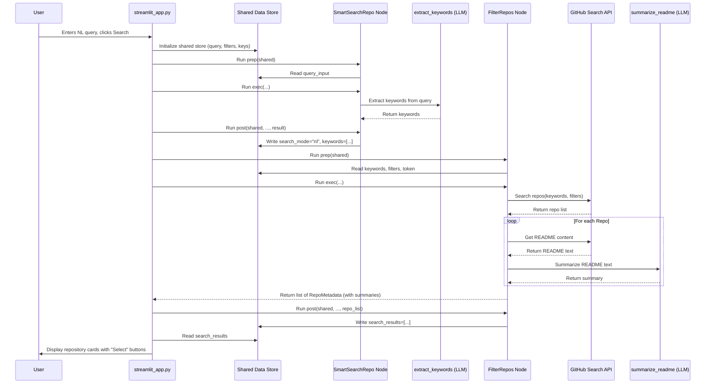
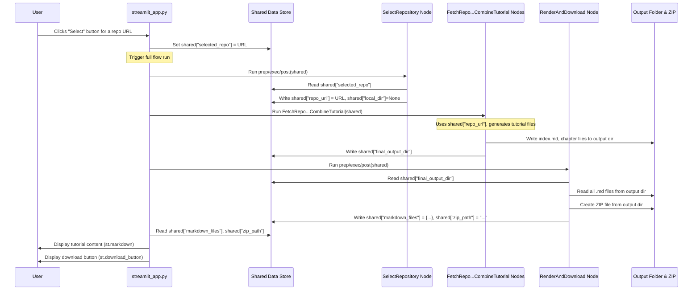

# Chapter 7: Streamlit UI & Search Flow

Welcome back! In [Chapter 6: Shared Data Store](06_shared_data_store.md), we learned how different parts of our documentation pipeline (the "Nodes") share information using the central `shared` dictionary, like passing a project binder along an assembly line. We've seen how the tool works from the command line, taking inputs like a GitHub URL and generating files.

But what if you prefer a more visual way to interact with the tool? What if you want to *search* for interesting repositories directly, filter them, and see the results right in your web browser? That's where this chapter comes in!

**Goal:** Understand how the `LLM-CODEBASE-DOCUMENTOR` provides a user-friendly web interface using Streamlit, allowing users to search for code, select a repository, generate the tutorial, and view/download it, all through their browser.

## The Problem: Command Lines Aren't for Everyone 🤔

Running programs from a terminal (the command line) is powerful, but it can be intimidating for beginners or inconvenient for quick tasks. You need to remember commands, type paths correctly, and look at files generated on your computer.

Wouldn't it be nicer to have a web page where you can:

*   Type a search term like "python data analysis library".
*   See a list of matching GitHub projects with summaries.
*   Click a button to generate the tutorial for one of them.
*   Read the generated tutorial directly on the page?
*   Download the whole tutorial as a ZIP file?

This makes the tool much more accessible and easier to use.

**Use Case:** A student wants to explore popular Python web frameworks. They use the web UI, type "python web framework" into a search box, see a list of projects like Flask and Django with summaries, click "Select" on Flask, and then read the automatically generated tutorial for Flask directly in their browser before downloading it.

## The Solution: Streamlit - Building Web Apps with Python ✨

To create this user-friendly web interface, our project uses **Streamlit**.

*   **What it is:** Streamlit is a fantastic Python library that lets developers build interactive web applications really quickly, often with just Python code. You don't need to be a web development expert!
*   **How we use it:** The `streamlit_app.py` file contains Python code that uses Streamlit functions (like `st.text_input`, `st.button`, `st.markdown`) to create the entire web page you interact with – the input boxes, buttons, search results, and tutorial display.

**Analogy:** Think of Streamlit as a set of super easy-to-use building blocks (like Lego) specifically designed for creating data-focused web pages using only Python.

When you run `streamlit run streamlit_app.py`, Streamlit starts a local web server and opens the application in your browser.

## A New Workflow for the UI: `create_streamlit_flow`

Remember our PocketFlow assembly line from [Chapter 2: PocketFlow Workflow](02_pocketflow_workflow.md)? That was designed for the command-line use case (`FetchRepo` -> `IdentifyAbstractions` -> ...).

For the Streamlit UI, especially the search functionality, we need a slightly different workflow that includes steps for searching and selecting *before* we get to the main tutorial generation.

This new workflow is defined in `flow.py` inside the `create_streamlit_flow()` function. It introduces some new Nodes specifically for the UI:

1.  **`SmartSearchRepo`:** The detective that figures out what you're searching for (URL, local path, or plain text) and extracts search keywords if needed.
2.  **`FilterRepos`:** The librarian that searches GitHub using your keywords and filters, and even reads the README summaries.
3.  **`SelectRepository`:** The receptionist that notes down which repository you finally choose.
4.  **`RenderAndDownload`:** The publisher that displays the finished tutorial chapters in the browser and prepares a downloadable ZIP file.

Here’s how these new nodes integrate with the existing ones:

```mermaid
flowchart TD
    subgraph Streamlit UI Interaction
        StartUI[User Input in UI] --> SmartSearch[SmartSearchRepo]
        SmartSearch --> Filter[FilterRepos]
        Filter --> DisplayResults[Show Results in UI]
        DisplayResults --> UserSelect[User Selects Repo]
        UserSelect --> SelectRepo[SelectRepository]
    end

    subgraph Core Tutorial Generation (Reused Nodes)
        Fetch[FetchRepo]
        Identify[IdentifyAbstractions]
        Analyze[AnalyzeRelationships]
        Order[OrderChapters]
        Write[WriteChapters]
        Combine[CombineTutorial]
    end

    subgraph Display Output
       Render[RenderAndDownload] --> DisplayTutorial[Show Tutorial & Download Button]
    end

    SelectRepo --> Fetch
    Fetch --> Identify --> Analyze --> Order --> Write --> Combine
    Combine --> Render
```

*Explanation:* The UI flow starts with `SmartSearchRepo`, `FilterRepos`, and `SelectRepository`. Once a repository is selected (via URL, local path, or search results), the `SelectRepository` node sets up the necessary information (`repo_url` or `local_dir`) in the `shared` store. Then, the flow plugs *directly* into the *same* `FetchRepo` node that the command-line version uses! The rest of the tutorial generation pipeline (`IdentifyAbstractions` -> `CombineTutorial`) runs exactly as before. Finally, the `RenderAndDownload` node takes the output and prepares it for display in Streamlit.

**Code Snippet (`flow.py` - `create_streamlit_flow`):**

```python
# In flow.py

def create_streamlit_flow():
    """Creates and returns the Streamlit UI flow with search and filtering."""

    # Reuse the original tutorial flow's nodes
    tutorial_flow, fetch_repo, combine_tutorial = create_tutorial_flow()

    # Instantiate new UI nodes
    smart_search = SmartSearchRepo()
    filter_repos = FilterRepos()
    select_repo = SelectRepository()
    render_download = RenderAndDownload()

    # Connect the UI nodes: Search -> Filter -> Select
    smart_search >> filter_repos
    filter_repos >> select_repo

    # Connect the selection node TO the start of the original tutorial flow
    select_repo >> fetch_repo

    # Connect the end of the tutorial flow TO the final rendering node
    combine_tutorial >> render_download

    # Create the full UI flow, starting with the search
    ui_flow = Flow(start=smart_search)

    return ui_flow
```

*Explanation:* This code defines the new workflow. It creates instances of the new UI nodes (`SmartSearchRepo`, `FilterRepos`, etc.) and connects them. Crucially, it links `select_repo` *to* `fetch_repo` (start of the old flow) and `combine_tutorial` (end of the old flow) *to* `render_download`. This cleverly reuses the core logic while adding the UI interaction steps at the beginning and end.

## The Search Process: Finding Your Repository

Let's walk through what happens when you type a natural language query (like "python web framework") into the Streamlit UI and click "Search".

1.  **User Action:** You type your query in the text box in the sidebar (`st.text_input`) and click the "Search" button (`st.button`).
2.  **Streamlit App (`streamlit_app.py`):**
    *   The app code takes your query, selected filters (like min stars), and API keys from the UI elements.
    *   It creates the initial `shared` dictionary, populating it with `shared["query_input"]`, `shared["filter_params"]`, `shared["github_token"]`, `shared["llm_provider"]`, etc.
    *   It gets the `ui_flow` using `create_streamlit_flow()`.
    *   It starts the flow by running the first few nodes (`SmartSearchRepo` and `FilterRepos`) maybe inside a `st.spinner("Searching...")`.
3.  **`SmartSearchRepo` Node:**
    *   **Prep:** Reads `shared["query_input"]`.
    *   **Exec:** Detects it's not a URL or local path, so `search_mode = "nl"`. It calls the `extract_keywords` utility function, potentially using an LLM ([Chapter 3: LLM Analysis & Generation](03_llm_analysis___generation.md)), to get keywords like `["python", "web", "framework"]`.
    *   **Post:** Writes `shared["search_mode"] = "nl"` and `shared["keywords"] = ["python", "web", "framework"]`.
4.  **`FilterRepos` Node:**
    *   **Prep:** Reads `shared["search_mode"]`, `shared["keywords"]`, `shared["filter_params"]`, and `shared["github_token"]`.
    *   **Exec:** Since `search_mode` is "nl", it calls the `github_search_repos` utility. This function uses the GitHub API to find repositories matching the keywords and filters. For each result, it might fetch the README content using `get_readme_content` and then call the `summarize_readme` utility (which uses an LLM) to create a short summary. It returns a list of `RepoMetadata` objects (containing URL, name, description, stars, summary, etc.).
    *   **Post:** Writes the list of found repositories into `shared["search_results"]`.
5.  **Streamlit App (`streamlit_app.py`):**
    *   After the initial nodes run, the app checks the `shared` store for `shared["search_results"]`.
    *   It loops through the `RepoMetadata` objects in the list.
    *   For each repository, it displays a "card" using `st.markdown` and other Streamlit elements, showing the name, description, summary, stars, forks, and crucially, a "Select" button (`st.button(..., on_click=select_repository, args=(repo.url,))`).

**Search Flow Sequence Diagram:**



**Simplified Code Snippets:**

```python
# In nodes.py - SmartSearchRepo.exec (Simplified NL path)
def exec(self, prep_res):
    query_input = prep_res["query_input"]
    llm_provider = prep_res["llm_provider"]
    # ... logic to detect it's natural language ...
    search_mode = "nl"
    selected_repo = None
    # Call utility to get keywords using LLM
    keywords = extract_keywords(query_input, llm_provider=llm_provider)
    return {"search_mode": search_mode, "keywords": keywords, "selected_repo": selected_repo}

# In nodes.py - FilterRepos.exec (Simplified NL path)
def exec(self, prep_res):
    # ... get keywords, filters, token ...
    search_mode = prep_res["search_mode"]
    llm_provider = prep_res["llm_provider"]
    if search_mode != "nl": return [] # Skip if not NL search

    # Call utility to search GitHub
    repos = github_search_repos(keywords, filter_params, github_token)
    # Loop and get summaries using LLM utility
    for repo in repos:
        readme_content = get_readme_content(repo.full_name, github_token)
        repo.readme_summary = summarize_readme(readme_content, llm_provider=llm_provider)
    return repos

# In streamlit_app.py - Displaying results (Simplified)
if st.session_state.ui_view == "results":
    st.title("Search Results")
    search_results = st.session_state.search_results # Get from state (updated from shared store)
    if search_results:
        for i, repo in enumerate(search_results):
            # Use Streamlit components to display repo info
            st.markdown(f"### [{repo.full_name}]({repo.url})")
            st.markdown(f"**Summary:** {repo.readme_summary}")
            # Add a button that calls select_repository when clicked
            st.button(f"Select", key=f"select_{i}", on_click=select_repository, args=(repo.url,))
```

## Selecting and Generating: The Main Event

Okay, you see the list of repositories. Now, you click "Select" on the one you want (e.g., Flask).

1.  **User Action:** You click the "Select" button next to the Flask repository card.
2.  **Streamlit App (`streamlit_app.py`):**
    *   The `on_click` function (`select_repository`) associated with that button is called.
    *   This function updates the application's state (`st.session_state.selected_repo = repo_url`) and ensures the `shared` dictionary also gets this selection: `shared["selected_repo"] = repo_url`.
    *   Because the state changed, Streamlit re-runs the app script. Crucially, it now knows a repository is selected and will try to run the *full* `ui_flow`.
    *   It shows a spinner: `st.spinner("Generating tutorial...")`.
3.  **`SmartSearchRepo` & `FilterRepos` Nodes:** These might run again, but they likely see that `selected_repo` is already set or don't perform heavy work.
4.  **`SelectRepository` Node:**
    *   **Prep:** Reads `shared["selected_repo"]`.
    *   **Exec:** Sees that `selected_repo` (the Flask URL) is present.
    *   **Post:** Writes the URL into the key needed by the original pipeline: `shared["repo_url"] = "https://github.com/pallets/flask"` and `shared["local_dir"] = None`.
5.  **Core Tutorial Nodes (`FetchRepo` -> `CombineTutorial`):**
    *   The PocketFlow engine now moves to the next node in the `ui_flow` sequence, which is `FetchRepo`.
    *   `FetchRepo` reads `shared["repo_url"]` (which was just set by `SelectRepository`).
    *   The entire tutorial generation pipeline executes exactly as described in previous chapters ([Chapter 1](01_code_fetching___parsing.md), [Chapter 3](03_llm_analysis___generation.md), [Chapter 4](04_tutorial_structure_generation.md), etc.), using the Flask repository URL as input and populating the `shared` store with files, abstractions, relationships, chapters, and finally the `final_output_dir`.
6.  **`RenderAndDownload` Node:**
    *   **Prep:** Reads `shared["final_output_dir"]`.
    *   **Exec:** Reads all the generated `.md` files (index and chapters) from the `final_output_dir`. It also calls a utility (`zip_output_folder`) to create a ZIP archive of that directory.
    *   **Post:** Writes the content of the Markdown files into `shared["markdown_files"]` (a dictionary like `{"index.md": "...", "01_chapter.md": "..."}`) and the path to the ZIP file into `shared["zip_path"]`.
7.  **Streamlit App (`streamlit_app.py`):**
    *   After the full flow completes, the app checks the `shared` store for `shared["markdown_files"]` and `shared["zip_path"]`.
    *   It displays the project title.
    *   It shows a download button (`st.download_button`) linked to the `zip_path`.
    *   It loops through the `markdown_files` dictionary, displaying the content of `index.md` first, and then the content of each chapter file using `st.markdown()`.

**Selection & Generation Flow Sequence Diagram:**



**Simplified Code Snippets:**

```python
# In nodes.py - SelectRepository.post (Simplified)
def post(self, shared, prep_res, exec_res):
    # exec_res might contain {"repo_url": url, "local_dir": None}
    if exec_res.get("repo_url"):
        shared["repo_url"] = exec_res["repo_url"]
        shared["local_dir"] = None
    elif exec_res.get("local_dir"):
        # Handle local directory selection similarly
        shared["repo_url"] = None
        shared["local_dir"] = exec_res["local_dir"]

# In nodes.py - RenderAndDownload.exec (Simplified)
def exec(self, prep_res):
    final_output_dir = prep_res["final_output_dir"]
    if not final_output_dir: return {"success": False, ...}

    try:
        # Utility to read all .md files into a dict
        markdown_files = read_all_markdown_files(final_output_dir)
        # Utility to create a zip file
        zip_path = zip_output_folder(final_output_dir)
        return {"success": True, "markdown_files": markdown_files, "zip_path": zip_path}
    except Exception as e:
        return {"success": False, "error": str(e), ...}

# In streamlit_app.py - Displaying tutorial (Simplified)
elif st.session_state.ui_view == "tutorial":
    st.title(f"Tutorial for {project_name}")
    zip_path = st.session_state.zip_path # Get from state

    if zip_path: # If ZIP is ready
        with open(zip_path, "rb") as f:
            st.download_button("Download Tutorial ZIP", data=f, ...)

    markdown_files = st.session_state.markdown_files # Get from state
    if markdown_files:
        if "index.md" in markdown_files:
            st.markdown(markdown_files["index.md"]) # Show index first
            st.markdown("---")
        for filename in sorted([f for f in markdown_files if f != "index.md"]):
            st.markdown(markdown_files[filename]) # Show chapters
```

## Handling URLs and Local Paths Directly

What if the user initially enters a direct GitHub URL or a local folder path instead of a natural language query?

*   **`SmartSearchRepo`** detects this!
    *   If it sees a URL, it sets `search_mode = "url"` and directly puts the URL into `selected_repo`.
    *   If it sees a valid local path, it sets `search_mode = "local"` and puts the path into `selected_repo`.
*   **`FilterRepos`** sees the `search_mode` is "url" or "local" and *skips* the GitHub API search and README summarization entirely.
*   **`SelectRepository`** receives the pre-filled `selected_repo` and sets `repo_url` or `local_dir` accordingly.
*   The flow then proceeds directly to `FetchRepo` and the tutorial generation pipeline, just like after selecting from search results.

This makes the UI versatile, handling direct inputs just as easily as natural language searches.

## Conclusion

In this chapter, we explored the user-friendly **Streamlit UI** and the **Search Flow** of the `LLM-CODEBASE-DOCUMENTOR`.

*   We use **Streamlit** (`streamlit_app.py`) to build an interactive web interface.
*   A new **PocketFlow workflow** (`create_streamlit_flow`) integrates UI-specific nodes with the core tutorial generation pipeline.
*   New nodes like **`SmartSearchRepo`**, **`FilterRepos`**, **`SelectRepository`**, and **`RenderAndDownload`** handle user interactions:
    *   Processing search queries (URL, local path, or natural language using LLM for keywords).
    *   Searching GitHub via API and summarizing READMEs (using LLM).
    *   Allowing users to select a repository.
    *   Rendering the final tutorial Markdown in the browser.
    *   Providing a ZIP download option.
*   The UI flow cleverly **reuses** the existing tutorial generation nodes (`FetchRepo` to `CombineTutorial`) after a repository source is determined.

This Streamlit interface makes the power of the codebase documentor accessible to a wider audience through a simple, visual, and interactive web application.

**Next Up:** We've seen how API keys (GitHub, LLMs) and other settings (model names, filters) are crucial. Let's look at how the project manages these configurations in [Chapter 8: Configuration & Environment Management](08_configuration___environment_management.md).

---

Generated by TEG SINGH TIWANA: [Cloud Assignment 2:Github LLM Codebase Knowledge Building Summarizer using Openai/Gemini/Claud](https://github.com/tej172/cloud_indv_assignments/tree/main/ass_2)