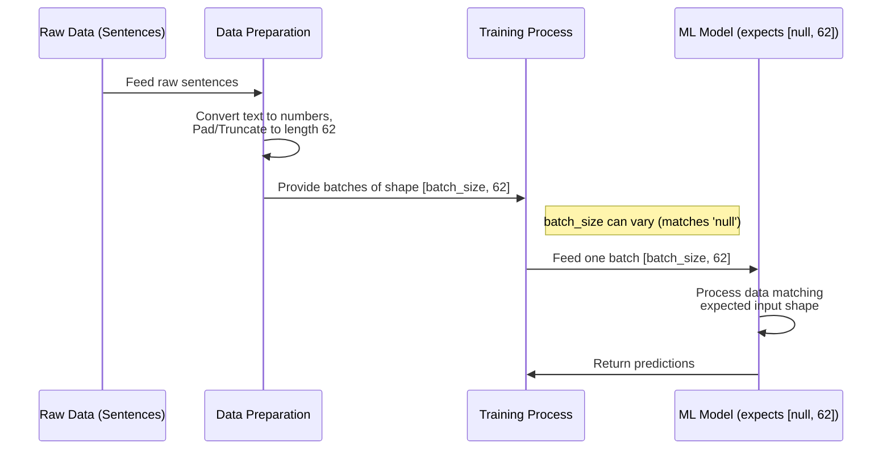

# Chapter 1: What is a Model Input Shape?

Welcome to the `SC4002-Group-Assignment` project tutorial! We're excited to have you here. This is the very first chapter, and we'll start with a fundamental concept in machine learning: the **Model Input Shape**.

## Why Do We Need a Specific Input Shape?

Imagine you have a super-smart machine learning model that can read sentences and tell if they express a positive or negative feeling (this is called sentiment analysis). You want to feed it lots of sentences to learn from.

But here's the catch: the model is like a very specific machine in a factory. It's designed to handle items of a *precise* size and shape. If you try to feed it something differently shaped, the machine might jam or break down.

Our machine learning model is similar. It needs its input data (the sentences, but represented as numbers) to be in a consistent format. This required format is called the **Input Shape**.

Think of it like baking a cake:
*   **Your Data (Ingredients):** The sentences you want to analyze.
*   **The Model (Oven):** The machine learning algorithm that processes the data.
*   **Input Shape (Baking Pan):** A specific size and shape of pan that the ingredients *must* fit into before going into the oven.

If your recipe requires a 9x13 inch pan, you can't just use a tiny cupcake tin or a giant cookie sheet! The ingredients (data) must fit the specified pan (input shape) for the oven (model) to work correctly.

## Understanding `[null, 62]`

In our project, you'll often see the input shape defined as `[null, 62]`. Let's break this down:

*   **It's a list with two dimensions:** This tells us the data should be structured like a table or a grid with rows and columns.
*   **`null` (or `None`):** This is the first dimension. In machine learning, we often process data in groups called "batches". `null` means the model can handle batches of *any size*. One time we might feed it 10 sentences, another time 32, or even just 1. The model is flexible about *how many* sentences it sees at once. (Think: Our oven can bake a variable number of cakes simultaneously).
*   **`62`:** This is the second dimension. It means *every single* piece of data (each sentence, after processing) must have a length of exactly 62 units (e.g., 62 numbers representing words or parts of words). If a sentence is longer, we might trim it. If it's shorter, we might add special "padding" values to make it reach 62. (Think: Each baking pan *must* have a diameter or length of exactly 62).

So, `[null, 62]` means the model expects data in batches, where the number of items per batch can vary (`null`), but each item in the batch must have a fixed length of 62 (`62`).

## Why is Consistency Crucial?

Machine learning models are typically built with layers, like floors in a building. The first layer receives the input data. The output of that layer becomes the input for the next layer, and so on.

Each layer is designed expecting data of a specific shape from the previous one. If the initial input shape isn't consistent, the connections between these layers won't work correctly, and the model will fail. Sticking to the defined `[null, 62]` input shape ensures the data flows smoothly through all the model's layers.

## Where We Define Input Shape: Configuration Files

How does our project know to use `[null, 62]`? We store this information in configuration files. Take a look at these snippets from different experiment "trials" in our project:

--- File: `sentiment_transformer_tuning/trial_00/build_config.json` ---
```json
{"input_shape": [null, 62]}
```

--- File: `sentiment_transformer_tuning/trial_05/build_config.json` ---
```json
{"input_shape": [null, 62]}
```

--- File: `sentiment_transformer_tuning/trial_09/build_config.json` ---
```json
{"input_shape": [null, 62]}
```

These files (`build_config.json`) store settings used to build or train the model for different experiments (called "trials"). Notice that `"input_shape": [null, 62]` is the same in all these examples. This tells us that for these particular experiments, the fundamental structure expected for the input data remained consistent. Even if other settings were changed (like the model's internal complexity, which we'll explore later), the required "entry door" size for the data stayed the same: `[null, 62]`.

## How It Works: From Sentence to Shaped Input

Let's visualize the process using our baking analogy and a simple diagram:

1.  **Raw Data (Ingredients):** You start with raw sentences like "This movie was fantastic!" or "I did not like it."
2.  **Preprocessing (Measuring & Mixing):** These sentences are converted into numbers (a process called tokenization) and then forced into the required length.
    *   "This movie was fantastic!" -> `[101, 2023, 3185, 2001, 12411, 102]` (Maybe length 6) -> Needs padding! -> `[101, 2023, 3185, 2001, 12411, 102, 0, 0, ..., 0]` (Padded to length 62)
    *   A very long sentence -> `[... lots of numbers ...]` (Maybe length 100) -> Needs trimming! -> `[... first 62 numbers ...]` (Trimmed to length 62)
3.  **Shaped Data (Batter in Pan):** The processed numerical sequences, all exactly 62 units long, are grouped into batches. A batch might look like `[[seq1_len62], [seq2_len62], ..., [seq_batchsize_len62]]`. This batch has the shape `[batch_size, 62]`, which matches our required `[null, 62]` (since `batch_size` can vary).
4.  **Model Processing (Baking):** The model takes these batches, one by one, and processes them through its layers.
5.  **Output (Cake!):** The model produces a result, like a sentiment score (e.g., 0.9 for positive, 0.1 for negative).

Here's a diagram showing the flow:



## A Peek Inside: Defining the Shape in Code (Conceptual)

While the `build_config.json` *stores* the shape, the actual enforcement happens when the model is defined in code. Using popular libraries like TensorFlow/Keras, it often looks something like this (this is a simplified, conceptual example):

```python
# Conceptual Python code using TensorFlow/Keras
import tensorflow as tf
from tensorflow import keras

# 1. Define the shape for *one* sequence (batch size is handled automatically)
# We know each sequence must have length 62.
single_input_shape = (62,)

# 2. Use this shape when creating the model's entry point
# This Input layer tells the model what shape to expect for each item.
input_layer = keras.layers.Input(shape=single_input_shape)

# 3. Build the rest of the model...
# ... layers that process sequences of length 62 would follow ...
# Example: output_layer = keras.layers.Dense(1, activation='sigmoid')(input_layer) # Simplified!
# model = keras.Model(inputs=input_layer, outputs=output_layer)

# This 'input_layer' now enforces that data must conform to the shape (None, 62)
# where None represents the flexible batch size.
print(f"Model expects sequences of shape: {single_input_shape}")
# Output: Model expects sequences of shape: (62,)
```

**Explanation:**

1.  We define `single_input_shape` as `(62,)`. This tuple represents the dimensions of *one* input sample (one processed sentence). We only specify the sequence length (62) here.
2.  We create an `Input` layer, which is like the official entrance to our model. We tell it the expected shape of each individual input using `shape=single_input_shape`.
3.  Keras automatically understands that data will come in batches, so effectively, this `Input` layer expects data with the shape `[null, 62]` (or `(None, 62)` in Python terms). Any data fed to the model later during training *must* conform to this shape.

The `build_config.json` files we saw earlier store the value (`[null, 62]`) that would be used to configure this `Input` layer (or equivalent) when the actual model for that trial was constructed.

## Conclusion

You've learned about the Model Input Shape, a crucial concept in machine learning!

*   It defines the **required dimensions** for the data fed into a model.
*   In our project, it's often `[null, 62]`, meaning a **variable number of items per batch (`null`)**, where each item has a **fixed length of 62**.
*   It's like a **baking pan size** – the data (ingredients) must fit the shape (pan) before the model (oven) can process it.
*   This shape is usually defined in configuration files (`build_config.json`) and enforced when building the model, typically in the first layer.
*   **Consistency** is key for the model's internal layers to work together correctly.

Understanding the input shape is the first step. Now that we know the *shape* of the data our model needs, how do we figure out the best *settings* for the model itself (like how complex it should be, or how quickly it should learn)? These settings are called hyperparameters.

In the next chapter, we'll explore the range of possible values for these settings.

Ready to move on? Let's dive into the [Tuning Hyperparameter Space](02_tuning_hyperparameter_space.md).

---

Generated by TEG SINGH TIWANA: [Cloud Assignment 2:Github LLM Codebase Knowledge Building Summarizer using Openai/Gemini/Claud](https://github.com/tej172/cloud_indv_assignments/tree/main/ass_2)