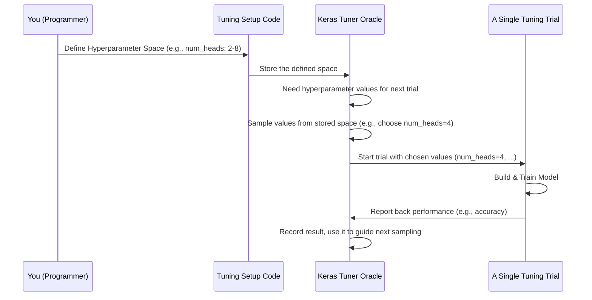

# Chapter 2: Tuning Hyperparameter Space

Hello again! In the [previous chapter](01_model_input_shape.md), we learned about the **Model Input Shape**, which is like defining the exact size of the baking pan our data needs to fit into. We saw that our model needs data in the shape `[null, 62]`.

Now that we know the shape of the *data*, let's think about the *model* itself. Building a good machine learning model often involves some trial and error. There are many "settings" we can adjust, kind of like knobs on a machine, to try and get the best performance. But how do we know which settings to even try? That's where the **Tuning Hyperparameter Space** comes in!

## What's the Problem? Finding the Best Recipe Settings

Imagine you have a fantastic cake recipe, but it's a bit vague. It says "use some eggs," "add sugar," and "bake until done." To get the *perfect* cake, you need more specific instructions, or at least some guidelines on what ranges are sensible. Maybe 2-4 eggs work best, and somewhere between 100g and 200g of sugar is ideal.

Our machine learning models are similar. They have adjustable settings called **hyperparameters**. These are settings that *we* define *before* the model starts learning from the data. They control things like:

*   How complex should the model be? (e.g., number of layers)
*   How quickly should it learn? (e.g., learning rate)
*   How much should it "forget" to avoid memorizing? (e.g., dropout rate)

Finding the *best combination* of these hyperparameters can dramatically improve our model's ability to analyze sentiment correctly. But trying every single possible combination would take forever!

So, we need a way to tell our automatic "tuning" process (which tries different combinations for us) *where* to look. We need to define the **search space** – the sensible range of values for each hyperparameter.

## Defining the Search Boundaries: The Hyperparameter Space

The **Tuning Hyperparameter Space** is exactly that: a definition of the possible range of values for each hyperparameter we want to optimize.

Think back to the cookbook analogy:
*   **Hyperparameter:** An ingredient or setting (e.g., number of eggs, amount of sugar, oven temperature).
*   **Hyperparameter Space:** The section outlining the allowed variations (e.g., "use 2 to 8 eggs", "adjust sugar between 100g and 500g", "bake between 170°C and 190°C").

An automatic tuner will then explore different combinations *within these boundaries* to find the recipe that gives the best results (the best-performing model).

## How We Define the Space in Our Project

In our `SC4002-Group-Assignment` project, we use a tool called Keras Tuner to help us find the best hyperparameters. This tool needs to know the space to search. This information is recorded in a file called `oracle.json` after the tuning process starts. Let's look at a part of that file:

--- File: `sentiment_transformer_tuning/oracle.json` (Relevant Snippet) ---
```json
{
  "hyperparameters": {
    "space": [
      {
        "class_name": "Int",
        "config": {
          "name": "num_heads",       // Name of the hyperparameter
          "min_value": 2,            // Smallest value to try
          "max_value": 8,            // Largest value to try
          "step": 2                  // Increment value (try 2, 4, 6, 8)
        }
      },
      {
        "class_name": "Int",
        "config": {
          "name": "dff",             // Size of an internal layer
          "min_value": 64,
          "max_value": 512,
          "step": 64                 // Try 64, 128, 192, ..., 512
        }
      },
      {
        "class_name": "Int",
        "config": {
          "name": "num_layers",      // How many layers in the model
          "min_value": 1,
          "max_value": 4,
          "step": 1                  // Try 1, 2, 3, 4
        }
      },
      {
        "class_name": "Float",
        "config": {
          "name": "dropout_rate",   // How much regularization
          "min_value": 0.1,
          "max_value": 0.5,
          "step": 0.1                // Try 0.1, 0.2, 0.3, 0.4, 0.5
        }
      },
      {
        "class_name": "Float",
        "config": {
          "name": "learning_rate",  // How fast the model learns
          "min_value": 1e-05,        // 0.00001 (very small)
          "max_value": 0.001,        // 0.001 (relatively larger)
          "sampling": "log"          // Explore smaller values more thoroughly
        }
      }
    ],
    "values": { // Default or best values found so far might be listed here
        "num_heads": 2, "dff": 64, "num_layers": 1, "dropout_rate": 0.1, "learning_rate": 1e-05
    }
  }
  // ... other tuner information ...
}
```

**Let's break this down:**

*   `"hyperparameters"`: This section contains information about the settings we are tuning.
*   `"space"`: This is a list defining the search boundaries for each hyperparameter.
*   **Each item in the list** describes one hyperparameter:
    *   `"name"`: The name we give to this setting (e.g., `num_heads`, `learning_rate`).
    *   `"class_name"`: Tells the tuner if it's an integer (`Int`) or a decimal number (`Float`).
    *   `"config"`: Contains the specific range details:
        *   `"min_value"`: The lowest value the tuner should try.
        *   `"max_value"`: The highest value the tuner should try.
        *   `"step"`: (For `Int` and sometimes `Float`) How much to increase by when trying values (e.g., step 2 means try 2, 4, 6...). If not specified or `null`, the tuner might pick values more freely within the range.
        *   `"sampling"`: (Optional) How the tuner should pick values. `"linear"` means pick uniformly across the range. `"log"` means focus more on smaller values, which is often useful for `learning_rate`.

So, this configuration tells the tuner:
*   Try between 2 and 8 attention heads (`num_heads`), specifically 2, 4, 6, or 8.
*   Try different internal layer sizes (`dff`) from 64 up to 512, in steps of 64.
*   Try models with 1, 2, 3, or 4 layers (`num_layers`).
*   Try dropout rates from 0.1 to 0.5 (like 10% to 50%).
*   Try learning rates between 0.00001 and 0.001, paying closer attention to the smaller end of this range.

The tuner will then intelligently pick combinations from these allowed ranges (e.g., maybe `num_heads=4`, `dff=128`, `num_layers=2`, `dropout_rate=0.2`, `learning_rate=0.0001`) and test how well the resulting model performs.

## Under the Hood: How the Tuner Uses This Space

Defining the space is like giving instructions to the Keras Tuner. Here's a simplified view of what happens:

1.  **You (the programmer)** define this hyperparameter space in your Python code when setting up the tuning process.
2.  **The Tuner** (specifically, a component called the [Keras Tuner Oracle](05_keras_tuner_oracle.md)) reads and remembers this space definition.
3.  **When it's time to run a test (a "trial")**: The Oracle consults the defined space.
4.  **Sampling**: It picks a *specific value* for each hyperparameter from within its allowed range (e.g., it picks `num_heads=6`, `dff=256`, etc.).
5.  **Trial Execution**: A model is built and trained using exactly these chosen hyperparameter values. We'll learn more about this in [Tuning Trial Configuration & State](06_tuning_trial_configuration___state.md).
6.  **Feedback**: The performance of this trial is recorded. The Oracle uses this feedback to decide which combination to try next, aiming to find the best one within the defined space.

Here's a diagram showing this flow:



## Defining the Space in Code (Conceptual Example)

While `oracle.json` *records* the space, the actual definition happens in Python code, often inside a function that builds the model. Here's a simplified conceptual example using Keras Tuner's `hp` object:

```python
# Conceptual Python code using Keras Tuner
# (This would typically be inside a function the tuner calls)
import keras_tuner as kt

# Assume 'hp' is a HyperParameters object provided by the tuner
# We use it to define the search space for each parameter

# Define the search space for 'num_heads'
num_heads = hp.Int("num_heads",           # Give it a name
                   min_value=2,           # Minimum value
                   max_value=8,           # Maximum value
                   step=2)                # Step size

# Define the search space for 'learning_rate'
learning_rate = hp.Float("learning_rate", # Give it a name
                         min_value=1e-5,  # Minimum value (0.00001)
                         max_value=1e-3,  # Maximum value (0.001)
                         sampling="log")  # Use logarithmic sampling

# Now, these variables (num_heads, learning_rate) hold values
# sampled by the tuner for the current trial.
# We would use them when building the actual model layers.
print(f"This trial uses num_heads: {num_heads}")
print(f"This trial uses learning_rate: {learning_rate}")

# ... code to build the model using these specific values ...
# Example (conceptual):
# model_layer = SomeTransformerLayer(num_heads=num_heads, ...)
# optimizer = tf.keras.optimizers.Adam(learning_rate=learning_rate)
# ...
```

**Explanation:**

1.  We import `keras_tuner`.
2.  The tuner provides an object (conventionally named `hp`) that has methods like `hp.Int` and `hp.Float`.
3.  We call these methods to define each hyperparameter's search space:
    *   `hp.Int("num_heads", min_value=2, max_value=8, step=2)` defines an integer hyperparameter named "num_heads" that the tuner should search within the range [2, 4, 6, 8].
    *   `hp.Float("learning_rate", min_value=1e-5, max_value=1e-3, sampling="log")` defines a float hyperparameter named "learning_rate" to be searched between 0.00001 and 0.001, using log sampling.
4.  When the tuner runs a specific trial, it replaces these definitions with actual sampled values (like `num_heads` might become `4` for one trial, and `6` for another).
5.  This code tells the tuner *what ranges are allowed*. The tuner then takes care of picking specific values for each trial and records the space definition (similar to what we saw in `oracle.json`).

## Conclusion

You've now learned about the **Tuning Hyperparameter Space**!

*   It defines the **allowed range of values** for each setting (hyperparameter) we want to optimize in our model.
*   It's like the **variation guidelines** in a recipe (e.g., "2-8 eggs", "100g-500g sugar").
*   We define this space to guide the **automatic tuning process** (like Keras Tuner).
*   The tuner explores combinations *only within these boundaries* to find the best model configuration.
*   This definition is typically done in Python code using the tuner's tools (like `hp.Int`, `hp.Float`) and recorded in files like `oracle.json`.

We've defined the shape of our data ([Model Input Shape](01_model_input_shape.md)) and the search space for our tunable model settings (Hyperparameter Space). But are there any settings that we *don't* want to tune, settings that should remain fixed during the experiments?

In the next chapter, we'll look at [Training Constants](03_training_constants.md), which are the fixed parameters used during our model training and tuning process.

---

Generated by TEG SINGH TIWANA: [Cloud Assignment 2:Github LLM Codebase Knowledge Building Summarizer using Openai/Gemini/Claud](https://github.com/tej172/cloud_indv_assignments/tree/main/ass_2)