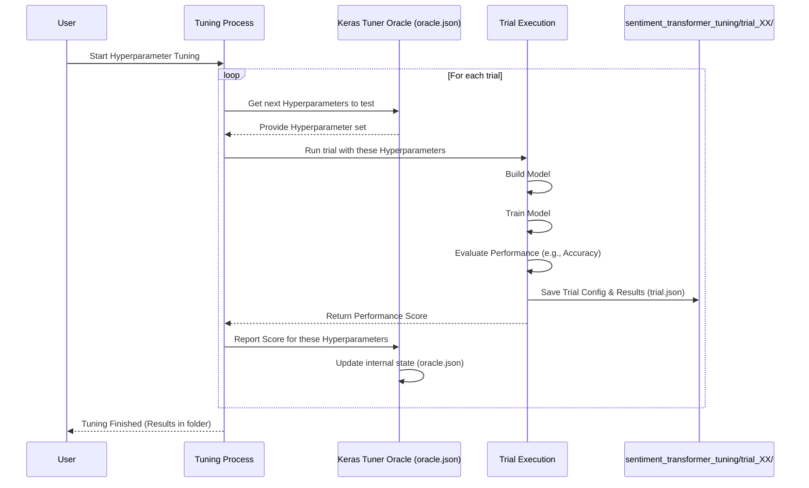

# Chapter 4: Hyperparameter Tuning Setup

Hi there! In the [previous chapter](03_training_constants.md), we learned about **Training Constants** – the fixed settings like `BATCH_SIZE` that act as our standard tools. We now have:

1.  The required data format: [Model Input Shape](01_model_input_shape.md) (`[null, 62]`).
2.  The range of experimental settings: [Tuning Hyperparameter Space](02_tuning_hyperparameter_space.md) (e.g., how many layers, learning rate).
3.  The standard, fixed settings: [Training Constants](03_training_constants.md) (e.g., batch size).

Now, how do we actually put all this together and *start the experiments* to find the best combination of hyperparameters? We need a system, a setup, to manage this process automatically. That's what this chapter is about!

## The Problem: Running Many Experiments Systematically

Imagine you're determined to bake the absolute best chocolate cake. You have a basic recipe, but you know you can improve it by tweaking things like the amount of sugar, the number of eggs, or the baking time (these are like our hyperparameters).

Trying just one variation isn't enough. You need to:
*   Try *many* different combinations (recipes).
*   Keep track of exactly what you did for each cake (which recipe variation).
*   Record how well each cake turned out (taste test!).
*   Compare the results to find the winning recipe.

Doing this manually would be slow and messy. You need an organized *setup* for your baking experiments – maybe a dedicated corner of the kitchen, a notebook for results, and a clear plan.

Similarly, finding the best settings for our sentiment analysis model requires running many training experiments with different hyperparameter combinations. We need an organized way to manage these experiments, track their configurations, and store their results. This organized system is our **Hyperparameter Tuning Setup**.

## What is the Hyperparameter Tuning Setup?

The **Hyperparameter Tuning Setup** is the overall **process and infrastructure** we use to automatically:

1.  Define the experiments we want to run (using the [Tuning Hyperparameter Space](02_tuning_hyperparameter_space.md)).
2.  Execute each experiment (called a "trial"). Each trial builds and trains a model with a specific set of hyperparameters.
3.  Keep track of the hyperparameters used in each trial.
4.  Record the performance (e.g., accuracy) of the model from each trial.
5.  Organize all this information so we can later identify the best hyperparameters found.

Think of it as setting up your **experimental kitchen** for finding the best cake recipe:

*   **The Kitchen Space:** A dedicated place where all the experiments happen. In our project, this is the `sentiment_transformer_tuning` folder.
*   **The Master Recipe Book:** A central place defining the range of ingredients to try ([Tuning Hyperparameter Space](02_tuning_hyperparameter_space.md)) and tracking the overall progress ([Keras Tuner Oracle](05_keras_tuner_oracle.md)).
*   **Individual Recipe Cards & Notes:** For each specific cake baked (each trial), a record of the exact recipe used and how it turned out ([Tuning Trial Configuration & State](06_tuning_trial_configuration___state.md)).

## Our Experimental Kitchen: The `sentiment_transformer_tuning` Folder

In our project, the main place where all the tuning experiments happen and their results are stored is a folder named `sentiment_transformer_tuning`.

Let's peek at its structure and purpose:

```
sentiment_transformer_tuning/
├── README.md                    # A note about this folder
├── oracle.json                  # The 'master plan' / tuner's brain state
├── tuner0.json                  # Tuner configuration status (often empty or minimal)
├── trial_00/                    # Results & config for the 1st experiment
│   ├── build_config.json        # Input shape used for this trial
│   ├── trial.json               # Details of this specific trial (hyperparameters, score)
│   └── ... (other files like model checkpoints)
├── trial_01/                    # Results & config for the 2nd experiment
│   ├── build_config.json
│   ├── trial.json
│   └── ...
├── trial_02/
...
└── trial_09/                    # Results & config for the 10th experiment
    ├── build_config.json
    ├── trial.json
    └── ...
```

**Explanation:**

*   **`sentiment_transformer_tuning/`**: This is the main directory for our tuning process. Think of it as the logbook for our recipe experiments. The `README.md` inside just gives a brief description.
    --- File: `sentiment_transformer_tuning/README.md` ---
    ```
    This folder contains trials 1-10 for sentiment transformer tuning, produced on 28/10/2024. This folder is merely used to store these intermediary files 
    ```
*   **`oracle.json`**: This is a crucial file managed by the tuning tool (Keras Tuner). It stores the overall state of the tuning process, including the [Tuning Hyperparameter Space](02_tuning_hyperparameter_space.md) we defined, which trials have been run, and maybe the best results found so far. We'll dive deeper into this in the next chapter: [Keras Tuner Oracle](05_keras_tuner_oracle.md).
*   **`tuner0.json`**: Stores some internal state for the tuner itself. For beginners, it's less important than `oracle.json`.
*   **`trial_XX/` folders**: Each folder represents *one complete experiment* (one "trial") testing a specific combination of hyperparameters.
    *   Inside each `trial_XX` folder, files like `trial.json` store the specific hyperparameter values used for *that trial* and the resulting performance score. Other files might store the trained model weights or configuration details like the input shape (`build_config.json`). We'll explore these in more detail in [Tuning Trial Configuration & State](06_tuning_trial_configuration___state.md).

This folder structure is automatically created and managed by the hyperparameter tuning tool (like Keras Tuner) when we run the tuning script. It provides a clean and organized way to store the results of potentially hundreds of experiments.

## How the Tuning Setup Works (The Big Picture)

Imagine you start the automatic tuning process (usually by running a Python script, which we won't detail here). Here’s a simplified step-by-step flow:

1.  **Start:** You initiate the tuning process.
2.  **Ask Oracle:** The system asks the [Keras Tuner Oracle](05_keras_tuner_oracle.md) (using the info in `oracle.json`) for the next set of hyperparameters to try, based on the defined [Tuning Hyperparameter Space](02_tuning_hyperparameter_space.md) and past results.
3.  **Run Trial:** A new trial (e.g., `trial_10`) is started:
    *   A model is built using the specific hyperparameters suggested by the Oracle.
    *   The model is trained using the data, respecting the [Model Input Shape](01_model_input_shape.md) and using [Training Constants](03_training_constants.md) where needed.
    *   The model's performance is evaluated (e.g., accuracy is measured).
4.  **Save Results:** The hyperparameters used, the final performance score, and other relevant information for this trial are saved inside the corresponding `trial_XX` folder (e.g., in `sentiment_transformer_tuning/trial_10/trial.json`).
5.  **Update Oracle:** The performance result is reported back to the Oracle, which updates its state in `oracle.json`. This helps it make better decisions about which hyperparameters to try next.
6.  **Repeat:** Steps 2-5 are repeated for a predefined number of trials or until a certain condition is met.
7.  **Finish:** Once done, you can examine the `oracle.json` file or the `trial_XX` folders (especially their `trial.json` files) to find the trial that achieved the best performance and the hyperparameters that led to it.

Here's a diagram illustrating this flow:



This whole setup allows us to systematically explore different model configurations without manual intervention, saving time and effort while increasing the chances of finding a high-performing model.

## Conclusion

You've now learned about the **Hyperparameter Tuning Setup**:

*   It's the **overall process and infrastructure** for automatically finding the best model settings (hyperparameters).
*   It involves running multiple **trials** (experiments), each testing a different hyperparameter combination.
*   It's like setting up an **experimental kitchen** to systematically test many cake recipes.
*   In our project, the results and state are primarily stored in the **`sentiment_transformer_tuning` folder**.
*   This folder contains the **`oracle.json`** file (the master plan) and individual **`trial_XX` folders** (results of each specific experiment).
*   This setup automates the search, organizes results, and helps us find the best-performing model configuration.

Now that we understand the overall structure, let's zoom in on the "brain" of this operation – the component that decides which hyperparameters to try next.

Ready to meet the mastermind? Let's explore the [Keras Tuner Oracle](05_keras_tuner_oracle.md) in the next chapter!

---

Generated by TEG SINGH TIWANA: [Cloud Assignment 2:Github LLM Codebase Knowledge Building Summarizer using Openai/Gemini/Claud](https://github.com/tej172/cloud_indv_assignments/tree/main/ass_2)