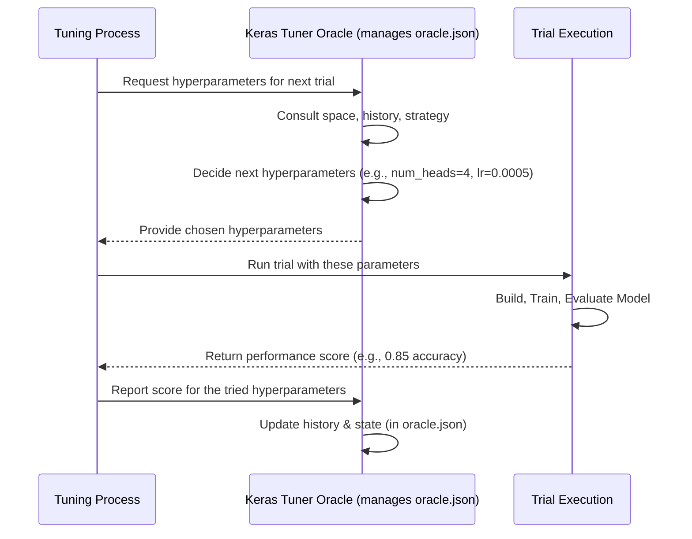

# Chapter 5: Keras Tuner Oracle

Welcome back! In the [previous chapter](04_hyperparameter_tuning_setup.md), we learned about the overall **Hyperparameter Tuning Setup** – our organized "experimental kitchen" (`sentiment_transformer_tuning/` folder) for automatically running many model training experiments (trials) to find the best settings. We saw that this setup involves asking for hyperparameter combinations, running trials, and recording results.

But who decides *which* combination of hyperparameters to try next? And who keeps track of all the experiments and their outcomes? That's the job of the **Keras Tuner Oracle**!

## The Problem: Who's Directing the Experiments?

Imagine you're in your experimental kitchen, ready to bake dozens of cakes to find the perfect recipe. You've defined the possible ranges for your ingredients ([Tuning Hyperparameter Space](02_tuning_hyperparameter_space.md)): 2-8 eggs, 100g-500g sugar, etc.

You *could* just randomly pick values from these ranges for each cake. But maybe there's a smarter way? Perhaps after baking a few cakes, you notice that cakes with more sugar tend to taste better. Shouldn't your next experiments focus more on the higher end of the sugar range?

You need a **director** or a **head chef** for your experiments. Someone (or something!) that:

1.  Knows the allowed ingredient ranges (the hyperparameter space).
2.  Decides the *exact* recipe (hyperparameter combination) for the *next* cake (trial).
3.  Keeps a detailed logbook of every recipe tried and how well the cake turned out (the performance score).
4.  Uses this information (and possibly a clever strategy) to guide future experiments towards better recipes.

This "director" role in Keras Tuner is filled by the **Oracle**.

## What is the Keras Tuner Oracle?

The **Keras Tuner Oracle** is the central component that **manages the hyperparameter search process**. It's the "brain" behind the tuning operation within the Keras Tuner library.

Think of it as the **Head Chef** in our experimental kitchen:

*   **Knows the Recipe Boundaries:** It holds the definition of the [Tuning Hyperparameter Space](02_tuning_hyperparameter_space.md).
*   **Keeps the Master Logbook:** It tracks which hyperparameter combinations have been tried (`tried_so_far`), the results (scores) of those trials, and the overall state of the search.
*   **Plans the Next Experiment:** Based on a defined strategy (like random search, or more advanced methods), it decides which specific combination of hyperparameters should be tested in the next trial.

The Oracle ensures that the search is conducted systematically and efficiently, guiding the process towards finding the best possible hyperparameters within the defined space.

## The Oracle's Logbook: Peeking Inside `oracle.json`

The Oracle needs to store its knowledge and the history of the search somewhere. In our project setup ([Chapter 4](04_hyperparameter_tuning_setup.md)), this information is primarily stored in the `sentiment_transformer_tuning/oracle.json` file. This file acts as the Oracle's master logbook and state tracker.

Let's look at some key parts of this file (we saw the full file in Chapter 4, here are the highlights):

--- File: `sentiment_transformer_tuning/oracle.json` (Simplified Snippet) ---
```json
{
  "hyperparameters": { // Section about the settings being tuned
    "space": [ // The allowed ranges (defined in Chapter 2)
      // ... definitions for num_heads, dff, num_layers, etc. ...
    ]
  },
  "tried_so_far": [ // A list representing unique recipes already tried
    "198210495baf2451b73e907a02b1546c", // Hash representing one combo
    "c4be04584b5ae928a62b872b508505ad", // Another unique combo
    // ... more hashes ...
    "29c605d5e8a77f9296610df81f15c87c"
  ],
  "id_to_hash": { // Maps trial IDs (like folder names) to the recipe hash
    "00": "29c605d5e8a77f9296610df81f15c87c",
    "01": "b0d65a09e62a5f5927ee1a53ac7d0e1a",
    // ... mapping for all trials (00 to 09) ...
    "09": "69e1b9791653b9499f6986d32cdc9cb0"
  },
  "seed": 2999, // Starting point for random number generation
  "seed_state": 3049, // Current state of random generation
  // ... other details like trial start/end times ...
}
```

**What this tells us about the Oracle:**

*   **It knows the rules:** The `"hyperparameters"` section shows the Oracle has stored the [Tuning Hyperparameter Space](02_tuning_hyperparameter_space.md) we defined – the allowed ranges for each setting.
*   **It remembers the past:** The `"tried_so_far"` list contains unique identifiers (hashes) for each hyperparameter combination that has already been tested. This prevents the Oracle from trying the exact same recipe twice (unless intended). Like the chef crossing off recipes in the logbook.
*   **It connects trials to recipes:** The `"id_to_hash"` dictionary links the trial number (like `00`, `01`) to the specific recipe (hash) used in that trial. This helps organize the results.
*   **It manages randomness:** The `"seed"` and `"seed_state"` relate to how the Oracle uses random numbers (important for strategies like Random Search or breaking ties). Using seeds helps make experiments reproducible.

This `oracle.json` file essentially captures the Oracle's memory and current understanding of the search process.

## How the Oracle Decides: The Strategy

Okay, the Oracle remembers the past, but how does it decide what to try *next*? This depends on the **type** of Oracle being used, which corresponds to a specific search strategy.

Common strategies (types of Oracles) include:

1.  **Random Search:** The Oracle simply picks the next hyperparameter combination randomly from the allowed space. It's like the chef randomly choosing ingredient amounts within the defined ranges for each cake. This is simple and surprisingly effective sometimes. The `oracle.json` we looked at likely came from a Random Search, as it explores different combinations without a clear pattern based only on the hashes shown.
2.  **Bayesian Optimization:** A more advanced strategy. The Oracle builds a statistical model based on the results of previous trials. It uses this model to predict which *untried* combinations are most likely to yield good results. It tries to balance exploring new areas of the search space with exploiting areas that have already shown promise. Like the chef noticing that 3-egg cakes were good, and deciding to try 4 eggs next, based on that trend.
3.  **Hyperband:** Another clever strategy that tries many combinations quickly with limited resources (e.g., training for fewer epochs initially) and then dedicates more resources to the most promising ones.

The choice of which Oracle (and thus strategy) to use is made when you set up the tuner in your Python code. The Oracle then implements that strategy, using the information in `oracle.json` to guide its decisions.

## How it Works Under the Hood

Let's visualize the Oracle's role in the tuning loop:

1.  The main tuning process needs parameters for a new trial.
2.  It asks the Oracle.
3.  The Oracle consults its internal state (strategy, history from `oracle.json`, defined space).
4.  It decides on a new set of hyperparameters.
5.  It gives these back to the tuning process.
6.  The trial runs with these parameters.
7.  The tuning process reports the final score (e.g., accuracy) back to the Oracle.
8.  The Oracle updates its state (`oracle.json`) with the results of this trial.

Here's a simplified diagram:



## Using the Oracle (Implicitly)

As a beginner, you usually don't interact with the Oracle object directly *while* the tuning is running. You interact with it primarily during the initial **setup**:

```python
# Conceptual Python code for setting up a Tuner with an Oracle

import keras_tuner as kt
import tensorflow as tf # Just for context

# Assume build_model is a function that defines your model
# and uses hp.Int, hp.Float etc. to define the search space
# (as shown in Chapter 2)
# def build_model(hp):
#   ... define model using hp ...
#   return model

# 1. CHOOSE the Oracle/Strategy: Here we choose RandomSearch
tuner = kt.RandomSearch(
    hypermodel=build_model,           # Function that builds the model
    objective="val_accuracy",        # What score to maximize
    max_trials=10,                   # How many different combinations to try
    executions_per_trial=1,          # How many times to train each combination
    directory="sentiment_transformer_tuning", # Where to store results (incl. oracle.json)
    project_name="my_first_tuning"   # Subfolder within the directory
)

# 2. START the search (The Tuner uses the Oracle internally)
# tuner.search(train_data, epochs=5, validation_data=val_data)
# ... The Oracle manages things behind the scenes during search ...

print("Tuning setup complete. The Oracle will manage the search.")
# When tuner.search() runs, the RandomSearch Oracle inside the 'tuner'
# object will be consulted repeatedly.
```

**Explanation:**

1.  We choose `kt.RandomSearch`. This creates a Tuner that *contains* a `RandomSearchOracle`. If we wanted Bayesian Optimization, we'd use `kt.BayesianOptimization(...)`.
2.  We configure the Tuner, telling it which function defines our model and search space (`build_model`), what metric to optimize (`val_accuracy`), how many trials to run (`max_trials`), and where to save the results (`directory`).
3.  When we would call `tuner.search(...)` (commented out here), the Tuner object takes over. It repeatedly asks its internal Oracle for hyperparameters, runs the trial, and reports back the score, all automatically. The `oracle.json` file is created and updated within the specified `directory`.

So, you choose the *type* of Oracle by choosing the type of Tuner, and the framework handles the rest!

## Conclusion

You've now met the **Keras Tuner Oracle**, the mastermind behind hyperparameter tuning!

*   It's the **central component managing the search**, like the head chef directing recipe experiments.
*   It **knows the hyperparameter space**, **tracks tried combinations** and their **results**, and **decides which parameters to try next**.
*   Its state and history are stored in the **`oracle.json`** file.
*   The **strategy** it uses (e.g., Random Search, Bayesian Optimization) depends on the type of Oracle/Tuner you choose during setup.
*   It works behind the scenes during the `tuner.search()` process to guide the experiments intelligently.

The Oracle manages the overall search, but what information is stored for each *individual* experiment or "trial" that it launches?

Let's dive into the details of each specific experiment in the next chapter: [Tuning Trial Configuration & State](06_tuning_trial_configuration___state.md).

---

Generated by TEG SINGH TIWANA: [Cloud Assignment 2:Github LLM Codebase Knowledge Building Summarizer using Openai/Gemini/Claud](https://github.com/tej172/cloud_indv_assignments/tree/main/ass_2)