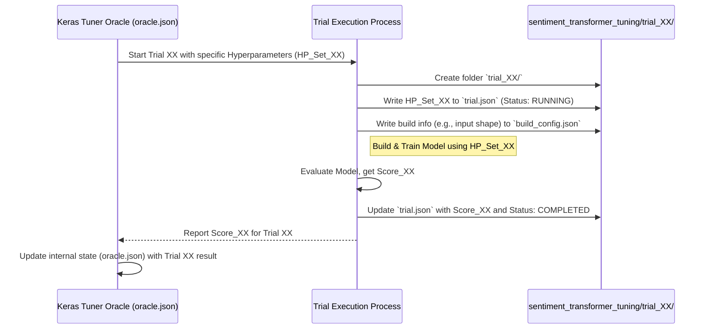

# Chapter 6: Tuning Trial Configuration & State

Hello again! In the [previous chapter](05_keras_tuner_oracle.md), we met the **Keras Tuner Oracle**, the "Head Chef" or "director" that manages our hyperparameter tuning experiments. The Oracle decides *which* combinations of settings (hyperparameters) to try next and keeps track of the overall progress in its master logbook (`oracle.json`).

But what about the detailed records for each *individual* experiment? When our Head Chef decides to try baking a specific cake (say, Cake #5 with 3 eggs, 200g sugar, baked for 35 minutes), we need a dedicated place to write down *that specific recipe* and *exactly how that cake turned out*. Where do we store the notes for each single attempt?

That's where the concept of **Tuning Trial Configuration & State** comes in!

## The Problem: Keeping Track of Each Experiment's Details

The [Keras Tuner Oracle](05_keras_tuner_oracle.md) gives us the big picture – which recipes have been tried (`tried_so_far` in `oracle.json`), the overall search space, and maybe the best score found so far. But if we want to know the *exact* settings used for Trial #3, or the specific accuracy achieved by Trial #7, we need to look at the records for those individual trials.

We need a system to store:
*   The **configuration** used for each trial (the specific hyperparameter values).
*   The **state** of each trial (Did it start? Did it finish? What was the result?).

## What is a "Trial" in Hyperparameter Tuning?

A **Trial** represents **one single experiment run** within the larger hyperparameter tuning process.

Think back to our baking analogy:
*   **Hyperparameter Tuning Process:** The entire project of baking dozens of cakes to find the best recipe.
*   **Trial:** Baking *one specific cake* using *one specific recipe variation* chosen by the Head Chef (the Oracle).

Each trial involves:
1.  Getting a specific set of hyperparameter values from the [Keras Tuner Oracle](05_keras_tuner_oracle.md).
2.  Building a machine learning model using *exactly* those hyperparameters.
3.  Training the model on our data.
4.  Evaluating its performance (e.g., measuring its accuracy).
5.  Saving the details: which hyperparameters were used, and what the final score was.

## The Trial's Notebook: `trial_XX/` Folders

Remember the `sentiment_transformer_tuning/` folder we saw in [Chapter 4: Hyperparameter Tuning Setup](04_hyperparameter_tuning_setup.md)? Inside that main folder, we find several subfolders named `trial_00/`, `trial_01/`, `trial_02/`, and so on.

```
sentiment_transformer_tuning/
├── oracle.json                  # The Oracle's master logbook
├── ... (other top-level files)
├── trial_00/                    # <--- Notebook page for Trial 0
│   ├── build_config.json
│   ├── trial.json
│   └── ...
├── trial_01/                    # <--- Notebook page for Trial 1
│   ├── build_config.json
│   ├── trial.json
│   └── ...
...
└── trial_09/                    # <--- Notebook page for Trial 9
    ├── build_config.json
    ├── trial.json
    └── ...
```

Each `trial_XX` folder is like a **dedicated page or section in our baking logbook** for one specific cake attempt. It contains all the important notes and results for that particular trial.

## Inside the Trial Notebook: Key Files

Let's open one of these trial folders, say `trial_05/`, and look at the most important files inside.

### 1. `trial.json`: The Recipe Card and Result

This is the most crucial file within a trial folder. It stores the core information about this specific experiment: the exact configuration used and the outcome.

--- File: `sentiment_transformer_tuning/trial_05/trial.json` (Conceptual Example Structure) ---
```json
{
  "trial_id": "05", // Unique ID for this trial
  "hyperparameters": {
    "space": [ // Repeats the search space definition
      // ... space definition ...
    ],
    "values": { // <-- THE IMPORTANT PART! Specific values used in THIS trial
      "num_heads": 6,
      "dff": 256,
      "num_layers": 3,
      "dropout_rate": 0.3,
      "learning_rate": 0.00015 // Example values chosen by the Oracle for trial 05
    }
  },
  "score": 0.885, // The performance metric (e.g., validation accuracy) achieved
  "best_step": 4, // Which training step/epoch gave the best score
  "status": "COMPLETED" // State of the trial (e.g., RUNNING, COMPLETED, FAILED)
}
```

**Explanation:**

*   `"trial_id"`: Matches the folder name ("05").
*   `"hyperparameters"`:
    *   `"space"`: Often repeats the overall search space definition (for completeness).
    *   `"values"`: This is key! It shows the **exact hyperparameter values** that the [Keras Tuner Oracle](05_keras_tuner_oracle.md) selected *for this specific trial*. Think of this as the precise recipe used for Cake #5.
*   `"score"`: The final evaluation score obtained by the model trained in this trial. This is the "taste test" result for Cake #5.
*   `"status"`: Tells us if the trial finished successfully (`COMPLETED`), is still running (`RUNNING`), or encountered an error (`FAILED`).

This `trial.json` file gives you a complete snapshot of what happened in one specific experiment.

### 2. `build_config.json`: Confirming the Setup

This file often stores configuration details that were fixed when the model for this trial was *built*, rather than settings that were tuned. A common example we've already seen is the [Model Input Shape](01_model_input_shape.md).

--- File: `sentiment_transformer_tuning/trial_05/build_config.json` ---
```json
{"input_shape": [null, 62]}
```

**Explanation:**

*   This file confirms that for Trial #05, the model was built expecting the standard input shape `[null, 62]`, as discussed in [Chapter 1](01_model_input_shape.md).
*   You'll notice this file is often identical across many `trial_XX` folders (like the snippets provided show for trials 00 through 09). This indicates that the input shape was a constant part of the setup for all these trials, not something being tuned.
*   Analogy: This file is like a note confirming we used the standard 9x13 inch baking pan for Cake #5, just like we did for Cakes #0 through #9.

### Other Files

You might sometimes find other files inside a `trial_XX` folder, such as:
*   `checkpoints/`: Saved versions (weights) of the model trained during this trial.
*   `logs/`: Detailed logs from the training process.

For understanding the **configuration and state**, `trial.json` and `build_config.json` are usually the most important.

## Connecting the Oracle and the Trials

How do the Oracle's master logbook (`oracle.json`) and the individual trial notebooks (`trial_XX/trial.json`) relate to each other?

1.  **Oracle Decides:** The [Keras Tuner Oracle](05_keras_tuner_oracle.md) picks a set of hyperparameters (a specific recipe) based on its strategy and history (`oracle.json`).
2.  **Trial Starts:** A new trial folder (e.g., `trial_10/`) is created. The chosen hyperparameters are recorded in `trial_10/trial.json` with status `RUNNING`. The Oracle also notes the start time in `oracle.json`.
3.  **Trial Runs:** The model is built (using fixed settings like `input_shape` recorded in `build_config.json`) and trained using the specific hyperparameters from `trial_10/trial.json`.
4.  **Trial Ends:** The performance score is measured. This score, along with the final status (`COMPLETED`), is saved in `trial_10/trial.json`.
5.  **Report Back:** The score is reported back to the Oracle, which updates its master logbook (`oracle.json`) to include this result, helping it decide future trials.

Here's a diagram showing this flow:



## How Are Trial Folders Created?

You don't need to create these `trial_XX` folders or the JSON files inside them manually! The Keras Tuner framework does this automatically for you when you run the tuning process (typically initiated by a `tuner.search(...)` command in your Python script).

For each trial the Oracle decides to run, the tuner framework handles:
*   Creating the `trial_XX` directory.
*   Populating `trial.json` with the chosen hyperparameters and initial status.
*   Running your model-building function (which might save `build_config.json`).
*   Executing the training and evaluation.
*   Updating `trial.json` with the final score and status.

It's all part of the automated **Hyperparameter Tuning Setup** we discussed in [Chapter 4](04_hyperparameter_tuning_setup.md).

## Conclusion

In this chapter, we zoomed in on the individual experiments within hyperparameter tuning: the **Trials**.

*   A **Trial** is a single run testing one specific combination of hyperparameters chosen by the [Keras Tuner Oracle](05_keras_tuner_oracle.md).
*   It's like baking **one specific cake** with **one specific recipe variation**.
*   The details of each trial – its **configuration** (hyperparameters used) and **state** (status, score) – are stored in dedicated **`trial_XX` folders**.
*   The key file inside is **`trial.json`**, acting as the "recipe card and result note" for that trial.
*   **`build_config.json`** often stores fixed build-time settings like the [Model Input Shape](01_model_input_shape.md).
*   These trial-specific records complement the Oracle's overall view and allow us to analyze each experiment individually.

We've now covered the core concepts of our tuning process: the data shape, the search space, constants, the overall setup, the Oracle director, and the individual trial records. Before you can run this project yourself, there's one last piece: knowing what software tools and libraries you need installed.

Let's move on to the final chapter: [Project Dependencies](07_project_dependencies.md).

---

Generated by TEG SINGH TIWANA: [Cloud Assignment 2:Github LLM Codebase Knowledge Building Summarizer using Openai/Gemini/Claud](https://github.com/tej172/cloud_indv_assignments/tree/main/ass_2)