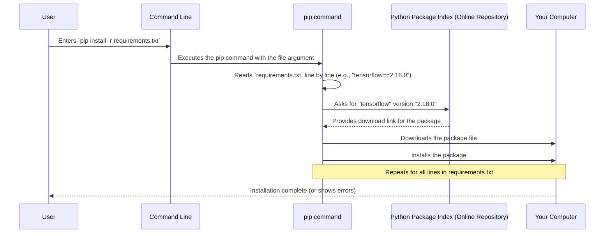

# Chapter 7: Project Dependencies

Welcome to the final chapter of our `SC4002-Group-Assignment` tutorial! In the [previous chapter](06_tuning_trial_configuration___state.md), we looked closely at individual **Tuning Trials**, understanding how the configuration and results of each specific experiment are stored in the `trial_XX` folders. We've covered how data is shaped, how hyperparameters are tuned, and how results are tracked.

Now, imagine you've just downloaded this project onto your computer, eager to run it. You try to execute the code, but... errors pop up everywhere! It complains about missing tools like "TensorFlow" or "NLTK". Why is this happening? It's because your computer doesn't yet have all the necessary "appliances" and "ingredients" (software libraries) required to run the project's "recipe" (the code). How do we make sure everyone has the exact same set of tools? That's where **Project Dependencies** come in.

## The Problem: Missing Tools in Your Kitchen

Think of our project's code as a complex recipe for baking a cake (analyzing sentiment). This recipe relies on specific kitchen tools and appliances:

*   A powerful mixer (like **TensorFlow** for machine learning calculations)
*   A specific brand of food processor (like **Keras Tuner** for hyperparameter optimization)
*   A set of specialized measuring spoons (like **NLTK** for text processing)
*   Even specific brands of flour or sugar (particular versions of these libraries)

If you try to follow the recipe, but your kitchen is missing the mixer, or you have a different brand of food processor that works slightly differently, the cake might not turn out right, or you might not be able to bake it at all!

Similarly, our Python code relies on many external software packages (libraries) written by other developers. To run our project, you need to have these libraries installed on your computer, and often, you need *specific versions* of them to ensure everything works together correctly. If you have the wrong version, or a library is missing, the code will fail.

How can we easily list all the required tools and their exact models (versions) so that anyone can set up their "kitchen" correctly?

## What are Project Dependencies?

**Project Dependencies** are the collection of external software libraries and tools that our project's code needs to function. They are "dependencies" because our code *depends* on them – it can't run without them.

To manage these dependencies, we typically use a simple text file, often named `requirements.txt`. This file acts like a shopping list for your kitchen setup:

*   It lists every essential "tool" (library) needed.
*   It specifies the exact "model number" (version) for each tool.

Why specific versions? Sometimes, newer versions of a library might change how things work, potentially breaking our code (like a new mixer model having different speed settings). Listing exact versions ensures that everyone running the project uses the *exact same set* of compatible tools, making the results reproducible and avoiding unexpected errors.

## Our Project's Shopping List: `requirements.txt`

In our `SC4002-Group-Assignment` project, you'll find a file named `requirements.txt`. This file lists all the external Python packages required. Let's look at a small part of it:

--- File: `requirements.txt` (Snippet) ---
```txt
# Core ML libraries
tensorflow==2.18.0
keras==3.6.0
keras-tuner==1.4.7

# Data handling and text processing
nltk==3.9.1
pandas==2.2.3
datasets==3.1.0
numpy==1.26.4

# Utilities and support libraries
huggingface-hub==0.26.2
tqdm==4.67.0
requests==2.32.3
# ... many more lines ...
```

**Explanation:**

*   Each line specifies one required library.
*   The format is typically `library_name==version_number`.
    *   `tensorflow==2.18.0`: This means our project requires the TensorFlow library, specifically version 2.18.0.
    *   `nltk==3.9.1`: Requires the Natural Language Toolkit (NLTK) version 3.9.1.
    *   `keras-tuner==1.4.7`: Requires the Keras Tuner library (which manages the [Keras Tuner Oracle](05_keras_tuner_oracle.md) and [Tuning Trial Configuration & State](06_tuning_trial_configuration___state.md)) version 1.4.7.
*   Lines starting with `#` are comments and are ignored.
*   Sometimes you might see `>=` (greater than or equal to) or `<` (less than), but using `==` (exactly equal to) provides the highest level of reproducibility.

This file is the definitive list of everything you need to install *after* you have Python itself set up.

## How to Install the Dependencies

Okay, you have the shopping list (`requirements.txt`). How do you actually get all these tools into your kitchen (install the libraries on your computer)? Python comes with a package manager called `pip` that can read this file and install everything automatically.

You typically run this command in your terminal or command prompt, making sure you are in the main directory of the project where `requirements.txt` is located:

```bash
pip install -r requirements.txt
```

**Explanation:**

*   `pip`: This is the command-line tool for installing Python packages.
*   `install`: Tells `pip` that you want to install packages.
*   `-r requirements.txt`: This is the crucial part. The `-r` flag tells `pip` to read the package names and versions from the specified file (`requirements.txt`) and install them.

**What Happens Next?**

When you run this command, `pip` will:
1.  Read each line in `requirements.txt`.
2.  Connect to the Python Package Index (PyPI) – a huge online repository of Python software.
3.  Find the specified version of each library (e.g., TensorFlow 2.18.0).
4.  Download the library and any additional libraries *it* might depend on.
5.  Install them onto your system in a place where your Python interpreter can find them.

You'll see a lot of messages in your terminal showing the download and installation progress. Once it finishes without errors, you have successfully set up your "kitchen" with all the necessary tools!

## Under the Hood: How `pip` Uses the List

Let's visualize the process with a simple diagram:



This automated process ensures that you get the exact versions needed, saving you the hassle of finding and installing each library manually.

## Why This Matters for Our Project

Having the correct dependencies installed is crucial for running the `SC4002-Group-Assignment` project:

*   **Running the Code:** Without TensorFlow, Keras, and Keras Tuner, you can't build, train, or tune the sentiment analysis model.
*   **Data Processing:** Libraries like NLTK, Pandas, and Datasets are essential for loading and preparing the text data before it fits the [Model Input Shape](01_model_input_shape.md).
*   **Reproducibility:** Using the exact versions specified in `requirements.txt` ensures that if you run the code, you should get similar results to what the original developers got (assuming the same data and code). This is vital for scientific and group work.
*   **Avoiding Conflicts:** Different libraries sometimes depend on *other* libraries. Using specific versions helps prevent situations where Library A needs Tool X version 1.0, but Library B needs Tool X version 2.0, causing a conflict. The `requirements.txt` represents a set of versions known to work together.

## Conclusion

Congratulations on reaching the end of the tutorial! In this chapter, we learned about **Project Dependencies**:

*   They are the **external software libraries** our project needs to run (like TensorFlow, Keras Tuner, NLTK).
*   They are listed, along with their specific **versions**, in the **`requirements.txt`** file – our project's "shopping list".
*   Specifying exact versions ensures **reproducibility** and avoids **conflicts**.
*   We use the command **`pip install -r requirements.txt`** to automatically download and install all listed dependencies.
*   Having the correct dependencies is the final step needed to ensure you can successfully run the project code and reproduce the experiments we've discussed throughout these chapters.

From understanding the [Model Input Shape](01_model_input_shape.md) to exploring the [Tuning Hyperparameter Space](02_tuning_hyperparameter_space.md), defining [Training Constants](03_training_constants.md), setting up the [Hyperparameter Tuning Setup](04_hyperparameter_tuning_setup.md), understanding the [Keras Tuner Oracle](05_keras_tuner_oracle.md), examining [Tuning Trial Configuration & State](06_tuning_trial_configuration___state.md), and now managing [Project Dependencies](07_project_dependencies.md), you've gained a solid overview of the key concepts involved in this `SC4002-Group-Assignment` project.

We hope this tutorial has been helpful. Happy coding!

---

Generated by TEG SINGH TIWANA: [Cloud Assignment 2:Github LLM Codebase Knowledge Building Summarizer using Openai/Gemini/Claud](https://github.com/tej172/cloud_indv_assignments/tree/main/ass_2)