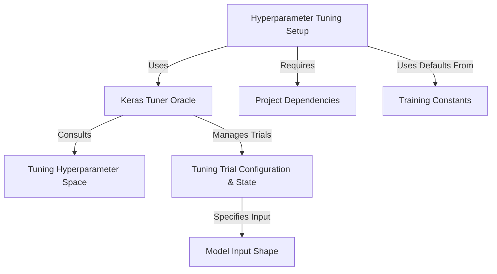

# Tutorial: SC4002-Group-Assignment

This project focuses on automatically finding the best settings (*hyperparameters*) for a **sentiment analysis transformer model**.
It uses the *Keras Tuner library* to run multiple **training experiments** (trials) with different configurations, exploring a defined **hyperparameter space** (e.g., learning rates, layer sizes).
The goal is to discover the *optimal model setup* for better performance without manual adjustment. The project relies on specific **software dependencies** listed in `requirements.txt`.

**Source Repository:** [https://github.com/KristiyanCholakov/SC4002-Group-Assignment](https://github.com/KristiyanCholakov/SC4002-Group-Assignment)

## Chapters

1. [Model Input Shape](01_model_input_shape.md)
2. [Tuning Hyperparameter Space](02_tuning_hyperparameter_space.md)
3. [Training Constants](03_training_constants.md)
4. [Hyperparameter Tuning Setup](04_hyperparameter_tuning_setup.md)
5. [Keras Tuner Oracle](05_keras_tuner_oracle.md)
6. [Tuning Trial Configuration & State](06_tuning_trial_configuration___state.md)
7. [Project Dependencies](07_project_dependencies.md)

---

Generated by TEG SINGH TIWANA: [Cloud Assignment 2:Github LLM Codebase Knowledge Building Summarizer using Openai/Gemini/Claud](https://github.com/tej172/cloud_indv_assignments/tree/main/ass_2)