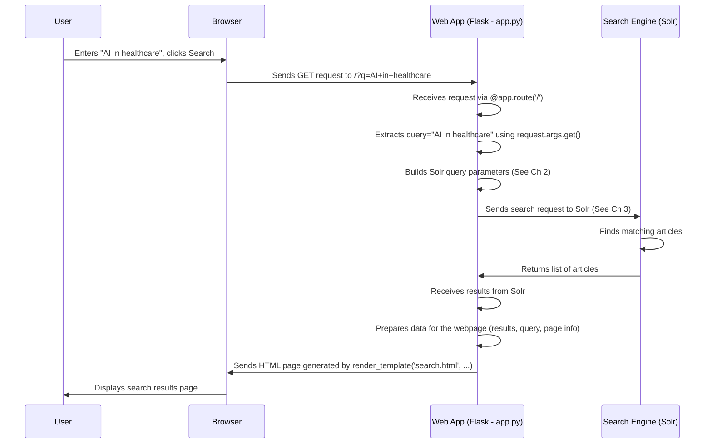

# Chapter 1: Web Application Interface

Welcome to the SC4021 Information Retrieval project tutorial! We're starting our journey by looking at the most visible part of the system: the **Web Application Interface**.

Imagine you have a powerful search engine that can sift through thousands of news articles. How do *you* actually use it? You need some way to type in your search, maybe select some filters (like date ranges or news sources), and then see the results displayed nicely. That's exactly what the Web Application Interface does!

**Use Case:** Let's say you want to find recent news articles about "artificial intelligence in healthcare" published after January 1st, 2023. You'd use the web interface to type your search query and set the date filter. The interface then takes your request, gets the relevant articles from the backend search engine, and displays them neatly on a webpage for you to read.

## What is this Interface Made Of?

Our web interface is built using a tool called **Flask**.

*   **Flask:** Think of Flask as a lightweight toolkit for building websites and web applications in Python. It provides the basic building blocks needed to handle incoming web requests (like someone visiting a webpage or clicking a button) and send back responses (like displaying a webpage with search results). It's like having a simple, efficient frame to build our application's "front door" and "display window".

Here's how we start our Flask application in `app.py`:

```python
# File: app.py
from flask import Flask, request, render_template # Import necessary parts from Flask

# Initialize Flask app
app = Flask(__name__) # Create our web application object
app.secret_key = 'your_secret_key_here' # Needed for some features like session management

# ... (rest of the setup like Solr connection)
```

This simple code sets up the basic Flask application. `Flask(__name__)` creates the core app object we'll use to define how it handles web requests.

## Handling User Actions: Web Requests

When you interact with the web interface – type a search query, click a filter, or go to the next page of results – your web browser sends a message to our Flask application. This message is called a **web request** (specifically, an HTTP GET request in our case).

Flask listens for these requests at specific URLs (web addresses). We tell Flask what code to run when a request arrives at a certain URL using a special instruction called a **route**.

```python
# File: app.py

# This tells Flask: When someone visits the main page ('/'), run the 'search' function
@app.route('/', methods=['GET'])
def search():
    # ... code to handle the request and show results ...
    print("Someone visited the search page!")
    # This function will get the user's query, talk to the search engine,
    # and prepare the results page.
    return render_template('search.html', ...) # Sends back the HTML page
```

The `@app.route('/')` line is like putting up a signpost: "If a request comes for the main page (`/`), direct it to the `search` function." The `search` function then does all the work.

## Getting User Input

How does the `search` function know *what* the user searched for? Flask provides the `request` object, which holds all the information from the incoming web request, including any data typed into forms (like the search box) or selected from filters.

```python
# File: app.py (inside the search function)

# Get the search query from the URL, e.g., /?q=ai+healthcare
# If 'q' isn't in the URL, default to an empty string ''
query = request.args.get('q', '')

# Get selected categories, e.g., /?category=Technology&category=Healthcare
# If none are selected, it defaults to an empty list
selected_categories = request.args.getlist('category')

print(f"User searched for: {query}")
print(f"Selected categories: {selected_categories}")
```

This code snippet shows how we extract the search term (`q`) and any selected categories (`category`) from the request. `request.args` holds data sent in the URL, and `.get()` or `.getlist()` retrieve specific pieces of information.

## Talking to the Backend (The Search Engine)

The web interface itself doesn't store or search the articles. It's just the front counter. The real work of searching happens in the **backend**, which in our project is a search engine called **Solr**.

Our Flask app needs to:
1.  Take the user's query and filters.
2.  Translate them into a format Solr understands (we'll cover this in [Chapter 2: Search Query Construction](02_search_query_construction.md)).
3.  Send this structured query to Solr.
4.  Receive the results back from Solr.

Think of the Flask app as a librarian at the front desk. You tell the librarian what you're looking for (your query and filters). The librarian figures out how to phrase the request for the library's catalog system (Solr), goes to the system, gets the list of books (search results), and brings them back to you.

```python
# File: app.py (Simplified inside search function)
import pysolr # Library to talk to Solr

# Assume 'solr' is already set up to connect to our Solr engine
solr = pysolr.Solr('http://localhost:8983/solr/mycore', timeout=10)

def search():
    query = request.args.get('q', '')
    # 1. Get user input (already done)

    # 2. Prepare the Solr query (simplified - details in Chapter 2)
    solr_params = {'q': f'text:{query}' if query else 'text:*'}
    # ... add filters based on request.args ...

    # 3. Send query to Solr and get results (details in Chapter 3)
    results = solr.search(**solr_params)

    # 4. Prepare and display results (see next section)
    # ...
    return render_template('search.html', results=results.docs, ...)
```

This snippet shows the core idea: construct parameters (`solr_params`) and use the `solr.search()` function to interact with the backend search engine ([Chapter 3: Search Execution (Solr)](03_search_execution__solr_.md)).

## Displaying the Results: Rendering Templates

Once Flask gets the search results back from Solr, it needs to present them nicely to the user. It does this using **HTML templates**.

Think of a template like a fill-in-the-blanks document (`search.html` in our case). It defines the structure of the webpage (header, search bar, results area, footer), but leaves placeholders for the actual data (like the search query, the list of results, page numbers).

Flask's `render_template` function takes the template file and fills in the blanks with the actual data we provide.

```python
# File: app.py (inside the search function)
from flask import render_template

def search():
    # ... (get query, get results from Solr) ...
    query = request.args.get('q', '')
    results_from_solr = solr.search(...) # Get results

    # Pass data to the HTML template
    return render_template(
        'search.html', # The template file to use
        query=query,   # Fill in the 'query' placeholder
        results=results_from_solr.docs, # Fill in the 'results' placeholder
        total_results=results_from_solr.hits # Fill in total count
        # ... other data like page number, filters, etc. ...
    )
```

This code tells Flask: "Take the `search.html` template, fill in the `query` placeholder with the user's search term, fill in the `results` placeholder with the documents we got from Solr, and so on." The final filled-in HTML is then sent back to the user's browser to be displayed. We also generate charts and graphs, which is covered in [Chapter 4: Data Visualization](04_data_visualization.md).

## How it Works: Step-by-Step

Let's trace the journey of our example use case: searching for "AI in healthcare".



1.  **User Action:** You type "AI in healthcare" into the search box on the webpage and click "Search".
2.  **Browser Request:** Your web browser creates a URL like `http://your-app-address/?q=AI+in+healthcare` and sends a GET request to our Flask application.
3.  **Flask Routing:** Flask sees the request for the main page (`/`) and directs it to the `search()` function in `app.py`.
4.  **Input Processing:** Inside `search()`, the code `request.args.get('q', '')` retrieves "AI in healthcare". Other code retrieves filter values if any were selected.
5.  **Query Building:** Helper functions (like `build_solr_params`) construct a query that Solr can understand based on the input. (More in [Chapter 2](02_search_query_construction.md)).
6.  **Backend Interaction:** The `solr.search(...)` command sends the constructed query to the Solr search engine. (More in [Chapter 3](03_search_execution__solr_.md)).
7.  **Solr Processing:** Solr searches its index for articles matching the query.
8.  **Results Return:** Solr sends the found articles (documents) back to the Flask application.
9.  **Response Preparation:** The `search()` function receives the results. It might also call functions to generate visualizations (like word clouds - see [Chapter 4](04_data_visualization.md)).
10. **Template Rendering:** The `render_template('search.html', ...)` function is called. Flask takes the `search.html` file and inserts the query, the list of results, pagination info, etc., into the placeholders.
11. **Browser Display:** Flask sends the complete HTML page back to your browser, which then displays the formatted search results page.

## Conclusion

The Web Application Interface, powered by Flask, acts as the crucial intermediary between you (the user) and the powerful backend search engine (Solr). It handles your requests, translates them for the backend, and presents the results in a user-friendly format using HTML templates. It's the dashboard and control panel for our information retrieval system.

We've seen how it receives input and displays output. But how exactly is that user input turned into something the search engine understands? That's what we'll dive into next.

**Next:** [Chapter 2: Search Query Construction](02_search_query_construction.md)

---

Generated by [AI Codebase Knowledge Builder](https://github.com/The-Pocket/Tutorial-Codebase-Knowledge)