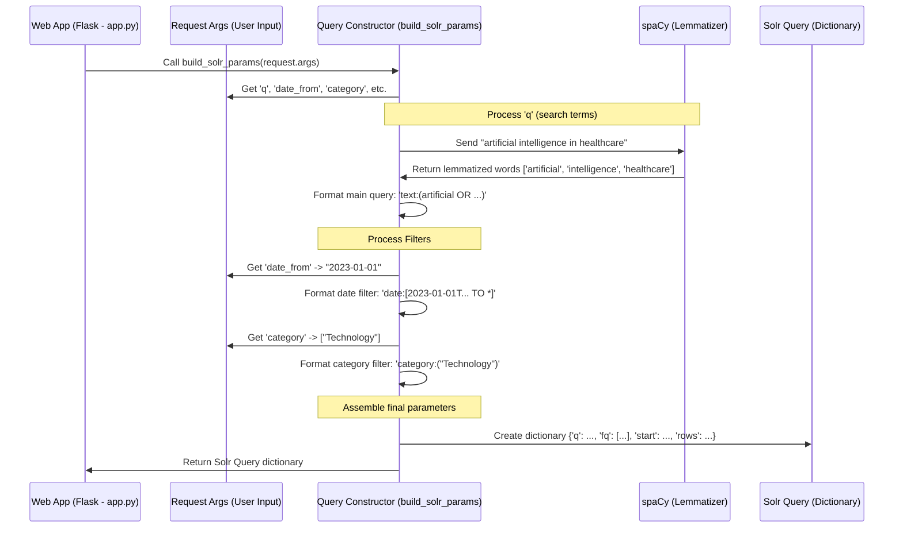

# Chapter 2: Search Query Construction

In [Chapter 1: Web Application Interface](01_web_application_interface.md), we saw how users interact with our application through a web page built with Flask. Users type search terms, select filters like dates or categories, and click "Search". But how does our application take that plain language request and turn it into something the powerful backend search engine, Solr, can actually understand?

That's where **Search Query Construction** comes in! Think of it as a specialized translator.

**Use Case:** Remember our example from Chapter 1? A user wants to find articles about "artificial intelligence in healthcare" published *after* January 1st, 2023, and perhaps only in the "Technology" category. The user simply types the words and selects options from dropdowns or date pickers. Our Search Query Construction component needs to translate this simple request into a precise set of instructions for Solr.

## Why Do We Need to Translate?

Search engines like Solr are incredibly powerful but also very specific about how they receive instructions. You can't just tell Solr "find me recent tech articles about AI in healthcare". It needs a structured query, like a command written in its own technical language.

Imagine ordering a coffee:
*   **Your Request (Plain English):** "I'd like a medium latte with oat milk, please."
*   **Barista's Internal Shorthand (Structured Query):** "MED OAT LATTE"

Our Search Query Construction component acts like the barista, translating your everyday language request into the specific shorthand Solr understands.

## Breaking Down the Translation Process

This translation happens in a few key steps, mostly handled by the `build_solr_params` function in our `app.py` file:

1.  **Get the Raw Ingredients:** First, we grab all the information the user provided through the web interface – the search terms, selected dates, categories, polarities, etc. We saw in Chapter 1 how Flask uses `request.args` to get this information.

2.  **Process the Search Terms (Lemmatization):** Users might type "running", "runs", or "ran". To the search engine, these should ideally all match articles containing the core concept "run". This process of reducing words to their base or dictionary form is called **lemmatization**. We use a Natural Language Processing (NLP) tool called `spaCy` to help with this.

3.  **Handle the Filters:** The user might have selected specific date ranges, categories (like "Technology"), or sentiment polarities (like "Positive"). These selections need to be converted into **filter queries** (often abbreviated as `fq` in Solr). Filters narrow down the search results *after* the main keyword search.

4.  **Build the Final Solr Query:** Finally, we assemble all the processed pieces – the lemmatized search terms and the filter queries – into a structured format (a Python dictionary in our case) that the `pysolr` library can use to talk to Solr.

## Step-by-Step: Building the Query

Let's see how these steps apply to our use case: "artificial intelligence in healthcare", after 2023-01-01, category "Technology".

**1. Get Raw Input:**
Our Flask app receives the request. Using `request.args`, it extracts:
*   `q`: "artificial intelligence in healthcare"
*   `date_from`: "2023-01-01"
*   `date_to`: (empty, maybe defaults to "now")
*   `category`: ["Technology"]

**2. Process Search Terms (Lemmatization):**
The `build_solr_params` function takes the query "artificial intelligence in healthcare". It uses `spaCy` to break it down and find the base form (lemma) of each important word.
*   "artificial" -> "artificial"
*   "intelligence" -> "intelligence"
*   "in" -> (often ignored as a "stop word")
*   "healthcare" -> "healthcare"
The processed terms might become something like: `artificial OR intelligence OR healthcare`. (We use `OR` to find documents containing *any* of these key terms, and add `~` for fuzzy matching).

```python
# File: app.py (inside build_solr_params)
import spacy
import re

nlp = spacy.load('en_core_web_sm') # Load the English language model

query = request.args.get('q', '').strip() # Get query: "artificial intelligence in healthcare"
words = []
if query:
    # Use spaCy to process the query
    lemmatized = ' '.join([token.lemma_ for token in nlp(query)])
    # Extract individual words (simplified)
    words = re.findall(r'\b\w+\b', lemmatized)
    # Result: words = ['artificial', 'intelligence', 'healthcare'] (potentially)

# Construct the main query part ('q') for Solr
# If words exist, join them with OR and add '~' for fuzzy matching
solr_q = f'text:*' if not query else f'text:({" OR ".join(words)}~)'
# Result: solr_q = 'text:(artificial OR intelligence OR healthcare)~'
```
This code snippet shows how we get the user's query string, process it with `spaCy` to get lemmatized words, and then format it into the main part of the Solr query (`q`). We search within the `text` field of our documents.

**3. Handle Filters:**
The function then looks at the filter selections:
*   **Date:** `date_from="2023-01-01"` and `date_to=*` (meaning up to the latest) gets translated into a Solr date range query: `date:[2023-01-01T00:00:00Z TO *]`
*   **Category:** `category=["Technology"]` gets translated into: `category:("Technology")` (If multiple were selected, it would be `category:("Tech" OR "Finance")`).

We use helper functions like `get_date_param` and `get_list_param` to safely retrieve and format these values.

```python
# File: app.py (inside build_solr_params)

# Example of getting and formatting the date filter
date_from_str = get_date_param("date_from") # Gets "2023-01-01", converts to Solr format
date_to_str = get_date_param("date_to")     # Gets "", defaults to "*" (now)
date_filter = f'date:[{date_from_str} TO {date_to_str}]'
# Result: date_filter = 'date:[2023-01-01T00:00:00Z TO *]'

# Example of getting and formatting the category filter
selected_categories = get_list_param("category") # Gets ["Technology"]
category_filter = f'category:({" OR ".join(selected_categories)})'
# Result: category_filter = 'category:("Technology")'

# Other filters (polarity, source, etc.) are handled similarly...
```
These snippets show how specific filter types (dates, lists of categories) are retrieved from the request and formatted into strings that Solr understands as filter queries (`fq`).

**4. Build the Final Solr Query Structure:**
All these pieces are assembled into a Python dictionary that `pysolr` uses. The main keywords go into the `q` parameter, and all the filters go into a list under the `fq` (filter query) parameter. We also add parameters for sorting and pagination (controlling which page of results to show).

```python
# File: app.py (inside build_solr_params function)

def build_solr_params(request_args):
    # ... (code from steps 1-3 to get solr_q, date_filter, category_filter, etc.) ...

    # Collect all filter strings into a list
    filter_queries = [
        date_filter,
        category_filter,
        # ... other filters like polarity, source ...
        f'polarity:({" OR ".join(get_list_param("polarity"))})', # Example
    ]
    # Remove any empty filters that might result from default values
    filter_queries = [fq for fq in filter_queries if fq and ':' in fq and not fq.endswith(':(*)') and not fq.endswith(':[* TO *]')]


    # Get pagination info
    start_index = (int(request_args.get('page', 1)) - 1) * DEFAULT_RESULTS_PER_PAGE
    rows_per_page = DEFAULT_RESULTS_PER_PAGE

    # Assemble the final dictionary for pysolr
    params = {
        'q': solr_q,             # The main keyword query
        'fq': filter_queries,    # The list of filter queries
        'start': start_index,    # Which result number to start at
        'rows': rows_per_page,   # How many results per page
        'sort': f'{get_param('sort_field', 'id_num')} {get_param('sort_order', 'asc')}' # Sorting
    }
    return params
```
This final snippet shows the assembly. The processed `solr_q` and the list of `filter_queries` are put into a dictionary, along with pagination (`start`, `rows`) and sorting information. This `params` dictionary is exactly what `pysolr` needs to send the request to Solr.

## How It Works: Under the Hood

Let's visualize the flow when the `build_solr_params` function is called:



1.  The Flask `search` function gets the user's input (`request.args`).
2.  It calls `build_solr_params`, passing this input.
3.  `build_solr_params` reads the search terms (`q`).
4.  It sends the terms to `spaCy` for lemmatization.
5.  It formats the lemmatized terms into the main Solr query string (`q`).
6.  It reads filter values (date, category, etc.) from the input.
7.  It formats each filter into a Solr filter query string (`fq`).
8.  It bundles the main query (`q`), the list of filter queries (`fq`), and other parameters like sorting and pagination into a Python dictionary.
9.  This dictionary is returned to the Flask `search` function, ready to be sent to Solr.

## Conclusion

Search Query Construction is the vital translator between the user's simple request and the search engine's complex requirements. By processing keywords using lemmatization and converting user selections into specific filter queries, it builds a structured set of instructions (the `params` dictionary) that Solr can execute efficiently. This ensures that users find the relevant information they're looking for, even when they express their needs in slightly different ways or apply various filters.

Now that we have this perfectly structured query, how do we actually send it to the Solr engine and get the results back? That's the focus of our next chapter.

**Next:** [Chapter 3: Search Execution (Solr)](03_search_execution__solr_.md)

---

Generated by [AI Codebase Knowledge Builder](https://github.com/The-Pocket/Tutorial-Codebase-Knowledge)