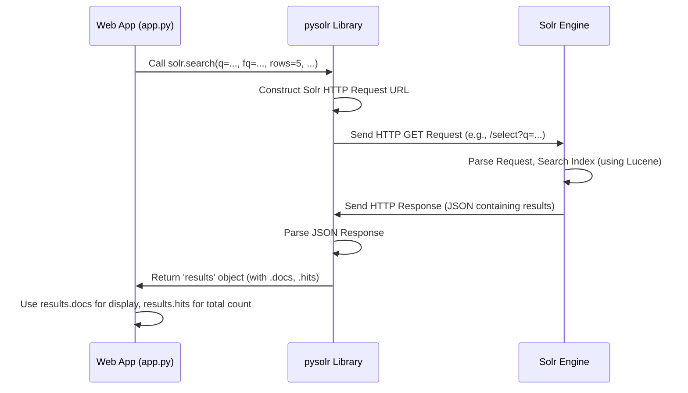

# Chapter 3: Search Execution (Solr)

Welcome back! In [Chapter 2: Search Query Construction](02_search_query_construction.md), we learned how to translate a user's search request (like "AI in healthcare" after a certain date) into a precise set of instructions, a structured query, that our search engine, Apache Solr, can understand.

But having the instructions written down isn't enough. We need someone to *take* those instructions, go to the library's vast collection (the Solr index), find the matching items, and bring them back. That's exactly what **Search Execution** does!

**Use Case:** Imagine our structured query from Chapter 2 is like a perfectly filled-out library request form for "Books about 'AI' or 'healthcare', published after Jan 1, 2023, in the 'Technology' section". Search Execution is the librarian who takes this form, walks into the library stacks (our Solr index), finds all the books matching the criteria, and brings them back to the front desk (our Flask application).

## Connecting to the Search Engine (Solr)

Before our application can send any requests to Solr, it needs to know *where* Solr is and how to talk to it. We use a special Python library called `pysolr` that acts as our translator and messenger.

Think of `pysolr` as the dedicated phone line connecting our Flask web application directly to the Solr search engine. We set up this connection when our application starts.

```python
# File: app.py (Near the top)
import pysolr # Import the library to talk to Solr

# Solr setup: Tell pysolr where our Solr engine lives
# 'http://localhost:8983/solr/mycore' is the address of our specific Solr collection
# 'timeout=10' means we won't wait more than 10 seconds for a response
solr = pysolr.Solr('http://localhost:8983/solr/mycore', timeout=10)

print("Connected to Solr!")
```

This code creates a `solr` object. From now on, we can use this `solr` object to send commands (like search queries) to our Solr engine. It's like having the librarian's direct phone number saved in our contacts.

## Sending the Query and Getting Results

In Chapter 2, we built a Python dictionary called `params` containing the structured query (like `{'q': 'text:(artificial OR intelligence OR healthcare)~', 'fq': ['date:[2023-01-01T00:00:00Z TO *]', 'category:("Technology")'], 'rows': 5, 'start': 0}`).

Now, we use our `solr` object (our connection to Solr) and its `search()` method to send these parameters.

```python
# File: app.py (Inside the 'search' function)

# Assume 'params' is the dictionary built by build_solr_params (from Chapter 2)
# params = {'q': 'text:(...)~', 'fq': [...], 'rows': 5, 'start': 0, ...}

print(f"Sending search query to Solr: {params['q']}")

# Send the search parameters to Solr and wait for the results
# The **params syntax unpacks the dictionary into arguments for the search function
results = solr.search(q=params['q'], fq=params['filters'], sort=params['sort'], start=params['start'], rows=params['rows'])

# 'results' now holds the response from Solr
print(f"Received {results.hits} matching documents from Solr.")
```

It's as simple as calling `solr.search()`! We pass the main query (`q`), the filters (`fq`, which stands for "filter query"), sorting instructions (`sort`), and pagination info (`start`, `rows`). The `pysolr` library takes care of formatting this into a web request that Solr understands, sending it, and parsing the response Solr sends back.

The `results` object returned by `solr.search()` contains everything Solr found:
*   `results.docs`: A list of the actual documents (news articles, in our case) that matched the query for the requested page. Each document is usually a dictionary-like object containing its fields (like title, content, date, category).
*   `results.hits`: The total number of documents that matched the query across *all* pages.

## Getting All Results vs. Getting One Page

Sometimes, we need *all* the matching documents. For example, if we want to create a visualization like a word cloud ([Chapter 4: Data Visualization](04_data_visualization.md)) based on *every* article about "AI in healthcare", we need the full dataset.

Other times, like when displaying results on the web interface ([Chapter 1: Web Application Interface](01_web_application_interface.md)), we only want a small number of results per page (e.g., 5 or 10). This is called **pagination**.

Our application handles both scenarios:

**1. Getting ALL Results (for Analysis/Visualization):**
To get all results, we send a query but set the `rows` parameter to a very large number, ensuring we get everything back in one go. This happens when the search filters change, so we can regenerate visualizations based on the complete matching dataset.

```python
# File: app.py (Inside the 'search' function - simplified logic)

# Check if search parameters changed since last time
if search_filters_changed:
    print("Filters changed, fetching ALL results for analysis...")
    # Send query to get all results (e.g., up to 12372 rows, our total articles approx)
    # We only pass 'q' and 'fq' because we don't need pagination here
    all_results = solr.search(q=params['q'], fq=params['filters'], sort=params['sort'], rows=12372).docs
    print(f"Fetched {len(all_results)} total documents for analysis.")
    # Store these results (e.g., in session) or pass them to visualization functions
    # generate_visualizations(all_results) # Covered in Chapter 4
```

**2. Getting Paginated Results (for Display):**
To display results page by page, we use the `start` and `rows` parameters that were calculated in `build_solr_params` (Chapter 2) based on which page the user requested.

```python
# File: app.py (Inside the 'search' function)

# Fetch ONLY the results for the current page
print(f"Fetching page {current_page} (start={params['start']}, rows={params['rows']})")
paginated_results = solr.search(
    q=params['q'],
    fq=params['filters'],
    sort=params['sort'],
    start=params['start'],
    rows=params['rows']
)

# Now use paginated_results.docs to display on the web page
# And use paginated_results.hits to show the total count and calculate page numbers

print(f"Displaying {len(paginated_results.docs)} results out of {paginated_results.hits} total.")
```

This way, we don't overload the user's browser (or our application) by fetching thousands of results when they only need to see a few at a time.

## How it Works: Under the Hood

What actually happens when we call `solr.search()`?

1.  **Your App Calls `pysolr`:** Your Flask code (in `app.py`) calls the `search()` method on the `solr` object we created.
2.  **`pysolr` Builds an HTTP Request:** The `pysolr` library takes the parameters (`q`, `fq`, `rows`, etc.) and constructs a standard web request (an HTTP GET request) URL. It looks something like this (simplified):
    `http://localhost:8983/solr/mycore/select?q=text:(...)~&fq=date:[...]&fq=category:(...)&rows=5&start=0&sort=...`
3.  **Request Sent to Solr:** `pysolr` sends this HTTP request over the network to the Solr server running at `http://localhost:8983`.
4.  **Solr Processes the Request:** The Solr engine receives the request, parses the parameters, searches its internal index using the powerful Lucene library, finds the matching documents, and gathers the requested fields.
5.  **Solr Sends Back an HTTP Response:** Solr packages the results (the documents found, the total hit count, etc.) into a structured format, usually JSON, and sends it back as an HTTP response.
6.  **`pysolr` Parses the Response:** The `pysolr` library receives this JSON response, parses it, and turns it into the convenient `results` object (with `.docs` and `.hits`) that your Flask application can easily use.

Let's visualize this interaction:



This diagram shows our `app.py` code using the `pysolr` library as an intermediary to communicate with the external `Solr Engine`. `pysolr` handles the technical details of the web communication.

## Conclusion

Search Execution is the bridge between wanting information and getting it. Using the `pysolr` library, our application establishes a connection to the Solr search engine. It takes the structured query crafted in the previous step ([Chapter 2: Search Query Construction](02_search_query_construction.md)), sends it to Solr using `solr.search()`, and receives the matching documents back. We learned how to fetch both paginated results for efficient display and all results when needed for deeper analysis or visualization.

We now have the raw results back from Solr! But just getting a list of documents isn't always the most insightful way to understand the information. How can we present this data visually, perhaps showing trends or distributions?

**Next:** [Chapter 4: Data Visualization](04_data_visualization.md)

---

Generated by [AI Codebase Knowledge Builder](https://github.com/The-Pocket/Tutorial-Codebase-Knowledge)