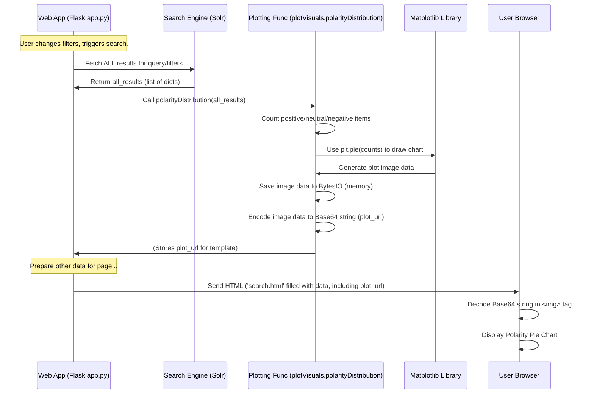

# Chapter 4: Data Visualization

In [Chapter 3: Search Execution (Solr)](03_search_execution__solr_.md), we saw how our application takes a structured query, sends it to the Solr search engine, and gets back a list of matching news articles. We learned how to get just one page of results for display, and also how to fetch *all* matching results when needed.

But what do we do with potentially hundreds or thousands of results? Just reading through them all is often impractical. How can we quickly understand the main themes, trends, or feelings hidden within that large set of information? That's where **Data Visualization** comes in!

**Use Case:** Imagine you searched for "AI impact on jobs". You get back 500 articles. Instead of reading them one by one, wouldn't it be great to see:
*   A **word cloud** showing the most frequently mentioned terms? (Maybe "automation", "skills", "training" pop out).
*   A **pie chart** showing the overall sentiment? (Are most articles positive, negative, or neutral about the impact?).
*   A **trend line** showing how sentiment changed over time? (Was discussion more optimistic last year?).

Data Visualization helps us create these visual summaries, turning raw data into easily understandable pictures.

## What is Data Visualization?

Think of data visualization as creating charts, graphs, and other pictures from data. Instead of looking at a spreadsheet full of numbers or a long list of text documents, you look at a visual representation.

Why is this helpful?
*   **Spot Patterns Quickly:** Our brains are great at finding patterns in images. A rising line on a chart is much easier to spot than scanning through hundreds of numbers.
*   **Understand the Big Picture:** Visuals can summarize complex information concisely. A pie chart instantly shows proportions.
*   **Communicate Insights:** It's often easier to show someone a chart than to explain the underlying data verbally.

In our project, the Data Visualization component takes the *full set* of search results for your current query and filters, and generates various plots.

## Tools of the Trade: Our Drawing Kit

To draw these plots, we use some powerful Python libraries:

*   **Matplotlib:** This is like the fundamental drawing canvas and basic tools (pens, colors) for creating static plots like line charts, bar charts, and pie charts.
*   **Seaborn:** Built on top of Matplotlib, Seaborn makes creating more complex and statistically informative plots (like heatmaps and distribution plots) easier and prettier.
*   **WordCloud:** A specific library designed just for creating those cool word clouds where word size indicates frequency.
*   **(Optional) Plotly:** While the provided code uses Matplotlib/Seaborn primarily, Plotly is another popular library often used for creating interactive charts (where you can hover over points for details, zoom in, etc.). Our project focuses mainly on static images generated by Matplotlib/Seaborn saved for display.

These libraries do the heavy lifting of figuring out how to arrange the data points, draw the axes, add labels, and color everything correctly. Our code just needs to prepare the data and tell the libraries what kind of plot to make.

All the code that *uses* these libraries to create our specific plots lives in the `plotVisuals.py` file.

## Types of Plots We Generate

Our `plotVisuals.py` file contains functions to create several types of visualizations from the search results:

1.  **Word Cloud (`wordCloud`, `word_cloud_polarity`):** Shows the most frequent words in the text of the results. Bigger words mean they appeared more often. We generate an overall word cloud and separate ones for positive/negative sentiment text.
2.  **Polarity Distribution (`polarityDistribution`):** A pie chart showing the percentage of search results classified as having positive, negative, or neutral sentiment.
3.  **Sentiment Distribution by Industry (`sentiment_distribution_by_industry`):** A bar chart showing the count of positive, negative, and neutral articles for each industry category found in the results.
4.  **Industry Sentiment Heatmap (`industry_sentiment_heatmap`):** A grid where rows are industries, columns are sentiments (positive, neutral, negative), and the color/number in each cell shows how many articles fall into that combination. Helps spot which industries have particularly strong sentiment leanings.
5.  **AI Sentiment Trends Across Sectors (`ai_sentiment_trends_across_sectors`):** A line chart showing how the *volume* of discussion (number of articles) for different industries changed over time within the search results.

## How We Create and Show the Plots

Generating these plots involves teamwork between our main application file (`app.py`) and the plotting functions (`plotVisuals.py`).

**Step 1: Fetching All Data (in `app.py`)**
As we saw in [Chapter 3: Search Execution (Solr)](03_search_execution__solr_.md), when you change your search query or filters, `app.py` detects this change. It then performs a special Solr search to get *all* matching documents (not just the first page).

```python
# File: app.py (inside search function)
# ... (build_solr_params creates 'params') ...

# Check if the user changed the search query or filters
search_params = { # Dictionary holding current filters }
if session.get('search_params') != search_params:
    session['search_params'] = search_params # Update saved filters
    print("Filters changed, fetching ALL results for analysis...")

    # Get ALL results (e.g., up to 12372 rows)
    all_results = solr.search(q=params['q'], fq=params['filters'], sort=params['sort'], rows=12372).docs
    print(f"Fetched {len(all_results)} total documents for analysis.")

    # Pass all results to the visualization generator
    generate_visualizations(all_results)
```
This code block checks if the `search_params` (like the query text, date range, categories) are different from the last search. If they are, it calls `solr.search` with a large `rows` value to get `all_results` and then calls `generate_visualizations`.

**Step 2: Calling Plotting Functions (in `app.py`)**
The `generate_visualizations` function in `app.py` is simple. It just calls each specific plotting function defined in `plotVisuals.py`, passing the `all_results` data to them.

```python
# File: app.py
from plotVisuals import ( # Import specific plot functions
    wordCloud, polarityDistribution, sentiment_distribution_by_industry,
    # ... other plot functions ...
)

def generate_visualizations(results):
    """Generate various sentiment-related visualizations."""
    print(f"Generating visualizations from {len(results)} results...")
    # List of functions to call from plotVisuals.py
    visual_functions = [
        wordCloud, polarityDistribution, sentiment_distribution_by_industry,
        # ... other plot functions ...
    ]
    # Call each function with the results data
    for func in visual_functions:
        # Note: The actual plots are saved/handled within the plotVisuals functions
        func(results)
    print("Finished generating visualizations.")
```
This function acts as a coordinator, ensuring all the different plots are created using the same set of `results` data. It imports the necessary functions from `plotVisuals.py` and calls them one by one.

**Step 3: Drawing the Plot (in `plotVisuals.py`)**
Each function in `plotVisuals.py` (like `wordCloud` or `polarityDistribution`) takes the `results` data, processes it as needed (e.g., counts words, calculates percentages), and uses a library like Matplotlib or WordCloud to draw the actual plot.

Let's look at a simplified `polarityDistribution`:

```python
# File: plotVisuals.py (Simplified Example)
import matplotlib.pyplot as plt
from io import BytesIO
import base64

def polarityDistribution(results):
    # 1. Count sentiments from the results list
    counts = {'positive': 0, 'neutral': 0, 'negative': 0}
    for post in results:
        sentiment = post.get('polarity', [None])[0] # Get sentiment
        if sentiment in counts:
            counts[sentiment] += 1

    # Filter out sentiments with zero count
    labels = [k for k, v in counts.items() if v > 0]
    sizes = [v for v in counts.values() if v > 0]
    colors = {'positive': 'green', 'neutral': 'gray', 'negative': 'red'}
    plot_colors = [colors[label] for label in labels]

    if not sizes: # Handle case with no data
        print("No polarity data to plot.")
        # (Code to create/save a placeholder image would go here)
        return None

    # 2. Use Matplotlib to create a pie chart
    fig, ax = plt.subplots()
    ax.pie(sizes, labels=labels, colors=plot_colors, autopct='%1.1f%%', startangle=90)
    ax.axis('equal') # Equal aspect ratio ensures a circle.
    plt.title("Sentiment Polarity Distribution")

    # 3. Save the plot to memory (not a file)
    img = BytesIO() # Create an in-memory file
    plt.savefig(img, format='png', bbox_inches='tight') # Save the plot as PNG
    plt.close(fig) # Close the plot figure to free memory
    img.seek(0) # Go to the beginning of the in-memory file

    # 4. Encode the image data as a Base64 string
    plot_url = base64.b64encode(img.getvalue()).decode('utf8')

    # 5. Store/Return the Base64 string (or save it for the template)
    # In our app, the Flask template directly accesses saved plot URLs
    # For simplicity here, let's imagine it returns the string:
    # return plot_url
    # (Actual project saves plot to be accessed by template later)
    print(f"Generated polarity distribution plot.")
```
This function:
1.  Counts how many results have 'positive', 'negative', or 'neutral' polarity.
2.  Uses `plt.pie()` from Matplotlib to draw the pie chart based on these counts.
3.  Instead of saving to a file on disk, it saves the image data into `BytesIO`, which is like a temporary file in the computer's memory.
4.  Converts the raw image data into a **Base64 string**. This is a way to represent binary data (like an image) as plain text, which can be easily embedded in an HTML webpage.
5.  (In the full app) This Base64 string is stored so the HTML template can use it.

**Step 4: Displaying the Plot (in `search.html` Template)**
Finally, the Flask application uses `render_template` (as seen in [Chapter 1: Web Application Interface](01_web_application_interface.md)) to generate the `search.html` page. Inside the HTML template, there are `` tags. Instead of a normal file path, the `src` attribute of these tags is set to the Base64 string generated in the previous step. The browser knows how to decode this string and display the image.

```html
<!-- File: templates/search.html (Simplified Snippet) -->

<h2>Visualizations</h2>

<!-- Display the Word Cloud -->
<div>
  <h3>Word Cloud</h3>
  <!-- The src uses the Base64 data generated by plotVisuals.py -->
  
</div>

<!-- Display the Polarity Distribution -->
<div>
  <h3>Polarity Distribution</h3>
  
</div>

<!-- Other plots displayed similarly -->
```
The `{{ plot_url_wordcloud }}` and `{{ plot_url_polarity }}` are placeholders that Flask fills in with the actual Base64 strings generated by our `plotVisuals.py` functions. The `data:image/png;base64,` part tells the browser that the following text is Base64 encoded PNG image data.

## How it Works: Generating a Plot (Simplified Flow)

Let's trace the journey of creating and displaying one plot, like the Polarity Distribution:



1.  **Filters Change:** The user changes a filter (e.g., date range) and clicks Search.
2.  **Fetch All Data:** `app.py` detects the change and asks Solr for *all* matching results.
3.  **Call Plot Function:** `app.py` calls `polarityDistribution(all_results)`.
4.  **Process & Draw:** `polarityDistribution` counts sentiments in the `all_results` list and tells Matplotlib (`plt.pie`) to create a pie chart.
5.  **Encode:** Matplotlib generates the image data, which `polarityDistribution` saves to memory (`BytesIO`) and then encodes into a Base64 string (`plot_url`).
6.  **Store & Render:** `app.py` stores this `plot_url` (along with URLs for other plots). When rendering `search.html`, it passes these URLs to the template.
7.  **Display:** The user's browser receives the HTML, finds the `` tag with the Base64 source, decodes it, and displays the pie chart image.

## Conclusion

Data Visualization is a powerful technique for making sense of large amounts of search results. By using Python libraries like Matplotlib, Seaborn, and WordCloud within our `plotVisuals.py` file, we can generate insightful charts and graphs like word clouds and sentiment distributions.

We learned how the main application (`app.py`) triggers the generation of these plots when search filters change, how the plotting functions create the visuals and encode them as Base64 strings, and how these strings are embedded into the final HTML page (`search.html`) to be displayed in the user's browser. This allows users to quickly grasp key patterns and trends within the retrieved information, going beyond a simple list of documents.

So far, we've seen the user interface, how queries are built, how they are executed, and how results can be visualized. But where does the data that Solr searches actually come from? How are news articles collected, processed, and prepared *before* they even get into the search engine? That's the focus of the next few chapters, starting with the overall pipeline.

**Next:** [Chapter 5: Data Processing Pipeline](05_data_processing_pipeline.md)

---

Generated by [AI Codebase Knowledge Builder](https://github.com/The-Pocket/Tutorial-Codebase-Knowledge)