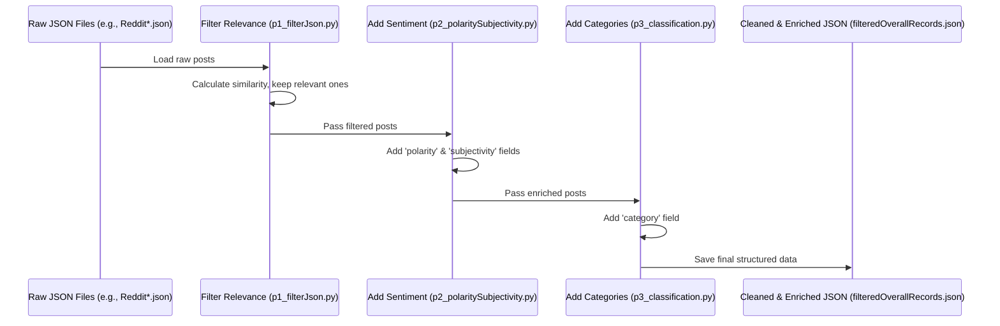

# Chapter 5: Data Processing Pipeline

In the previous chapter, [Chapter 4: Data Visualization](04_data_visualization.md), we saw how to create charts and graphs from the search results to understand them better. But where does the data that we search and visualize actually *come from*? How does raw information from the web, like Reddit posts, get transformed into the neat, searchable format our application uses?

That's the job of the **Data Processing Pipeline**! Think of it as the factory floor or an assembly line for our information.

**Use Case:** Imagine we've just collected thousands of raw posts and comments from various Reddit subreddits discussing "AI replacing jobs" (`crawlReddit.py`). This raw data is messy! It might contain irrelevant posts, duplicates, spam, and it lacks useful tags like sentiment or topic category. Our goal is to take this raw pile of text and turn it into a clean, structured dataset where each item is relevant, tagged with its sentiment (positive/negative/neutral) and potential industry category (like "Technology" or "Finance"), and formatted perfectly as a JSON object ready to be put into our search engine ([Chapter 7: Data Indexing](07_data_indexing.md)).

## What is a Data Processing Pipeline?

It's a series of automated steps (usually scripts) designed to take raw data, clean it up, transform it, add extra information, and get it ready for its final use – in our case, being searched by Solr.

Think of it like making cookies:
1.  **Get Raw Ingredients:** Flour, sugar, eggs, maybe some random things from the pantry (raw data).
2.  **Sift and Mix:** Remove lumps, combine the right ingredients in the right order (cleaning, filtering).
3.  **Add Flavor/Extras:** Add chocolate chips, vanilla essence (enrichment - sentiment, category).
4.  **Shape:** Cut into cookie shapes (formatting into JSON).
5.  **Bake:** (This is like [Chapter 7: Data Indexing](07_data_indexing.md) - getting it ready for consumption/search).

Our pipeline uses several Python scripts, each acting as a "station" on the assembly line.

## The Assembly Line Stations

Our pipeline takes the raw data (from `crawlReddit.py` and potentially combined using `combine_json_datas.py`) and passes it through these main processing stations, implemented as Python scripts in the `formatting_data/` folder:

1.  **Station 1: Filtering for Relevance (`p1_filterJson.py`)**
    *   **Problem:** Our initial data collection might grab posts that mention "AI" or "jobs" but aren't really about the core topic of "AI replacing jobs". We need to remove this noise.
    *   **Solution:** We use a smart technique involving **sentence transformers** (`SentenceTransformer` library). We compare each post's text to our main query ("Thoughts On AI Replacing Jobs"). If the meaning is too different (similarity score is too low), we discard the post.
    *   **Input:** A JSON file with many posts (e.g., `OverallRecords.json`).
    *   **Output:** A new JSON file containing *only* the posts that are relevant to our topic (e.g., `filteredOverallRecords.json`).

    ```python
    # File: formatting_data/p1_filterJson.py (Simplified)
    from sentence_transformers import SentenceTransformer, util
    import json

    # Load the model that understands sentence meaning
    model = SentenceTransformer("all-MiniLM-L6-v2")
    query = "Thoughts On AI Replacing Jobs"
    query_embedding = model.encode(query) # Turn query into numbers

    # Load raw data
    with open('OverallRecords.json', 'r') as file:
        data = json.load(file)

    filtered_data = []
    for post in data:
        # Turn post text into numbers and compare with query
        post_embedding = model.encode(post['text'])
        similarity = util.pytorch_cos_sim(query_embedding, post_embedding)

        # Keep only posts with similarity > 0.5
        if similarity.item() > 0.5:
            filtered_data.append(post)

    # Save the filtered data
    with open('filteredOverallRecords.json', 'w') as file:
        json.dump(filtered_data, file, indent=4)

    print(f"Filtered {len(data)} posts down to {len(filtered_data)} relevant ones.")
    ```
    This script uses a pre-trained AI model to understand the *meaning* of the query and each post, keeping only those that are semantically similar.

2.  **Station 2: Adding Sentiment & Subjectivity (`p2_polaritySubjectivity.py`)**
    *   **Problem:** We want to know if a post expresses a positive, negative, or neutral opinion (sentiment) and whether it's more factual or opinionated (subjectivity). This is useful for analysis and filtering searches later.
    *   **Solution:** We use a library called `TextBlob`. It reads the text of each post and automatically calculates these scores.
    *   **Input:** The filtered JSON file (`filteredOverallRecords.json`).
    *   **Output:** The *same* JSON file, but now each post has new fields: `polarity` (e.g., "positive") and `subjectivity` (e.g., "opinionated").

    ```python
    # File: formatting_data/p2_polaritySubjectivity.py (Simplified)
    from textblob import TextBlob
    import json

    # Load the filtered data
    with open('filteredOverallRecords.json', 'r') as file:
        data = json.load(file)

    for post in data:
        analysis = TextBlob(post['text'])
        # Determine sentiment
        if analysis.sentiment.polarity > 0:
            post['polarity'] = ["positive"] # Stored as a list
        elif analysis.sentiment.polarity < 0:
            post['polarity'] = ["negative"]
        else:
            post['polarity'] = ["neutral"]

        # Determine subjectivity
        if analysis.sentiment.subjectivity > 0.5:
            post['subjectivity'] = ["opinionated"]
        else:
            post['subjectivity'] = ["neutral"] # Renamed from "objective"

    # Save the enriched data back to the same file
    with open('filteredOverallRecords.json', 'w') as file:
        json.dump(data, file, indent=4)

    print("Added polarity and subjectivity to posts.")
    ```
    This script iterates through the posts and adds new key-value pairs for `polarity` and `subjectivity` based on TextBlob's analysis.

3.  **Station 3: Adding Industry Categories (`p3_classification.py`)**
    *   **Problem:** Knowing which industries (like "Healthcare", "Finance", "Education") are discussed in relation to AI job replacement is valuable.
    *   **Solution:** This script uses more advanced NLP techniques (like `spaCy` and `transformers` library with zero-shot classification). It reads the text and tries to assign relevant industry labels from a predefined list. It even tries to "mask" generic AI terms first to avoid simply classifying everything as "Technology & IT".
    *   **Input:** The enriched JSON file (`filteredOverallRecords.json`).
    *   **Output:** The *same* JSON file, but now each post has another new field: `category` (e.g., `["Healthcare & Pharmaceuticals", "Technology & IT"]`). It can have multiple categories.

    ```python
    # File: formatting_data/p3_classification.py (Highly Simplified)
    import json
    # (Assume setup for classifier and industry_labels is done)
    # from transformers import pipeline
    # classifier = pipeline(...)
    # industry_labels = ["Technology & IT", "Finance & Banking", ...]

    def classify_industry(text, labels):
        # Placeholder for complex classification logic
        # In reality, uses zero-shot classification model
        # Let's pretend it returns top 2 relevant labels
        if "hospital" in text.lower():
            return ["Healthcare & Pharmaceuticals", "Technology & IT"]
        if "bank" in text.lower():
            return ["Finance & Banking", "Technology & IT"]
        return ["Technology & IT"] # Default guess

    # Load the data enriched with sentiment
    with open('filteredOverallRecords.json', 'r') as file:
        data = json.load(file)

    for post in data:
        # Classify the post's text into industry categories
        post['category'] = classify_industry(post['text'], []) # Pass empty labels for dummy function

    # Save the further enriched data back to the same file
    with open('filteredOverallRecords.json', 'w') as file:
        json.dump(data, file, indent=4)

    print("Added industry categories to posts.")
    ```
    This script adds the `category` field, containing a list of relevant industry tags identified by the NLP classification model.

## How it Works: Data Flow

The data starts as raw files, potentially gets combined, and then flows through our `formatting_data` scripts one by one. Each script modifies the data and passes it along to the next station.



1.  **Start:** We have raw JSON files from scraping (e.g., `OverallRecords.json`).
2.  **Filter:** `p1_filterJson.py` reads this file, uses sentence transformers to check relevance against "Thoughts On AI Replacing Jobs", and writes *only* the relevant posts to `filteredOverallRecords.json`.
3.  **Add Sentiment:** `p2_polaritySubjectivity.py` reads `filteredOverallRecords.json`, uses TextBlob to add `polarity` and `subjectivity` to each post, and saves the changes back to `filteredOverallRecords.json`.
4.  **Add Category:** `p3_classification.py` reads the updated `filteredOverallRecords.json`, uses NLP classifiers to add the `category` list to each post, and saves the changes back again to `filteredOverallRecords.json`.
5.  **End:** The `filteredOverallRecords.json` file now contains cleaned, relevant, enriched, and consistently formatted data, ready for the next step: indexing.

## Conclusion

The Data Processing Pipeline is a critical behind-the-scenes component that transforms raw, messy data into a valuable, searchable asset. By chaining together scripts for filtering relevance, adding sentiment/subjectivity, and classifying by industry category, we create a clean, enriched, and consistently structured JSON dataset. This automated "assembly line" ensures that the data fed into our search engine ([Chapter 7: Data Indexing](07_data_indexing.md)) is high-quality and ready to power our application's search and visualization features.

We briefly touched upon how sentiment and categories are added. But how do those enrichment steps *really* work? Let's dive deeper into the specific techniques used.

**Next:** [Chapter 6: Data Enrichment (Sentiment/Category)](06_data_enrichment__sentiment_category_.md)

---

Generated by [AI Codebase Knowledge Builder](https://github.com/The-Pocket/Tutorial-Codebase-Knowledge)