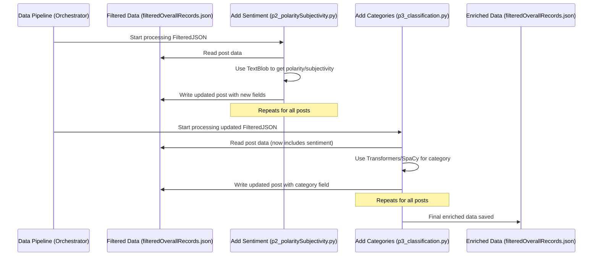

# Chapter 6: Data Enrichment (Sentiment/Category)

Welcome back! In [Chapter 5: Data Processing Pipeline](05_data_processing_pipeline.md), we saw the big picture: an assembly line that takes raw data (like Reddit posts) and cleans it up, getting it ready for our search engine. We learned that this pipeline involves several steps, including filtering, adding sentiment, and adding categories.

Now, let's zoom in on two crucial steps on that assembly line: **Data Enrichment**. This is where we add extra, valuable information to our data that wasn't there originally. Specifically, we'll look at how we figure out the *sentiment* (is the text positive, negative, or neutral?) and the *category* (what industry or topic is it about?).

**Use Case:** Imagine we've collected thousands of posts about "AI replacing jobs" using the pipeline from Chapter 5. We have the text, but that's it. Data Enrichment helps us answer questions like:
*   Are people generally feeling positive or negative about this topic?
*   Which industries (like Healthcare, Finance, Education) are being discussed most often in relation to job replacement by AI?

Knowing the sentiment and category makes our data much more insightful when we search or visualize it later ([Chapter 4: Data Visualization](04_data_visualization.md)).

## What is Data Enrichment?

Think about a librarian cataloging new books. They don't just record the title and author. They add extra tags:
*   **Genre:** Fiction, Science, History (like our *Category*)
*   **Keywords:** Space travel, dinosaurs, cooking (helps find related books)
*   **Maybe a short summary or review score:** Tells you what the book is like or how others felt (like our *Sentiment*)

Data Enrichment is just like that! We take our basic data (the text of a post) and add extra "tags" or "labels" that describe it better. In our project, the main tags we add are:
1.  **Sentiment:** The emotional tone (positive, negative, neutral).
2.  **Subjectivity:** Whether the text seems like an opinion or a statement of fact.
3.  **Category:** The relevant industry or topic (Technology, Healthcare, etc.).

These enrichments happen within specific scripts in our [Data Processing Pipeline](05_data_processing_pipeline.md), namely `p2_polaritySubjectivity.py` and `p3_classification.py`.

## Adding Feelings: Sentiment and Subjectivity

How can a computer read a sentence and understand if it's happy, sad, or just stating a fact? We use a helpful Python library called **TextBlob**.

TextBlob is like a mini-linguist. You give it some text, and it analyzes the words used, punctuation, and structure to make educated guesses about the feeling (polarity) and the style (subjectivity).

*   **Polarity:** A score from -1.0 (very negative) to +1.0 (very positive). 0.0 is neutral.
*   **Subjectivity:** A score from 0.0 (very objective/factual) to 1.0 (very subjective/opinionated).

In our script `p2_polaritySubjectivity.py`, we use TextBlob to calculate these scores for each post and then assign simple labels.

```python
# File: formatting_data/p2_polaritySubjectivity.py (Simplified Logic)
from textblob import TextBlob

def get_sentiment(text):
    # Create a TextBlob object to analyze the text
    analysis = TextBlob(text)

    # Determine polarity label
    if analysis.sentiment.polarity > 0:
        sentiment = "positive"
    elif analysis.sentiment.polarity < 0:
        sentiment = "negative"
    else:
        sentiment = "neutral"

    # Determine subjectivity label
    if analysis.sentiment.subjectivity > 0.5:
        subjectivity = "opinionated" # We label highly subjective text
    else:
        subjectivity = "neutral" # Less subjective text (more factual)

    return sentiment, subjectivity

# Imagine 'data' is a list of posts (dictionaries) loaded from JSON
# for post in data:
#    text_content = post['text']
#    # Calculate sentiment and subjectivity for the post's text
#    sentiment_label, subjectivity_label = get_sentiment(text_content)
#    # Add these new labels as fields to the post dictionary
#    post['polarity'] = [sentiment_label] # Store as a list for consistency
#    post['subjectivity'] = [subjectivity_label]
#    print(f"Analyzed post, added sentiment: {sentiment_label}")
```

This `get_sentiment` function takes the text from a post. It uses `TextBlob(text)` to perform the analysis. Then, based on the `polarity` and `subjectivity` scores TextBlob provides, it assigns simple labels like "positive" or "opinionated". The main part of the script (commented out above) would loop through all posts, call this function, and add the resulting labels as new fields (`polarity` and `subjectivity`) to each post's data.

**Input:** A post dictionary like `{'id': 'abc', 'text': 'AI is amazing!'}`
**Output:** The same dictionary with new fields: `{'id': 'abc', 'text': 'AI is amazing!', 'polarity': ['positive'], 'subjectivity': ['opinionated']}`

## Adding Topics: Category Classification

Okay, we know *how* people feel, but *what* are they talking about? Specifically, which industries? Assigning industry categories is trickier than sentiment. We use more advanced Natural Language Processing (NLP) tools for this:

*   **SpaCy:** Helps with basic text processing, like identifying parts of speech or specific entities.
*   **Transformers (Hugging Face library):** Provides access to powerful pre-trained AI models. We use a model capable of **zero-shot classification**.

**What's Zero-Shot Classification?** Imagine you want to sort mail into bins labeled "Bills", "Personal Letters", and "Junk Mail". Zero-shot classification is like being able to do this *without* ever having seen examples of each category beforehand. The model understands language well enough to read a letter and decide which bin it likely belongs to based on the meaning, even if it hasn't been specifically trained on *your* exact categories.

Our script `p3_classification.py` uses this technique. It takes the text of a post and asks the zero-shot model: "Which of these industry labels best describe this text?"

**A Clever Trick: Masking AI Terms**
One challenge is that almost *all* our posts mention "AI". If we just classify the text, the model might always say "Technology & IT" because AI is so prominent. To find out what *else* the post is about (e.g., is it AI in *Healthcare*? AI in *Finance*?), we sometimes play a trick:
1.  Temporarily hide or "mask" common AI-related words (like "AI", "machine learning") in the text, replacing them with a placeholder like `[MASK]`.
2.  Classify *both* the original text and the masked text.
3.  If the masked text gives us useful categories *other* than just "Technology & IT", we might prefer those results. This helps uncover the specific domain where AI is being discussed.

Here's a highly simplified idea of how `p3_classification.py` works:

```python
# File: formatting_data/p3_classification.py (Highly Simplified Concept)
import random # Using random for this simplified example

# Define the possible industry labels the model knows
industry_labels = [
    "Technology & IT", "Finance & Banking", "Healthcare & Pharmaceuticals",
    "Education & Training", "Manufacturing & Engineering", "Retail & E-Commerce",
    # ... many more categories ...
]

def classify_industry_simplified(text):
    # --- This is a placeholder! ---
    # The real function uses complex NLP models (Transformers zero-shot)
    # and the masking technique described above.
    # For this example, let's just pick 1 or 2 random labels.
    num_labels = random.randint(1, 2)
    chosen_labels = random.sample(industry_labels, num_labels)
    print(f"Simplified classification for '{text[:30]}...' -> {chosen_labels}")
    return chosen_labels

# Imagine 'data' is a list of posts (dictionaries) loaded from JSON
# for post in data:
#    text_content = post['text']
#    # Get the list of relevant industry categories
#    category_labels = classify_industry_simplified(text_content)
#    # Add this list as a new field to the post dictionary
#    post['category'] = category_labels
```

This simplified `classify_industry_simplified` function just picks random labels to illustrate the concept. The real `p3_classification.py` script contains sophisticated code using the `transformers` library to perform the zero-shot classification and the masking logic. The main part of the script (commented out) loops through posts, calls the classification function, and adds the resulting list of categories to the `category` field of each post.

**Input:** A post dictionary like `{'id': 'def', 'text': 'Robots doing surgery is the future.', 'polarity': ['positive'], ...}`
**Output:** The same dictionary with the new category field: `{'id': 'def', 'text': '...', 'polarity': ['positive'], ..., 'category': ['Healthcare & Pharmaceuticals', 'Technology & IT']}` (Note: `category` is a list, as a post might touch on multiple industries).

## How it Works: The Enrichment Steps

These enrichment processes are specific steps within the larger [Data Processing Pipeline](05_data_processing_pipeline.md). The data flows from one step to the next, gaining more labels along the way.



1.  The pipeline first runs `p1_filterJson.py` to get relevant posts into `filteredOverallRecords.json`.
2.  Then, `p2_polaritySubjectivity.py` reads this file, adds `polarity` and `subjectivity` using TextBlob, and saves the changes back to the *same file*.
3.  Next, `p3_classification.py` reads the updated file (which now has sentiment info), adds the `category` list using complex NLP, and saves the final enriched data back to `filteredOverallRecords.json`.

**Example: Before vs. After Enrichment**

*   **Before (Output of `p1_filterJson.py`):**
    ```json
    {
      "id": "xyz789",
      "title": "AI impact on banks?",
      "text": "Will AI automate teller jobs in finance soon? Seems likely.",
      "date": "2023-10-27T10:00:00Z",
      "source": "Reddit: r/artificial"
    }
    ```

*   **After (Output of `p3_classification.py`):**
    ```json
    {
      "id": "xyz789",
      "title": "AI impact on banks?",
      "text": "Will AI automate teller jobs in finance soon? Seems likely.",
      "date": "2023-10-27T10:00:00Z",
      "source": "Reddit: r/artificial",
      "polarity": ["neutral"],
      "subjectivity": ["opinionated"],
      "category": ["Finance & Banking", "Technology & IT"]
    }
    ```
    See how the `polarity`, `subjectivity`, and `category` fields have been added? This enriched data is much more useful for detailed searching and analysis.

## Conclusion

Data Enrichment is like adding superpowers to our raw data. By using tools like TextBlob for sentiment analysis and advanced NLP models (SpaCy, Transformers) for category classification, we add meaningful labels (`polarity`, `subjectivity`, `category`) to each piece of text. These labels, generated by scripts like `p2_polaritySubjectivity.py` and `p3_classification.py` within our [Data Processing Pipeline](05_data_processing_pipeline.md), transform simple text posts into rich data points ready for sophisticated searching and insightful visualization.

Now that our data is cleaned, filtered, and enriched, what's the final step before we can actually search it? We need to put it into our search engine, Solr. That process is called Indexing.

**Next:** [Chapter 7: Data Indexing](07_data_indexing.md)

---

Generated by [AI Codebase Knowledge Builder](https://github.com/The-Pocket/Tutorial-Codebase-Knowledge)