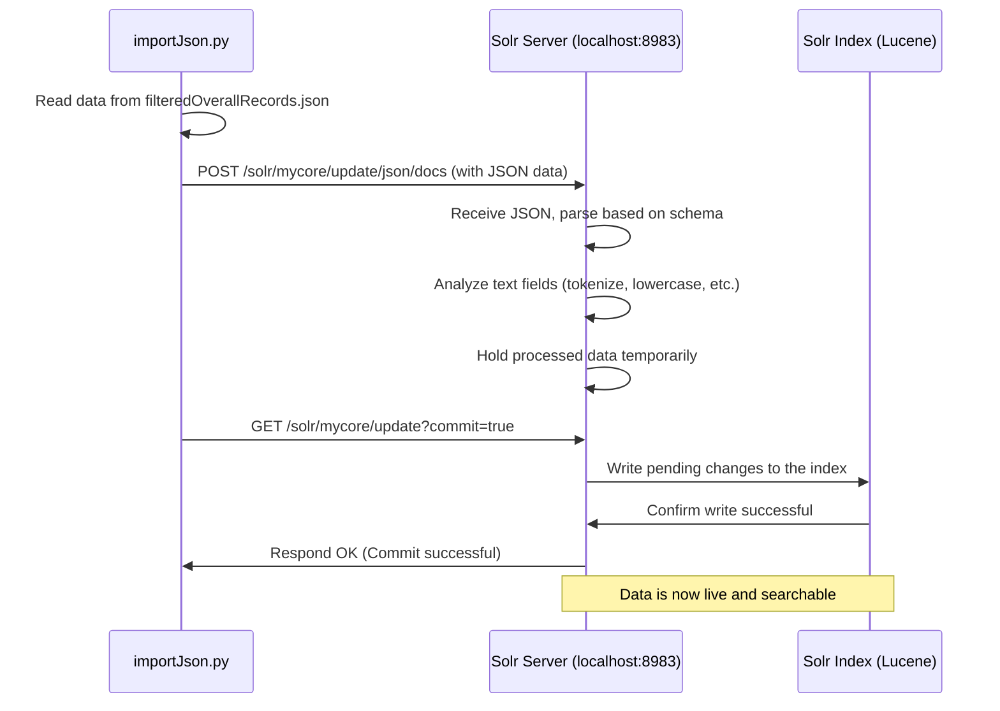

# Chapter 7: Data Indexing

Hello again! In the last chapter, [Chapter 6: Data Enrichment (Sentiment/Category)](06_data_enrichment__sentiment_category_.md), we learned how our pipeline adds valuable labels like sentiment (positive/negative) and industry category (Technology, Healthcare) to our processed data. We ended up with a clean, enriched JSON file (`filteredOverallRecords.json`) packed with useful information about topics like "AI replacing jobs".

But having this great JSON file isn't enough. How does our search engine, Solr, actually *see* this data so we can search it through our web application? If the data file is just sitting on the computer's hard drive, Solr doesn't know about it!

That's where **Data Indexing** comes in. It's the crucial step of loading our finalized data into the search engine.

**Use Case:** Remember our cleaned and enriched JSON file full of Reddit posts about "AI replacing jobs"? It contains the text, date, source, sentiment, and categories for each relevant post. Now, we need to feed this entire file into Solr. Once indexed, a user can go to our web application ([Chapter 1: Web Application Interface](01_web_application_interface.md)), type "negative sentiment finance jobs AI", and Solr will be able to instantly find the relevant posts because they are now *inside* its system.

## What is Data Indexing?

Think back to our library analogy. In [Chapter 5: Data Processing Pipeline](05_data_processing_pipeline.md) and [Chapter 6: Data Enrichment (Sentiment/Category)](06_data_enrichment__sentiment_category_.md), we were like the library staff taking new books (raw data), checking if they fit the library's collection (filtering), adding genre stickers (categories), and maybe a little review note (sentiment). We ended up with a stack of fully processed and cataloged books (our final JSON file).

**Data Indexing is like taking those fully cataloged books and carefully placing them onto the correct shelves in the library.**

The "library" is our Solr search engine, and the "shelves" are its internal data structure, called an **index**. Solr organizes the data in a highly efficient way (like using a super-fast card catalog) so that when you search later, it can find what you need almost instantly.

Until the data is *indexed* (put on the shelves), Solr can't find it.

## The Prepared Package: Our JSON Data

Thanks to the hard work done in the previous steps ([Chapter 5: Data Processing Pipeline](05_data_processing_pipeline.md) and [Chapter 6: Data Enrichment (Sentiment/Category)](06_data_enrichment__sentiment_category_.md)), our data is already perfectly formatted in a JSON file. Each entry in the file represents a "document" (a Reddit post, in our case) with fields that Solr expects, like `id`, `text`, `date`, `polarity`, `category`, etc.

It looks something like this (a single post):

```json
{
  "id": "xyz789",
  "title": "AI impact on banks?",
  "text": "Will AI automate teller jobs in finance soon? Seems likely.",
  "date": "2023-10-27T10:00:00Z",
  "source": "Reddit: r/artificial",
  "polarity": ["neutral"],
  "subjectivity": ["opinionated"],
  "category": ["Finance & Banking", "Technology & IT"],
  "id_num": 123 // Added unique numeric ID
}
```

This format is exactly what Solr understands. Now we just need to send it.

## The Tool for the Job: `importJson.py`

To get this JSON data into Solr, we use a simple Python script called `importJson.py`. Think of this script as the delivery truck that takes our box of cataloged books (the JSON file) from the processing room to the library (Solr) and tells the librarian exactly where to put them.

This script uses the popular `requests` library in Python, which is great for sending information over the web (like talking to our Solr server).

## How `importJson.py` Works: Step-by-Step

The script performs a few key actions:

1.  **Knows Solr's Address:** It defines the specific URL where Solr listens for incoming data updates.
2.  **Reads the Data:** It opens our final JSON file (`filteredOverallRecords.json` or a similar file, maybe named `data.json` for the script) and reads its entire content.
3.  **Sends the Data:** It sends the JSON content to the Solr URL using an HTTP POST request. This is like handing the box of books to the librarian.
4.  **Tells Solr to Save:** After sending the data, it sends another command (an HTTP GET request with `commit=true`) telling Solr: "Okay, I've given you all the new books, please update your main shelves now!" This "commit" step makes the newly added data searchable.

Let's look at the key parts of the script:

```python
# File: importJson.py (Simplified)
import requests
import json # Import json library to handle potential formatting

# 1. Solr's Address for receiving JSON documents
#    'mycore' is the name of our specific collection in Solr
solr_url = "http://localhost:8983/solr/mycore/update/json/docs"

# Path to the JSON file we want to index
json_file = "filteredOverallRecords.json" # Or could be "data.json"

print(f"Reading data from {json_file}...")
# 2. Read the JSON data from the file
with open(json_file, "r", encoding='utf-8') as file:
    # Read the whole file content as a string
    json_data = file.read()
    # It's good practice to ensure it's valid JSON before sending
    # (Actual script might load/dump to validate)

print(f"Sending data to Solr at {solr_url}...")
# 3. Send the JSON data to Solr
headers = {"Content-Type": "application/json"} # Tell Solr we're sending JSON
response = requests.post(solr_url, data=json_data.encode('utf-8'), headers=headers)

# Check if Solr received it okay
if response.status_code == 200:
    print("JSON data sent successfully to Solr!")
else:
    print(f"Failed to send JSON data. Solr responded: {response.text}")
    exit() # Stop if sending failed

print("Asking Solr to commit the changes...")
# 4. Tell Solr to make the changes permanent and searchable
commit_url = "http://localhost:8983/solr/mycore/update?commit=true"
commit_response = requests.get(commit_url)

if commit_response.status_code == 200:
    print("Solr committed changes successfully! Data is now indexed.")
else:
    print(f"Failed to commit changes. Solr responded: {commit_response.text}")

```

*   **`solr_url`**: This is the specific web address (URL) on the Solr server that's designed to accept new data in JSON format. `http://localhost:8983` is the base address of our local Solr instance, `/solr/mycore` points to our specific data collection, and `/update/json/docs` tells Solr we're sending JSON documents to be added or updated.
*   **`json_file`**: The name of the file containing our precious enriched data.
*   **`with open(...)`**: This safely opens and reads the entire content of the JSON file into the `json_data` variable. We specify `encoding='utf-8'` to handle various text characters correctly.
*   **`requests.post(...)`**: This is the core action! It sends the `json_data` (encoded into bytes) to the `solr_url`. The `headers` tell Solr that the data being sent is in JSON format. Solr receives this data and holds onto it temporarily.
*   **`requests.get(commit_url)`**: This sends a simple request to a different Solr URL that just includes `?commit=true`. This tells Solr: "Take all the data you received since the last commit and make it permanently part of your searchable index." Without this commit, the data might sit in Solr's memory but wouldn't be findable yet.

When you run this script (`python importJson.py`), it reads your file and uploads it straight into Solr, making it ready for searching.

## How it Works: Under the Hood

What happens when the `importJson.py` script runs and talks to Solr?

1.  **Script Reads File:** The Python script opens `filteredOverallRecords.json` and loads its content.
2.  **Script Sends Data (POST):** The script sends an HTTP POST request containing the JSON data to the Solr server's `/update/json/docs` endpoint.
3.  **Solr Receives Data:** Solr gets the JSON data. It looks at its configuration (called a "schema") to understand the fields (`text`, `date`, `category`, etc.).
4.  **Solr Processes (Analyzes):** For text fields like `title` and `text`, Solr performs analysis. This might involve breaking text into words (tokenization), converting to lowercase, removing common words ("the", "a"), and reducing words to their root form (lemmatization, like we saw in [Chapter 2: Search Query Construction](02_search_query_construction.md)). This makes searching more flexible. For other fields like `date` or `category`, it stores them in appropriate formats.
5.  **Solr Holds Data (Pre-Commit):** Solr keeps the processed data ready but doesn't make it searchable immediately. This is efficient if you're sending lots of updates.
6.  **Script Sends Commit (GET):** The script sends an HTTP GET request to the Solr `/update?commit=true` endpoint.
7.  **Solr Commits:** Solr takes all the pending changes and writes them permanently into its internal index (powered by a technology called Lucene).
8.  **Data is Searchable:** Now, the data is fully indexed and can be found via search queries sent from our web application!

Here's a diagram showing the interaction:



This shows the two main interactions: sending the data (`POST`) and then telling Solr to save it permanently (`GET commit=true`).

## Conclusion

Data Indexing is the bridge that connects our prepared data to our search engine. By using the `importJson.py` script, we take the final, enriched JSON output from our [Data Processing Pipeline](05_data_processing_pipeline.md) and load it directly into Solr. The script sends the data and then issues a "commit" command, telling Solr to analyze the information and add it to its internal index. Once indexed, the data becomes instantly searchable through our web application, allowing users to explore the insights we worked hard to uncover.

We've now covered how data gets *into* Solr. But how do we manage the Solr engine itself? What if we need to check its status, manage its configuration, or even delete data?

**Next:** [Chapter 8: Search Engine Management](08_search_engine_management.md)

---

Generated by [AI Codebase Knowledge Builder](https://github.com/The-Pocket/Tutorial-Codebase-Knowledge)