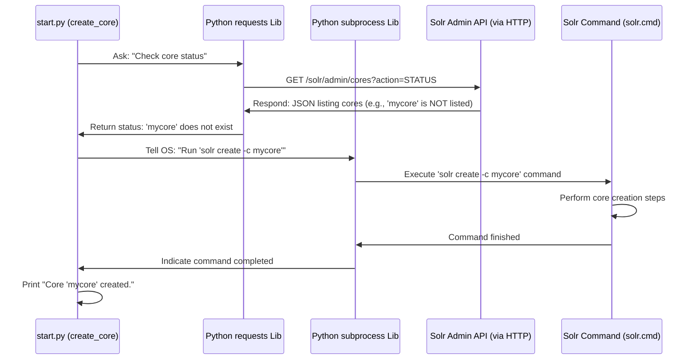

# Chapter 8: Search Engine Management

Welcome to the final chapter! In [Chapter 7: Data Indexing](07_data_indexing.md), we learned how to take our clean, enriched JSON data and load it into the Solr search engine using the `importJson.py` script. Now our data is "on the shelves" and ready to be searched.

But what about the library itself? What if the library (our Solr server) isn't even open? Or what if we need to set up a specific room (our data 'core') for the first time, or maybe clear it out later? That's where **Search Engine Management** comes in.

**Use Case:** Imagine you just downloaded this project and want to run it for the first time. Before you can index any data ([Chapter 7: Data Indexing](07_data_indexing.md)) or search anything ([Chapter 3: Search Execution (Solr)](03_search_execution__solr_.md)), you need to make sure the Solr search engine program is actually running on your computer. You might also need to create the specific data storage area, which we call `mycore`, where our project's data will live. Search Engine Management provides the tools to do exactly this – starting the engine and preparing its storage.

Think of it like the library's maintenance crew. They have the keys to open and close the library (start/stop Solr) and the tools to set up or remove specific sections (create/delete cores).

## What Are We Managing?

There are two main things we need to manage:

1.  **The Solr Server:** This is the main program that does all the searching. Like any program, it needs to be started before it can do anything, and sometimes you might need to stop it or restart it (maybe after changing some configuration).
2.  **The Solr Core (`mycore`):** Inside the main Solr server, you can have different, independent collections of data, called "cores". Our project uses a specific core named `mycore` to store all the Reddit post data we processed. Before we can put data *into* `mycore`, we need to make sure this core actually *exists* within the running Solr server. If it doesn't (like the first time you run the project), we need to create it. Sometimes, if you want to start fresh, you might also want to delete the core and all the data inside it.

## The Maintenance Toolkit: `start.py`

Doing these tasks manually (by typing commands in a terminal) can be repetitive. So, we have a helpful Python script, `start.py`, that bundles these common management actions into easy-to-use functions.

This script acts as our control panel for the Solr engine.

## Using the Toolkit: Common Tasks

The `start.py` script provides functions to handle the basic lifecycle of the Solr server and our `mycore`. Here's how you might use them (conceptually, you'd often run the script itself or call these functions from another script):

**1. Starting the Solr Server:**
Before anything else, Solr needs to be running.

```python
# File: start.py (Conceptual Usage)
# from start import start_solr # Assuming you import the function

start_solr()
```

*   **Input:** None.
*   **Output:** The script will print messages like "Starting Solr in the background..." and tell you the address where you can access Solr's web interface (usually `http://localhost:8983/solr/`). It also waits a few seconds to give Solr time to fully start up.

**2. Stopping the Solr Server:**
When you're done working with the project, you can shut down the Solr server to free up computer resources.

```python
# File: start.py (Conceptual Usage)
# from start import stop_solr

stop_solr()
```

*   **Input:** None.
*   **Output:** The script will print messages like "Stopping Solr in the background..." and confirm when it's done.

**3. Restarting the Solr Server:**
Sometimes, if you make changes to Solr's configuration, you need to restart it.

```python
# File: start.py (Conceptual Usage)
# from start import restart_solr

restart_solr()
```

*   **Input:** None.
*   **Output:** The script will print "Restart Solr in the background..." and wait briefly for it to complete.

**4. Creating the `mycore` Data Core:**
The very first time you set up the project, the `mycore` data collection won't exist yet. You need to create it before you can index data.

```python
# File: start.py (Conceptual Usage)
# from start import create_core

create_core()
```

*   **Input:** None.
*   **Output:** The script first checks if `mycore` already exists. If not, it prints "Core 'mycore' does not exist, creating it..." and then "Core 'mycore' created." If it already exists, it will just tell you.

**5. Deleting the `mycore` Data Core:**
If you want to completely remove all the indexed data and start over, you can delete the core. **Warning:** This permanently deletes all data in `mycore`!

```python
# File: start.py (Conceptual Usage)
# from start import delete_core

delete_core()
```

*   **Input:** None.
*   **Output:** The script checks if `mycore` exists. If it does, it prints "Core 'mycore' exist, deleting it..." and then "Core 'mycore' deleted." If it doesn't exist, it will inform you.

*(Important Note: The actual `start.py` script provided in the project context runs `start_solr()` directly when executed. The other functions like `create_core`, `delete_core`, etc., are commented out by default but can be uncommented and run if needed.)*

## How it Works: Under the Hood

How does the `start.py` script actually talk to Solr and tell it what to do? It uses two main techniques:

1.  **Running Solr Commands (`subprocess`):** For starting, stopping, restarting the server, and creating/deleting cores, Solr provides command-line tools (like `solr.cmd` or `solr` depending on your system). Our Python script uses the built-in `subprocess` module to essentially tell the operating system: "Please run this Solr command for me."
2.  **Checking Status via Web Requests (`requests`):** Solr has a web interface and an API (Application Programming Interface). The `create_core` and `delete_core` functions first *check* if the core exists by sending a quick web request (using the `requests` library) to a specific Solr status URL. Solr replies with information about existing cores, and our script uses this to decide whether to proceed with creation or deletion.

Let's visualize creating the core:



1.  The `create_core` function in `start.py` starts.
2.  It uses the `requests` library to send a web request to Solr's Admin API asking for the status of all cores.
3.  Solr responds with a list (let's assume `mycore` isn't there).
4.  The script sees `mycore` is missing.
5.  It uses the `subprocess` module to run the actual Solr command-line instruction: `solr create -c mycore`.
6.  The operating system executes this command, which tells the running Solr server to create the new core.
7.  Once the command finishes, the script prints a success message.

**Diving into the Code (Simplified Snippets)**

*   **Starting Solr using `subprocess`:**

```python
# File: start.py (Simplified snippet for starting)
import subprocess
import time
import os

# Define path to Solr's command-line tool
solr_bin = os.path.join("./solr-9.8.0/bin/solr.cmd") # Path may vary!

def start_solr():
    try:
        print("Starting Solr...")
        # Use subprocess to run the 'solr start' command
        # Popen runs it in the background without blocking our script
        process = subprocess.Popen([solr_bin, "start", "-p", "8983"])
        print(f"Solr start command issued (PID: {process.pid}).")
        # Wait a bit for Solr to become ready
        time.sleep(15)
        print("Solr should be running at http://localhost:8983/solr/")
        # (The original script also terminates the Popen handle,
        # but Solr itself keeps running in the background)
    except Exception as e:
        print(f"Error starting Solr: {e}")
```
This uses `subprocess.Popen` to execute the `solr.cmd start -p 8983` command. `Popen` allows the script to continue while Solr starts up in the background. `time.sleep(15)` pauses the script to give Solr enough time to launch fully.

*   **Checking Core Status using `requests`:**

```python
# File: start.py (Simplified snippet for checking core status)
import requests

SOLR_PORT = '8983'
SOLR_CORE = 'mycore'
SOLR_ADMIN_URL = f"http://localhost:{SOLR_PORT}/solr/admin/cores"

def core_exists():
    try:
        # Send a web request to the Solr Admin API to get core status
        response = requests.get(SOLR_ADMIN_URL, params={'action': 'STATUS'}, timeout=5)
        response.raise_for_status() # Raise an error for bad responses (4xx or 5xx)

        # Parse the JSON response from Solr
        cores_status = response.json().get('status', {})
        # Check if our specific core name is in the status list
        return SOLR_CORE in cores_status
    except requests.exceptions.RequestException as e:
        print(f"Error checking core status: {e}")
        return False # Assume it doesn't exist if we can't check

# Usage example within create_core (simplified):
# if not core_exists():
#    print(f"Core '{SOLR_CORE}' does not exist, creating it...")
#    # ... code using subprocess to run 'solr create' ...
# else:
#    print(f"Core '{SOLR_CORE}' already exists.")
```
This uses `requests.get` to ask the Solr server (at its admin URL) for the status of all cores. It parses the JSON response to see if `mycore` is listed among the active cores. This check is crucial for the `create_core` and `delete_core` functions to know whether they need to act.

*(Note: The provided `start.py` also includes checks for `JAVA_HOME`. Solr requires Java to run, so this environment variable must be set correctly on your system.)*

## Conclusion

Search Engine Management is about controlling the search engine instance itself. Using the helper functions in `start.py`, we can easily start, stop, and restart the Solr server, as well as create or delete the specific `mycore` data collection used by our project. These scripts leverage Python's `subprocess` module to run Solr's command-line tools and the `requests` library to interact with Solr's API for status checks. This makes managing the backend search engine much simpler, especially when setting up the project or needing to perform maintenance.

This concludes our journey through the `SC4021-Information-Retrieval` project! We've seen how users interact via the [Web Application Interface](01_web_application_interface.md), how their searches are translated into precise queries ([Search Query Construction](02_search_query_construction.md)), how Solr executes those queries ([Search Execution (Solr)](03_search_execution__solr_.md)), and how results can be summarized visually ([Data Visualization](04_data_visualization.md)). We also explored the backend pipeline that prepares the data: the overall [Data Processing Pipeline](05_data_processing_pipeline.md), the specific steps of [Data Enrichment (Sentiment/Category)](06_data_enrichment__sentiment_category_.md), the loading process via [Data Indexing](07_data_indexing.md), and finally, how to manage the Solr engine itself ([Search Engine Management](08_search_engine_management.md)).

Hopefully, this tutorial has given you a clear, step-by-step understanding of how all these pieces fit together to build a working information retrieval system. Happy searching!

---

Generated by [AI Codebase Knowledge Builder](https://github.com/The-Pocket/Tutorial-Codebase-Knowledge)