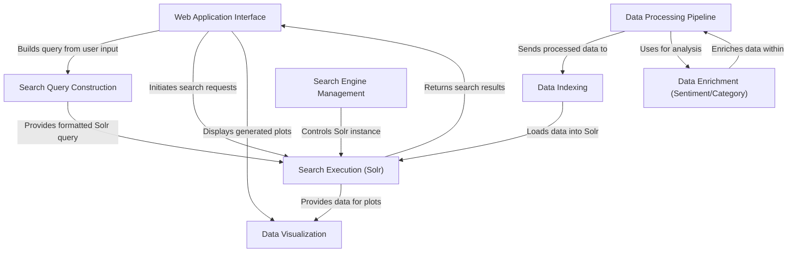

# Tutorial: SC4021-Information-Retrieval

This project is a *web application* that lets users explore public opinions about **AI replacing jobs**, using data scraped from Reddit.
Users can **search** for specific terms, apply **filters** (like date range, sentiment polarity, or industry category), and view the relevant posts.
The application analyzes the sentiment and category of each post and presents the aggregated results through various **visualizations**, such as word clouds and charts, to reveal trends and patterns. It uses the **Apache Solr** search engine in the background to manage and query the data efficiently.

**Source Repository:** [None](None)

## Chapters

1. [Web Application Interface](01_web_application_interface.md)
2. [Search Query Construction](02_search_query_construction.md)
3. [Search Execution (Solr)](03_search_execution__solr_.md)
4. [Data Visualization](04_data_visualization.md)
5. [Data Processing Pipeline](05_data_processing_pipeline.md)
6. [Data Enrichment (Sentiment/Category)](06_data_enrichment__sentiment_category_.md)
7. [Data Indexing](07_data_indexing.md)
8. [Search Engine Management](08_search_engine_management.md)

---

Generated by [AI Codebase Knowledge Builder](https://github.com/The-Pocket/Tutorial-Codebase-Knowledge)