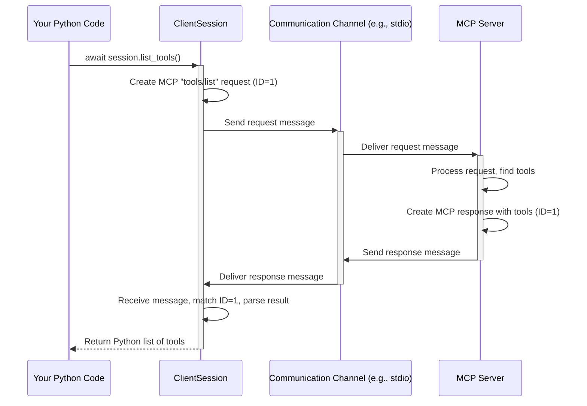

# Chapter 1: Client Session

Welcome to the `python-sdk` tutorial! We're excited to help you get started. This library helps your Python code talk to special servers called **MCP (Machine Communication Protocol) servers**. Think of these servers as assistants that have special tools or information you might want to use in your own programs.

This is the very first chapter, so we'll start with the basics!

## What's the Big Idea? Connecting to the Assistant

Imagine you have a helpful assistant (the MCP server) living on another computer, or maybe running as a separate program on your own machine. This assistant has some cool abilities, like maybe it can do complex calculations, look up the weather, or generate text.

How do you, from your Python script, ask this assistant to do something? You need a way to connect to it, send your request (like "Hey, what tools do you have?"), and understand its reply. Doing this directly involves complicated networking or process communication details. Wouldn't it be nice if there was something simpler?

That's exactly what the `ClientSession` does!

**`ClientSession` is like the dedicated phone line and translator between your Python code and the MCP server.** It manages the connection and handles all the back-and-forth communication for you.

Think of it as your **control panel** for interacting with the remote MCP server. Instead of fiddling with complex communication protocols, you just use simple Python methods provided by the `ClientSession`, like:

*   `session.list_tools()`: Ask the server what tools it offers.
*   `session.call_tool("calculator", {"operation": "add", "a": 5, "b": 3})`: Ask the server to use its "calculator" tool.

The `ClientSession` takes your Python command, translates it into the special MCP language the server understands, sends it off, waits for the server's reply, translates the reply back into Python, and gives it to you.

## Getting Started: Listing Server Tools

Let's try a simple task: connecting to an MCP server and asking it to list the tools it has available.

**1. Import `ClientSession`**

First, you need to import the necessary class from the `mcp` library.

```python
# main.py (simplified)
import asyncio
from mcp import ClientSession, StdioServerParameters # We need these
from mcp.client.stdio import stdio_client          # And this helper for local servers

# Configure logging (helpful for seeing what's happening)
import logging
logging.basicConfig(level=logging.INFO)
```

This code imports the main `ClientSession` class we'll be using. It also imports helpers (`StdioServerParameters`, `stdio_client`) that we'll use to connect to a server running locally on our machine via standard input/output (like a command-line tool). We also set up basic logging.

**2. Prepare the Connection**

`ClientSession` needs to know *how* to talk to the server. This involves setting up a communication channel. For this example, we'll assume the server is a command-line program we can run locally. The `stdio_client` helper function handles starting the server process and setting up the communication pipes (standard input/output).

```python
# main.py (continued - inside an async function)

# Details for running the server command (replace with your actual server command)
server_params = StdioServerParameters(
    command="your-mcp-server-command", # The command to run the server
    args=["--some-option"],            # Any arguments the server needs
)

# Use stdio_client to start the server and get communication streams
# 'async with' ensures resources are cleaned up automatically
async with stdio_client(server_params) as stdio_transport:
    # stdio_transport gives us two things:
    # read_stream: Where we receive messages FROM the server
    # write_stream: Where we send messages TO the server
    read_stream, write_stream = stdio_transport
    # ... now we can create the ClientSession ...
```

This snippet defines *how* to run the MCP server (using `StdioServerParameters`) and then uses the `stdio_client` helper. `stdio_client` starts the server process and gives us back `read_stream` and `write_stream` – the communication channels. Think of these like the "in" and "out" pipes for talking to the server process. We will cover other ways to connect in the [Transports](06_transports.md) chapter.

**3. Create and Initialize the `ClientSession`**

Now we have the communication streams, we can create our `ClientSession` instance and initialize the connection. Initialization is like a handshake: the client and server exchange greetings and basic information before starting real work.

```python
# main.py (continued - inside the 'async with stdio_client' block)

    # Create the ClientSession using the streams
    # 'async with' ensures the session is properly closed
    async with ClientSession(read_stream, write_stream) as session:
        logging.info("Session created. Initializing...")
        # Perform the initial handshake with the server
        await session.initialize()
        logging.info("Session initialized successfully!")
        # ... now we can use the session! ...
```

Here, we create the `ClientSession` instance, passing the `read_stream` and `write_stream` we got earlier. The `async with` statement is great because it automatically handles setting up and tearing down the session cleanly. The `await session.initialize()` line performs the crucial handshake with the server.

**4. Use the Session to List Tools**

With the session initialized, we can finally ask the server about its tools!

```python
# main.py (continued - inside the 'async with ClientSession' block)

        try:
            logging.info("Asking the server for its tools...")
            # Call the list_tools method
            tools_result = await session.list_tools()

            logging.info(f"Server responded with tools: {tools_result}")

            # Process the result (tools_result format detailed in MCP spec)
            # Example: Extract tool names
            tool_names = []
            for item in tools_result: # The result is a list of tuples
                if isinstance(item, tuple) and item[0] == "tools":
                    tool_names = [tool.name for tool in item[1]]
            logging.info(f"Found tool names: {tool_names}")

        except Exception as e:
            logging.error(f"An error occurred: {e}")

```

This is where the magic happens! `await session.list_tools()` sends the "tools/list" request to the server and waits for the response. The `ClientSession` handles the low-level communication. The server sends back a list of available [Tools](02_tools.md), which `session.list_tools()` returns as a Python object (specifically, a `ListToolsResult`, which is often a list containing a tuple like `('tools', [Tool(...), Tool(...)])`). We then log the raw result and extract just the names for clarity.

**Putting it together (Simplified Main Structure):**

```python
import asyncio
import logging
from mcp import ClientSession, StdioServerParameters
from mcp.client.stdio import stdio_client

logging.basicConfig(level=logging.INFO)

async def connect_and_list_tools():
    server_params = StdioServerParameters(
        command="your-mcp-server-command", # Replace with actual command
        args=[],
    )

    try:
        # Connect using stdio
        async with stdio_client(server_params) as (read_stream, write_stream):
            # Create and manage the session
            async with ClientSession(read_stream, write_stream) as session:
                await session.initialize() # Handshake!
                logging.info("Session Initialized.")

                # Ask for tools
                tools_result = await session.list_tools()
                logging.info(f"Tools result from server: {tools_result}")

                # Basic processing of the result
                tool_names = []
                for item in tools_result:
                   if item[0] == "tools": tool_names = [t.name for t in item[1]]
                logging.info(f"Extracted Tool Names: {tool_names}")

    except Exception as e:
        logging.error(f"Failed to connect or list tools: {e}")

if __name__ == "__main__":
    # Make sure to replace "your-mcp-server-command" before running!
    # If you don't have one yet, you can't run this, but you see the structure.
    # We'll learn about servers in the [FastMCP Server](05_fastmcp_server.md) chapter.
    # asyncio.run(connect_and_list_tools())
    logging.info("Example structure shown. Replace server command to run.")
```

This shows the complete flow: set up connection parameters, connect using `stdio_client`, create the `ClientSession`, initialize it, call `list_tools`, and process the result, all within `async with` blocks for proper resource management.

## Under the Hood: How `list_tools()` Works

When you call `await session.list_tools()`, what's actually happening?

1.  **Method Call:** Your Python code calls the `list_tools` method on the `ClientSession` object.
2.  **Request Creation:** The `ClientSession` creates a specific message formatted according to the MCP protocol. For `list_tools`, this message essentially says: `{"jsonrpc": "2.0", "method": "tools/list", "id": 1}`. The `"id"` is used to match the eventual response.
3.  **Sending:** The `ClientSession` sends this formatted message through the `write_stream` (which `stdio_client` connected to the server's standard input).
4.  **Server Processing:** The [FastMCP Server](05_fastmcp_server.md) receives the message, understands it's a request to list tools, gathers the information about its available tools, and prepares a response message.
5.  **Response Sending:** The server sends back a response message, like `{"jsonrpc": "2.0", "result": [["tools", [{"name": "calculator", ...}, {"name": "weather", ...}]]], "id": 1}`, through its standard output (which `stdio_client` connected to our `read_stream`).
6.  **Receiving:** The `ClientSession` is constantly listening on the `read_stream` for incoming messages. It receives the response.
7.  **Matching & Parsing:** It matches the response `id` (1) to the original request it sent. It parses the JSON data in the `result` field.
8.  **Returning:** It converts the parsed data into the appropriate Python object (a `ListToolsResult`) and returns it to your code where you called `await session.list_tools()`.

Here's a simplified diagram of the flow:



The `ClientSession` (along with the underlying transport mechanism like `stdio_client`) handles steps 2, 3, 6, 7, and 8, abstracting away the complexities of the MCP protocol and communication channel management.

Looking at the code (`src/mcp/client/session.py`), you can see the `list_tools` method:

```python
# src/mcp/client/session.py (simplified snippet)

    async def list_tools(self) -> types.ListToolsResult:
        """Send a tools/list request."""
        # 1. Create the specific request object
        request_obj = types.ClientRequest(
            types.ListToolsRequest(
                method="tools/list", # The MCP method name
            )
        )
        # 2. Send it and expect a ListToolsResult back
        return await self.send_request(
            request_obj,
            types.ListToolsResult, # The expected Python type of the result
        )
```

It creates a `ListToolsRequest` object (which knows its MCP method name is `"tools/list"`) and then calls the internal `send_request` method (part of the `BaseSession` it inherits from). `send_request` handles the actual sending, waiting for the response, and parsing it into the specified `types.ListToolsResult` type.

## Conclusion

You've learned about the `ClientSession`, the core component in `python-sdk` for interacting with MCP servers. It acts as your control panel, simplifying communication by:

1.  Managing the connection.
2.  Translating Python method calls (like `list_tools()`) into MCP requests.
3.  Sending requests and receiving responses/notifications.
4.  Translating MCP responses back into Python objects.

You saw how to set up a connection (using `stdio_client` as an example), create and initialize a `ClientSession`, and use it to perform a basic action like listing the server's tools.

Now that you know how to communicate with a server and ask what tools it has, let's dive deeper into what these [Tools](02_tools.md) actually are and how you can use them in the next chapter!

---

Generated by [Github LLM Codebase Knowledge Building Summarizer using Openai/Gemini/Claud](https://github.com/tej172/cloud_indv_assignments/tree/main/ass_2)