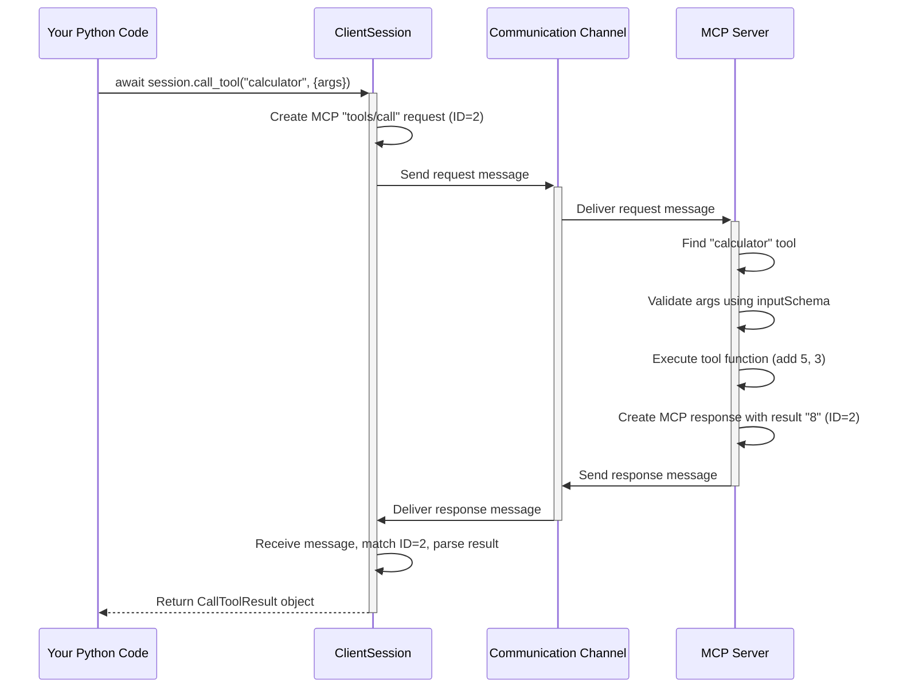

# Chapter 2: Tools - Asking the Server to Do Things

In [Chapter 1: Client Session](01_client_session.md), we learned how to connect to an MCP server using `ClientSession` and ask it a basic question: "What tools do you have?" using `session.list_tools()`. That's like looking at the buttons on a calculator or the commands available in a menu.

But just knowing the buttons isn't enough – we want to *press* them! This chapter is all about **Tools**: how to ask the server to actually *use* the capabilities it offers.

## Motivation: Why Do We Need Tools?

Imagine your Python program needs to perform a specific action that it can't easily do by itself. Maybe:

*   It needs to perform a complex mathematical calculation only the server knows how to do.
*   It needs to take a screenshot of the user's screen (like in the `screenshot.py` example).
*   It needs to fetch the latest weather information from a specialized service the server has access to.

Instead of trying to build all this complex functionality into your own program, you can connect to an MCP server that already *has* these capabilities. The server exposes these capabilities as **Tools**.

**Tools are like specialized commands or functions that the MCP server makes available for clients to run remotely.** Your program (the client) can ask the server to execute a specific tool, provide the necessary inputs, and get the result back.

Think of the MCP server as a helpful assistant with a toolbox. You can ask the assistant, "Please use your 'calculator' tool to add 5 and 3," or "Use your 'screenshot' tool to capture the screen."

## Using a Tool: Making the Request

Okay, let's say we connected to a server (like we did in Chapter 1) and used `list_tools()` to find out it has a tool named `"calculator"`. How do we ask the server to use it?

We use the `session.call_tool()` method!

**1. Connect and Initialize (Recap)**

First, we need a connected and initialized `ClientSession`, just like in Chapter 1.

```python
# Simplified setup - assume we have streams from Chapter 1
import asyncio
import logging
from mcp import ClientSession # And other necessary imports from Ch 1

logging.basicConfig(level=logging.INFO)

async def connect_and_use_tool(read_stream, write_stream): # Assume streams are ready
    async with ClientSession(read_stream, write_stream) as session:
        await session.initialize()
        logging.info("Session initialized.")
        # Now we can call tools!
        # ... tool calling code goes here ...
```

This code sets up the session. The `async with` block ensures the session is managed correctly, and `await session.initialize()` performs the handshake with the server.

**2. Call the Tool**

Now, inside that `async with` block, we can call `session.call_tool()`. We need to provide two main things:

*   The **name** of the tool we want to use (e.g., `"calculator"`).
*   A **dictionary** containing the specific inputs (arguments) the tool needs.

Let's imagine our "calculator" tool needs an `"operation"` (like "add" or "subtract") and the numbers (`"a"` and `"b"`) to operate on.

```python
# Inside the async with block from above...

        tool_name = "calculator"
        tool_arguments = {
            "operation": "add",
            "a": 5,
            "b": 3
        }

        try:
            logging.info(f"Calling tool '{tool_name}' with args: {tool_arguments}")
            # Ask the server to run the tool
            result = await session.call_tool(tool_name, tool_arguments)

            logging.info(f"Server returned result: {result}")

            # Example: Extract the text result if available
            text_result = None
            if result and result.content and isinstance(result.content[0], TextContent):
                 text_result = result.content[0].text
            logging.info(f"Extracted text from result: {text_result}") # Should be '8'

        except Exception as e:
            logging.error(f"Error calling tool '{tool_name}': {e}")

```

Here's what's happening:
1.  We define the `tool_name` we want to call (`"calculator"`).
2.  We create a dictionary `tool_arguments` with the specific inputs the `calculator` tool needs for an addition.
3.  `await session.call_tool(tool_name, tool_arguments)` sends the request to the server.
4.  The server receives the request, finds its `calculator` tool, executes the `add` operation with `a=5` and `b=3`.
5.  The server sends the result back.
6.  `session.call_tool` receives the response and returns it as a Python object (typically a `CallToolResult`).
7.  We log the result. A typical result for adding 5 and 3 might look something like `CallToolResult(content=[TextContent(type='text', text='8')], isError=False)`. We then extract the text part.

It's like telling the calculator assistant: "Use the `calculator` tool. The operation is `add`, `a` is `5`, and `b` is `3`." The assistant does the math and tells you "The result is 8."

## Tool Inputs: What the Tool Needs (JSON Schema)

How does the server know *what* arguments (`operation`, `a`, `b`) the `calculator` tool needs? And how does the client know what to send?

When a server defines a tool, it also defines an **input schema**. This schema is like a contract or a form that specifies exactly what inputs the tool expects, what their names are, and what type of data they should be (e.g., string, number, boolean). This schema is usually defined using a standard format called **JSON Schema**.

Remember the `list_tools()` call from Chapter 1? The result it gives back includes not just the tool names but also their descriptions and their `inputSchema`.

For our hypothetical `calculator` tool, the `inputSchema` might look something like this (simplified):

```json
{
  "type": "object",
  "properties": {
    "operation": {
      "type": "string",
      "description": "The operation to perform (e.g., 'add', 'subtract')"
    },
    "a": {
      "type": "number",
      "description": "The first number"
    },
    "b": {
      "type": "number",
      "description": "The second number"
    }
  },
  "required": ["operation", "a", "b"]
}
```

This schema tells us:
*   The input must be an object (like a Python dictionary).
*   It must have properties named `operation`, `a`, and `b`.
*   `operation` should be a string.
*   `a` and `b` should be numbers.
*   All three properties are required.

The `ClientSession` and the server use this schema to ensure that the arguments you provide in `call_tool` match what the tool expects. If you try to call the tool with missing or incorrect arguments, you'll likely get an error back from the server.

Similarly, the *result* of a tool call also has a structure, defined by the MCP protocol as `CallToolResult`, which contains a list of `content` items (like `TextContent`, `ImageContent`, or `EmbeddedResource`).

## Under the Hood: How `call_tool()` Works

When you call `await session.call_tool("calculator", {"operation": "add", "a": 5, "b": 3})`, several steps happen behind the scenes:

1.  **Method Call:** Your Python code calls the `call_tool` method on the `ClientSession` object.
2.  **Request Creation:** The `ClientSession` creates an MCP request message for the `"tools/call"` method. This message includes the tool name (`"calculator"`) and the arguments dictionary. It looks something like: `{"jsonrpc": "2.0", "method": "tools/call", "params": {"name": "calculator", "arguments": {"operation": "add", "a": 5, "b": 3}}, "id": 2}`.
3.  **Sending:** The `ClientSession` sends this formatted message through the `write_stream` to the server.
4.  **Server Processing:** The MCP server receives the message. It identifies it as a `tools/call` request, finds the tool named `"calculator"`, validates the incoming arguments against the tool's `inputSchema`, and executes the tool's function (e.g., performs the addition).
5.  **Response Creation:** The server prepares a response message containing the result (e.g., the number 8, formatted as `TextContent`). It looks something like: `{"jsonrpc": "2.0", "result": {"content": [{"type": "text", "text": "8"}]}, "id": 2}`.
6.  **Response Sending:** The server sends the response message back through its output stream to our `read_stream`.
7.  **Receiving:** The `ClientSession` receives the response message.
8.  **Matching & Parsing:** It matches the response `id` (2) to the original request and parses the JSON data in the `result` field.
9.  **Returning:** It converts the parsed data into a `CallToolResult` Python object and returns it to your code.

Here's a diagram showing the flow:



The `ClientSession` handles all the tricky parts of formatting the request, sending/receiving messages, and parsing the response according to the MCP protocol.

Looking at the `python-sdk` code (`src/mcp/client/session.py`), the `call_tool` method is similar in structure to `list_tools`:

```python
# src/mcp/client/session.py (simplified snippet)

    async def call_tool(
        self, name: str, arguments: dict[str, Any] | None = None
    ) -> types.CallToolResult:
        """Send a tools/call request."""
        # 1. Create the specific request object
        request_obj = types.ClientRequest(
            types.CallToolRequest(
                method="tools/call", # The MCP method name
                params=types.CallToolRequestParams(
                    name=name, arguments=arguments or {}
                ),
            )
        )
        # 2. Send it and expect a CallToolResult back
        return await self.send_request(
            request_obj,
            types.CallToolResult, # The expected Python type of the result
        )
```

It constructs a `CallToolRequest` (which knows its MCP method is `"tools/call"` and includes the `name` and `arguments`) and uses the internal `send_request` helper to manage the communication and result parsing.

## A Glimpse at the Server Side

While this tutorial focuses on the client (`python-sdk`), it's helpful to see briefly how a tool might be defined on the server side using the [FastMCP Server](05_fastmcp_server.md) framework (which we'll cover later).

A server might define the `add` tool like this:

```python
# Example Server Code (e.g., using FastMCP)
from mcp.server.fastmcp import FastMCP

mcp = FastMCP("Calculator Server")

@mcp.tool() # This decorator registers the function as a tool
def add(a: int, b: int) -> int:
    """Add two numbers"""
    return a + b

# Server runs using mcp.run()...
```

Notice the `@mcp.tool()` decorator? That's how the `FastMCP` server framework makes the Python function `add` available as an MCP tool. The type hints (`a: int`, `b: int`, `-> int`) are automatically used to generate the `inputSchema` and determine the output type. Don't worry too much about the server code now; we'll explore it in Chapter 5.

## Conclusion

You've now learned about **Tools** – the way MCP servers expose their specific capabilities. You saw how to:

1.  Understand that Tools are functions run remotely on the server.
2.  Use `session.call_tool()` to ask the server to execute a tool.
3.  Provide the tool's name and the required arguments in a dictionary.
4.  Understand that tools have defined inputs (via JSON Schema) and outputs (`CallToolResult`).
5.  Get a basic idea of the request/response flow when calling a tool.

You can now not only ask a server *what* it can do (`list_tools`) but also ask it *to do* something (`call_tool`)!

Tools are powerful, but sometimes you just need to get data or information that the server holds, rather than asking it to perform an action. For this, MCP uses a concept called **Resources**. Let's explore them in the next chapter: [Resources](03_resources.md).

---

Generated by [Github LLM Codebase Knowledge Building Summarizer using Openai/Gemini/Claud](https://github.com/tej172/cloud_indv_assignments/tree/main/ass_2)