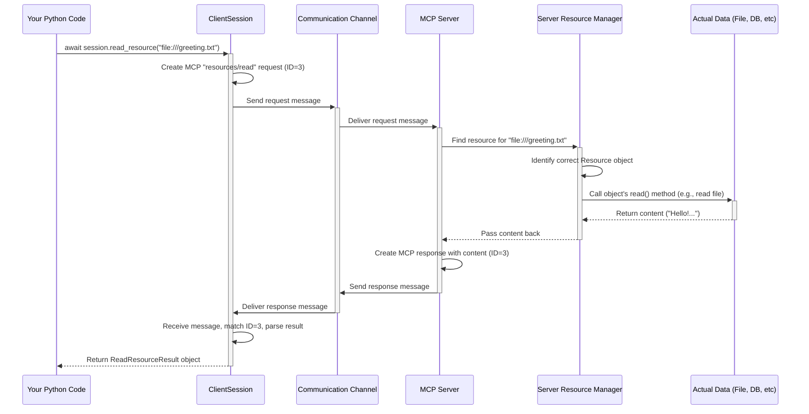

# Chapter 3: Resources - Accessing Server Data

In the previous chapter, [Tools](02_tools.md), we learned how to ask the MCP server to *perform actions* using `session.call_tool()`. That's great for tasks like calculations or taking screenshots.

But what if we just need to *get some data* that the server has access to? Maybe the server can provide:

*   The content of a specific configuration file.
*   A list of files in a particular directory on the server machine.
*   Data fetched from a web page or an API that only the server can reach.
*   Dynamically generated information (like the current time on the server).

This is where **Resources** come in!

## Motivation: Asking the Library for a Specific Book

Think of the MCP server as a helpful librarian. We already know how to ask the librarian to *do* something (like "calculate 5+3" using a Tool). Now, we want to ask the librarian for a specific *item* from the library's collection.

**Resources are like the specific books, documents, or data files that the library (MCP server) can provide access to.** Just like you need a catalog number to ask for a specific book, you need a **URI (Uniform Resource Identifier)** to ask the MCP server for a specific Resource.

A URI looks like a web address or a file path, and it uniquely identifies the piece of data you want. Examples include:

*   `file:///path/to/important_data.txt` (A specific file on the server's system)
*   `http://example.com/latest_news` (Data fetched from a web URL by the server)
*   `dir://desktop` (A special URI representing the server user's desktop directory)
*   `resource://server-status` (A custom URI for dynamically generated status info)

So, the core idea is: Instead of asking the server to *do* something, we ask it to *give us the content* associated with a specific URI.

## How Do We Know What Resources Are Available?

Before we can ask for a specific resource, we need to know which ones the server offers. Just like we used `session.list_tools()` to see the available tools, we use `session.list_resources()` to see the available resources.

**1. Connect and Initialize (Recap)**

As always, we start with a connected and initialized `ClientSession`.

```python
# Simplified setup - assume we have streams from Chapter 1
import asyncio
import logging
from mcp import ClientSession # And other necessary imports from Ch 1
from mcp.types import Resource # We'll need this type

logging.basicConfig(level=logging.INFO)

async def connect_and_list_resources(read_stream, write_stream): # Assume streams are ready
    async with ClientSession(read_stream, write_stream) as session:
        await session.initialize()
        logging.info("Session initialized.")
        # Now we can list resources!
        # ... listing code goes here ...
```

This familiar setup ensures we have an active communication line to the server.

**2. Listing the Resources**

Inside the `async with` block, we call `session.list_resources()`.

```python
# Inside the async with block from above...

        try:
            logging.info("Asking the server for available resources...")
            # Call the list_resources method
            resource_list_result = await session.list_resources()

            logging.info(f"Server responded with resources: {resource_list_result}")

            # Example: Print the URI and name of each resource
            if resource_list_result and resource_list_result.resources:
                logging.info("Found Resources:")
                for resource in resource_list_result.resources:
                    # resource is an mcp.types.Resource object
                    logging.info(f" - URI: {resource.uri}, Name: {resource.name}")
            else:
                logging.info("Server reported no available resources.")

        except Exception as e:
            logging.error(f"Error listing resources: {e}")

```

Here's the flow:
1.  `await session.list_resources()` sends a request to the server asking for its resource catalog.
2.  The server gathers information about all the resources it's configured to share.
3.  The server sends back a response.
4.  `session.list_resources()` receives the response and returns it as a `ListResourcesResult` object. This object contains a list called `resources`.
5.  Each item in the `resources` list is a `Resource` object (defined in `mcp.types`), containing details like the `uri`, `name`, `description`, and `mimeType` (like 'text/plain' or 'image/png').
6.  Our code then iterates through this list and prints the URI and name for each discovered resource.

If the server from the `simple-resource` example (`examples/servers/simple-resource/mcp_simple_resource/server.py`) was running, the output might show URIs like `file:///greeting.txt`, `file:///help.txt`, etc.

## How Do We Read a Resource's Content?

Okay, we've listed the resources and found one we're interested in, maybe `file:///greeting.txt`. How do we get its actual content ("Hello! This is a sample text resource.")?

We use the `session.read_resource()` method, providing the URI of the resource we want.

**1. Connect, Initialize, and Find URI (Recap)**

Assume we've already connected and maybe called `list_resources()` to get the URI we want.

```python
# Simplified setup - assume we have streams and know the URI
import asyncio
import logging
from mcp import ClientSession # And other necessary imports
from mcp.types import TextResourceContents # To check the result type

logging.basicConfig(level=logging.INFO)

async def connect_and_read_resource(read_stream, write_stream, resource_uri):
    async with ClientSession(read_stream, write_stream) as session:
        await session.initialize()
        logging.info("Session initialized.")
        # Now we can read the resource!
        # ... reading code goes here ...
```

**2. Reading the Resource**

Now, we call `session.read_resource()` with the specific URI.

```python
# Inside the async with block from above...

        try:
            logging.info(f"Asking server to read resource: {resource_uri}")
            # Call the read_resource method with the desired URI
            read_result = await session.read_resource(resource_uri)

            logging.info(f"Server responded with content: {read_result}")

            # Example: Extract and print the text content if available
            if read_result and read_result.contents:
                first_content = read_result.contents[0]
                # Check if it's text content
                if isinstance(first_content, TextResourceContents):
                    logging.info(f"Resource content (text): '{first_content.text}'")
                else:
                    # Could be binary (BlobResourceContents) or other types
                    logging.info(f"Resource content type: {type(first_content)}")
            else:
                logging.info("Server returned no content for this resource.")

        except Exception as e:
            # Handle potential errors, e.g., resource not found
            logging.error(f"Error reading resource '{resource_uri}': {e}")

```

What happens here?
1.  We specify the `resource_uri` we want to read (e.g., `"file:///greeting.txt"`).
2.  `await session.read_resource(resource_uri)` sends a request to the server: "Please give me the content for this URI."
3.  The server finds the resource definition associated with that URI.
4.  The server performs the action needed to get the data (e.g., opens and reads the file `/greeting.txt`, or calls a function, or fetches a URL).
5.  The server packages the data into a response.
6.  `session.read_resource()` receives the response and returns it as a `ReadResourceResult` object. This object contains a list called `contents`.
7.  Each item in `contents` represents a piece of the resource's data. For simple text files, it's usually a single `TextResourceContents` object which has a `text` attribute holding the actual content. For binary files, it would be `BlobResourceContents` with base64-encoded data in a `blob` attribute.
8.  Our code checks the type of the content and prints the text if available.

If we read `file:///greeting.txt` from the `simple-resource` example server, the extracted text would be `'Hello! This is a sample text resource.'`.

## Under the Hood: How `read_resource()` Works

When you call `await session.read_resource("file:///greeting.txt")`:

1.  **Method Call:** Your Python code calls `read_resource` on the `ClientSession`.
2.  **Request Creation:** `ClientSession` creates an MCP request message for the `"resources/read"` method, including the URI `"file:///greeting.txt"` in the parameters. E.g., `{"jsonrpc": "2.0", "method": "resources/read", "params": {"uri": "file:///greeting.txt"}, "id": 3}`.
3.  **Sending:** The `ClientSession` sends this request through the underlying [Transports](06_transports.md) (like stdio or SSE) to the server.
4.  **Server Processing:** The [FastMCP Server](05_fastmcp_server.md) (or another MCP server) receives the request.
5.  **Resource Lookup:** The server's `ResourceManager` looks up the URI `"file:///greeting.txt"` in its list of registered resources. It finds the corresponding `Resource` object (e.g., a `TextResource` or `FunctionResource`).
6.  **Data Retrieval:** The server calls the `read()` method on that specific `Resource` object. This might involve reading a file (`FileResource`), returning stored text (`TextResource`), calling a Python function (`FunctionResource`), or fetching from a URL (`HttpResource`). In the `simple-resource` example, it looks up the name in the `SAMPLE_RESOURCES` dictionary.
7.  **Response Creation:** The server takes the retrieved data (the string "Hello! ...") and creates an MCP response message. E.g., `{"jsonrpc": "2.0", "result": {"contents": [{"type": "text", "text": "Hello!..."}]}, "id": 3}`.
8.  **Response Sending:** The server sends the response back through the [Transports](06_transports.md).
9.  **Receiving:** `ClientSession` receives the response message.
10. **Matching & Parsing:** It matches the response `id` (3) and parses the JSON data in the `result` field.
11. **Returning:** It converts the parsed data into a `ReadResourceResult` object containing `TextResourceContents` and returns it to your code.

Here's a simplified diagram:



The client-side code in `python-sdk` (`src/mcp/client/session.py`) for `read_resource` follows the same pattern we saw for `list_tools` and `call_tool`: it creates a specific request object (`ReadResourceRequest`) and uses the internal `send_request` method to handle the communication and parsing into the expected result type (`ReadResourceResult`).

On the server side (like in `examples/fastmcp/desktop.py`), developers can easily define resources. The `@mcp.resource("dir://desktop")` decorator, for example, registers the `desktop()` function. When a client requests `dir://desktop`, the server runs this function, gets the list of desktop files, and returns it. The `FastMCP` framework provides various `Resource` types (`TextResource`, `FileResource`, `FunctionResource`, etc.) to handle different data sources easily (see `src/mcp/server/fastmcp/resources/types.py`).

## Conclusion

You've now learned about **Resources**, the MCP concept for accessing data exposed by a server.

*   Resources represent data sources identified by **URIs**.
*   They can be files, directories, web content, or dynamically generated data.
*   You can discover available resources using `session.list_resources()`.
*   You can fetch the content of a specific resource using `session.read_resource(uri)`.
*   The server handles the details of how to retrieve the data based on the URI.

Now you know how to ask the server to *do things* ([Tools](02_tools.md)) and how to *get data* (Resources). Sometimes, however, you might want to provide the server with structured input to generate more complex, context-aware responses, often for use with Large Language Models (LLMs). That's where the next concept comes in: [Prompts](04_prompts.md).

---

Generated by [Github LLM Codebase Knowledge Building Summarizer using Openai/Gemini/Claud](https://github.com/tej172/cloud_indv_assignments/tree/main/ass_2)