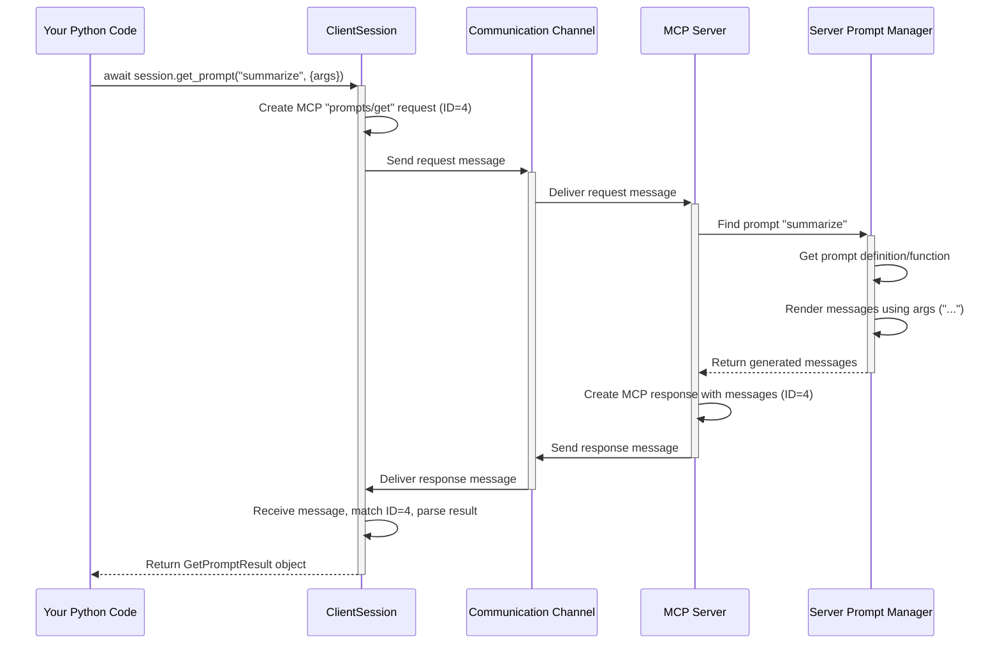

# Chapter 4: Prompts - Pre-written Recipes for LLMs

In the last chapter, [Resources](03_resources.md), we saw how to ask the server for specific pieces of data using URIs. We know how to ask the server to *do things* ([Tools](02_tools.md)) and how to *get data* ([Resources](03_resources.md)).

But what if we want the server to help us structure a more complex conversation, especially when talking to a Large Language Model (LLM)? Sometimes, we need more than just a single command or a single piece of data. We might need a pre-defined sequence of instructions or messages.

This is where **Prompts** come in handy!

## Motivation: Giving Instructions to an AI Assistant

Imagine you want to use an LLM (like ChatGPT or Claude) to summarize a long piece of text. You can't just send the text and hope for the best. You need to *instruct* the LLM. A typical instruction might look like this:

*   **You (User):** "Please summarize the following text for me:"
*   **You (User):** "[Your long text here]"
*   **AI (Assistant):** "[The summary]"

Notice this isn't just one message, but a *sequence* of messages, setting up the context and the request.

Now, imagine the MCP server is designed to help interact with LLMs. It could provide pre-written templates for common tasks like summarization, translation, or question answering. These templates ensure the LLM gets instructions in a format it understands well.

**Prompts are like pre-written recipes or instruction manuals provided by the MCP server.** They define a sequence of messages, often with placeholders (arguments) that you can fill in. The server gives you the recipe, you add your specific ingredients (like the text to summarize), and the server (or the `python-sdk` using the server's definition) generates the final, formatted instructions ready to be sent to an LLM.

## Key Concepts: Templates, Arguments, and Messages

1.  **Prompt Template:** This is the structure defined by the server. It specifies the sequence of messages and where arguments can be inserted. For our summarization example, the template might define two messages: one asking for a summary and another containing the text itself.
2.  **Arguments:** These are the specific details you provide when you use a prompt. In our example, the main argument would be the actual `text` you want summarized. Arguments are like filling in the blanks in the recipe. Prompts can be *static* (no arguments needed) or *dynamic* (requiring arguments).
3.  **Generated Messages:** When you ask the server to "get" a prompt and provide the necessary arguments, it renders the template. The result is a list of `PromptMessage` objects, each with a `role` ("user" or "assistant") and `content` (like text or images). This list is exactly what you might send to an LLM API.

## How to Use Prompts

Using prompts involves two main steps: finding out which prompt recipes the server has, and then asking the server to prepare one of those recipes with your specific ingredients.

**1. Listing Available Prompts**

First, you need to know what prompts the server offers. Similar to listing tools and resources, you use the `session.list_prompts()` method.

```python
# Assume 'session' is an initialized ClientSession from Chapter 1

import logging
from mcp.types import Prompt # We need this type

# Configure logging (helpful for seeing what's happening)
logging.basicConfig(level=logging.INFO)

async def list_server_prompts(session):
    try:
        logging.info("Asking the server for available prompts...")
        # Call the list_prompts method
        list_result = await session.list_prompts() # Usually PaginatedResult

        logging.info(f"Server responded with prompts: {list_result}")

        # Example: Print the name and description of each prompt
        if list_result and list_result.prompts:
            logging.info("Found Prompts:")
            for prompt in list_result.prompts:
                # prompt is an mcp.types.Prompt object
                logging.info(f" - Name: {prompt.name}")
                logging.info(f"   Description: {prompt.description}")
                # We could also inspect prompt.arguments here
        else:
            logging.info("Server reported no available prompts.")

    except Exception as e:
        logging.error(f"Error listing prompts: {e}")

# Example usage (within an async function with an active session):
# await list_server_prompts(session)
```

*   `await session.list_prompts()` sends a `prompts/list` request to the server.
*   The server replies with a `ListPromptsResult`, which contains a list of `Prompt` objects.
*   Each `Prompt` object tells you its `name` (like `"summarize"`), `description`, and importantly, what `arguments` it expects (if any).

If the server offered a summarization prompt, the output might include:

```
INFO:root:Found Prompts:
INFO:root: - Name: summarize
INFO:root:   Description: Summarizes the provided text.
```

**2. Getting a Specific Prompt (with Arguments)**

Once you know the name of the prompt you want (e.g., `"summarize"`) and what arguments it needs (e.g., a `text` argument), you can ask the server to generate the message sequence using `session.get_prompt()`.

Let's assume the `"summarize"` prompt requires one argument named `"text_to_summarize"`.

```python
# Assume 'session' is an initialized ClientSession
# Assume we know the prompt 'summarize' exists and needs 'text_to_summarize'

import logging
from mcp.types import PromptMessage # For checking result types

logging.basicConfig(level=logging.INFO)

async def get_summarize_prompt(session, input_text):
    prompt_name = "summarize"
    prompt_arguments = {
        "text_to_summarize": input_text
    }

    try:
        logging.info(f"Getting prompt '{prompt_name}' with args: {prompt_arguments}")
        # Ask the server to render the prompt with our arguments
        get_result = await session.get_prompt(prompt_name, prompt_arguments)

        logging.info(f"Server returned GetPromptResult: {get_result}")

        # Example: Print the generated messages
        if get_result and get_result.messages:
            logging.info("Generated Messages:")
            for message in get_result.messages:
                # message is an mcp.types.PromptMessage object
                logging.info(f" - Role: {message.role}")
                # Content could be TextContent, ImageContent, etc.
                logging.info(f"   Content Type: {message.content.type}")
                if hasattr(message.content, 'text'):
                    logging.info(f"   Text: '{message.content.text[:50]}...'") # Show start of text
        else:
            logging.info("Server returned no messages for this prompt.")

    except Exception as e:
        logging.error(f"Error getting prompt '{prompt_name}': {e}")

# Example usage:
# my_text = "This is a very long piece of text that needs summarizing..."
# await get_summarize_prompt(session, my_text)
```

*   We define the `prompt_name` and a dictionary `prompt_arguments` containing the required input.
*   `await session.get_prompt(prompt_name, prompt_arguments)` sends a `prompts/get` request with the name and arguments.
*   The server finds the `"summarize"` prompt template.
*   It runs the logic associated with that template, inserting our `text_to_summarize` into the appropriate place(s).
*   The server sends back a `GetPromptResult` containing the final list of `PromptMessage` objects.
*   Our code then iterates through these messages and prints their roles and content.

The output might look something like this:

```
INFO:root:Generated Messages:
INFO:root: - Role: user
INFO:root:   Content Type: text
INFO:root:   Text: 'Please summarize the following text:'
INFO:root: - Role: user
INFO:root:   Content Type: text
INFO:root:   Text: 'This is a very long piece of text that needs summa...'
```

This sequence of messages is now perfectly formatted to be sent to an LLM for the summarization task!

## Under the Hood: How `get_prompt()` Works

What happens when you call `await session.get_prompt("summarize", {"text_to_summarize": "..."})`?

1.  **Method Call:** Your Python code calls `get_prompt`.
2.  **Request Creation:** The `ClientSession` creates an MCP `prompts/get` request message, including the prompt name `"summarize"` and the provided `arguments` dictionary. `{"jsonrpc": "2.0", "method": "prompts/get", "params": {"name": "summarize", "arguments": {"text_to_summarize": "..."}}, "id": 4}`.
3.  **Sending:** The request is sent to the server via the active [Transports](06_transports.md).
4.  **Server Processing:** The [FastMCP Server](05_fastmcp_server.md) (or other MCP server) receives the request.
5.  **Prompt Lookup:** The server's `PromptManager` looks up the prompt named `"summarize"`.
6.  **Rendering:** The server executes the function or logic associated with the `"summarize"` prompt template, passing in the `arguments`. This function constructs the list of `PromptMessage` objects (e.g., the two user messages in our example).
7.  **Response Creation:** The server creates an MCP response message containing the generated `messages` list within a `GetPromptResult`. `{"jsonrpc": "2.0", "result": {"messages": [...]}, "id": 4}`.
8.  **Response Sending:** The server sends the response back.
9.  **Receiving & Parsing:** The `ClientSession` receives the response, matches the `id`, and parses the `result` into a `GetPromptResult` object.
10. **Returning:** The `GetPromptResult` object is returned to your code.

Here’s a simplified diagram:



**Code Glimpse:**

On the client side (`src/mcp/client/session.py`), `get_prompt` follows the familiar pattern:

```python
# src/mcp/client/session.py (simplified snippet)
    async def get_prompt(
        self, name: str, arguments: dict[str, str] | None = None
    ) -> types.GetPromptResult:
        """Send a prompts/get request."""
        # Create the specific request object
        request_obj = types.ClientRequest(
            types.GetPromptRequest(
                method="prompts/get", # The MCP method name
                params=types.GetPromptRequestParams(
                    name=name, arguments=arguments or {}
                ),
            )
        )
        # Send it and expect a GetPromptResult back
        return await self.send_request(
            request_obj,
            types.GetPromptResult, # The expected Python type
        )
```

On the server side, using the [FastMCP Server](05_fastmcp_server.md) framework, defining a prompt can be quite straightforward. The `simple-prompt` example (`examples/servers/simple-prompt/mcp_simple_prompt/server.py`) shows a more manual approach, but `FastMCP` provides helpers. For instance, the `echo.py` example uses a decorator:

```python
# examples/fastmcp/echo.py (simplified snippet)
from mcp.server.fastmcp import FastMCP

mcp = FastMCP("Echo Server")

# This function becomes the implementation for the 'echo' prompt
@mcp.prompt("echo") # Decorator registers the prompt
def echo_prompt(text: str) -> str: # Argument 'text' is automatically detected
    # The returned string is automatically wrapped in a UserMessage
    return text

# Server runs...
```

The `@mcp.prompt("echo")` decorator registers the `echo_prompt` function. `FastMCP` inspects the function's parameters (like `text: str`) to determine the required `arguments` for the prompt. When `get_prompt("echo", {"text": "hello"})` is called, this function runs, and its return value (`"hello"`) is automatically converted into the standard `GetPromptResult` structure with a `PromptMessage` containing `TextContent`. More complex prompts can return lists of message dictionaries or `Message` objects directly (see `src/mcp/server/fastmcp/prompts/base.py`).

## Conclusion

You've now learned about **Prompts**, the server-provided templates for generating structured message sequences, particularly useful for interacting with LLMs.

*   Prompts are like recipes defined by the server.
*   They can be static or dynamic (accepting **arguments**).
*   You can discover available prompts using `session.list_prompts()`.
*   You can generate the final message sequence for a specific prompt using `session.get_prompt(name, arguments)`.
*   The result is a `GetPromptResult` containing a list of `PromptMessage` objects, ready for use.

With Tools, Resources, and Prompts, you have a powerful toolkit for interacting with MCP servers. But how are these servers actually built? In the next chapter, we'll get a look behind the curtain at the server side with [FastMCP Server](05_fastmcp_server.md).

---

Generated by [Github LLM Codebase Knowledge Building Summarizer using Openai/Gemini/Claud](https://github.com/tej172/cloud_indv_assignments/tree/main/ass_2)