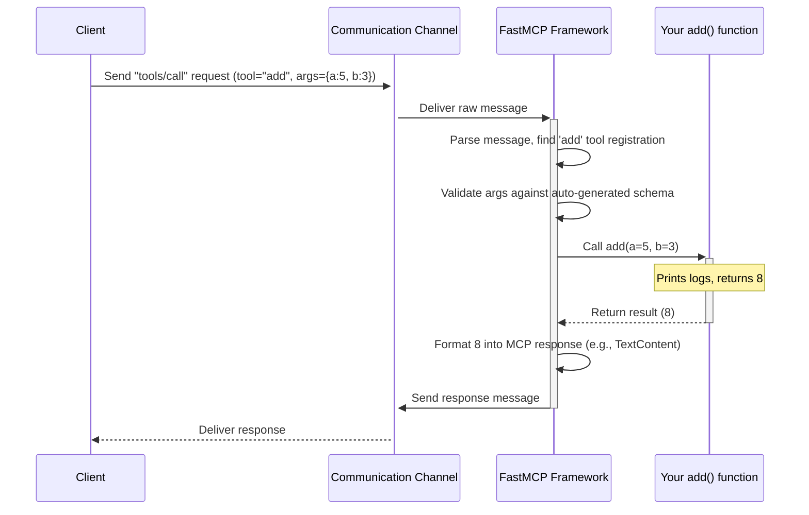

# Chapter 5: FastMCP Server - Building Your Own Assistant

In the previous chapters ([Client Session](01_client_session.md), [Tools](02_tools.md), [Resources](03_resources.md), [Prompts](04_prompts.md)), we learned how to *use* an existing MCP server from our Python code (the client). We learned how to connect, list capabilities, call tools, read resources, and get prompts.

But what if *you* want to create your own assistant? Maybe you have a special calculation, access to unique data, or a cool function you want to make available to other programs (or even to an AI like Claude). How do you build the *server* side?

## Motivation: Making Server Creation Easy

Building a server that speaks the MCP protocol might sound complicated. You'd need to handle:

*   Receiving messages (like JSON-RPC requests).
*   Parsing those messages correctly.
*   Understanding requests like "tools/list" or "tools/call".
*   Routing the request to the correct piece of your code.
*   Generating JSON Schemas to describe your tool inputs.
*   Formatting your results back into the correct MCP response format.
*   Sending the response back.

That's a lot of boilerplate code just to handle the communication! Wouldn't it be great if you could just write your core Python functions (the actual logic for your tools, resources, etc.) and have something else handle all the tricky MCP communication details?

That's exactly what **FastMCP Server** does!

**`FastMCP` is a high-level, user-friendly framework within `python-sdk` for creating MCP servers.** Think of it like a helpful construction kit for building your MCP assistant. You define the *capabilities* (tools, resources, prompts) using simple Python functions and special markers called **decorators** (`@mcp.tool()`, `@mcp.resource()`, `@mcp.prompt()`). `FastMCP` then automatically handles all the underlying MCP protocol details, generates the necessary descriptions (like JSON schemas), and routes incoming client requests to your functions.

It lets you focus on writing the *logic* for what your server can *do*, not the complex setup of how it *communicates*.

**Our Goal:** Let's build a very simple MCP server that offers just one tool: adding two numbers.

## Building Our Adder Server: Step-by-Step

We'll use `FastMCP` to create a server that a client can connect to and ask to add numbers.

**1. Import `FastMCP`**

First, we need to import the main class from the library.

```python
# adder_server.py
from mcp.server.fastmcp import FastMCP

# We'll add more code below...
```

This line brings the `FastMCP` framework into our script.

**2. Create a `FastMCP` Instance**

Next, we create an instance of the `FastMCP` class. This represents our server. We can give it a name.

```python
# adder_server.py (continued)
from mcp.server.fastmcp import FastMCP

# Create the server instance
mcp = FastMCP("Adder Server")

# We'll define tools next...
```

Think of `mcp` as the main control object for our server definition.

**3. Define the Tool Logic (A Simple Function)**

We need the actual code that performs the addition. This is just a regular Python function. Notice the use of type hints (`a: int`, `b: int`, `-> int`). These are important!

```python
# adder_server.py (continued)
# ... (import and mcp instance creation) ...

# This function contains the logic for our tool
def add(a: int, b: int) -> int:
    """Adds two numbers together."""
    print(f"Server: Received request to add {a} and {b}")
    result = a + b
    print(f"Server: Calculation result is {result}")
    return result

# Now, how do we tell FastMCP this is a tool?
```

This is the core logic. It takes two integers and returns their sum. The `print` statements are just for us to see when it gets called.

**4. Register the Function as a Tool (The Magic Decorator!)**

How does `FastMCP` know that our `add` function should be made available as an MCP tool? We use the `@mcp.tool()` **decorator**. A decorator is like a sticky note you put on a function to give it special powers or register it with a framework.

```python
# adder_server.py (continued)
# ... (import and mcp instance creation) ...

@mcp.tool() # <-- This is the FastMCP decorator!
def add(a: int, b: int) -> int:
    """Adds two numbers together."""
    print(f"Server: Received request to add {a} and {b}")
    result = a + b
    print(f"Server: Calculation result is {result}")
    return result

# We're almost ready to run the server...
```

By adding `@mcp.tool()` right above our `add` function, we tell `FastMCP`:

*   "Make this function available as an MCP tool."
*   **Automatically use the function name (`add`) as the tool name.** (You can specify a different name like `@mcp.tool("adder")` if you want).
*   **Automatically use the function's docstring (`"""Adds two numbers together."""`) as the tool's description.**
*   **Automatically look at the type hints (`a: int`, `b: int`) to generate the JSON `inputSchema`** that tells clients what arguments are needed (an integer `a` and an integer `b`).
*   **Automatically understand the return type (`-> int`)** to know what kind of result the tool produces.

This single line saves us from writing a lot of configuration code!

**5. Run the Server**

Finally, we need to tell our server to start running and listening for connections.

```python
# adder_server.py (complete example)
from mcp.server.fastmcp import FastMCP

# Create the server instance
mcp = FastMCP("Adder Server")

@mcp.tool()
def add(a: int, b: int) -> int:
    """Adds two numbers together."""
    print(f"Server: Received request to add {a} and {b}")
    result = a + b
    print(f"Server: Calculation result is {result}")
    return result

# Add this block to start the server when the script is run
if __name__ == "__main__":
    print("Starting Adder Server...")
    # This runs the server, listening for connections via stdio by default
    mcp.run()
    print("Adder Server stopped.")

```

The `if __name__ == "__main__":` block is standard Python practice to make code run only when the script is executed directly. `mcp.run()` starts the `FastMCP` server. By default, it uses "stdio" (standard input/output) as the communication channel, meaning it behaves like a command-line application waiting for requests on its input and sending responses to its output. We'll learn more about different ways servers and clients can communicate in the next chapter on [Transports](06_transports.md).

If you save this as `adder_server.py` and run it (e.g., `python adder_server.py`), it will print "Starting Adder Server..." and wait. You could then use a client (like the one from [Chapter 2: Tools](02_tools.md), configured to run this script) to connect and call the `add` tool!

## What Happens Under the Hood?

Let's trace what happens when a client (using `ClientSession` from Chapter 1) calls `session.call_tool("add", {"a": 5, "b": 3})` on our running `adder_server.py`:

1.  **Client Sends Request:** The `ClientSession` creates an MCP `tools/call` request message (like `{"method": "tools/call", "params": {"name": "add", "arguments": {"a": 5, "b": 3}}, ...}`) and sends it over the communication channel (e.g., stdio).
2.  **Transport Delivers:** The underlying transport layer ([Transports](06_transports.md)) delivers this raw message to the running `FastMCP` server.
3.  **FastMCP Receives & Parses:** The `FastMCP` framework reads the incoming message. It understands the MCP protocol and parses the JSON to identify it's a `tools/call` request for the tool named `add` with arguments `a=5` and `b=3`.
4.  **Finds the Tool Function:** `FastMCP` looks up the tool name "add" in its internal registry (where the `@mcp.tool()` decorator placed our `add` function).
5.  **Validates Arguments:** It checks if the provided arguments (`{"a": 5, "b": 3}`) match the `inputSchema` it automatically generated from the `add(a: int, b: int)` type hints. In this case, they do. (If not, it would generate an error response).
6.  **Calls Your Function:** `FastMCP` calls your actual Python function: `add(a=5, b=3)`. Your `print` statements will execute.
7.  **Receives Return Value:** Your function returns the integer `8`.
8.  **Formats Response:** `FastMCP` takes the return value (`8`) and automatically formats it into the standard MCP `CallToolResult` structure, likely as `TextContent`. The response message might look like `{"result": {"content": [{"type": "text", "text": "8"}]}, ...}`.
9.  **Sends Response:** `FastMCP` sends this JSON response message back over the communication channel.
10. **Client Receives:** The client's `ClientSession` receives the response, parses it, and returns the `CallToolResult` object to the calling code.

Here's a diagram illustrating this flow:



**Code Glimpse:**

You don't *need* to know the internals, but it can be helpful. Inside `FastMCP` (see `src/mcp/server/fastmcp/server.py`):

*   The `FastMCP` class initializes internal managers like `ToolManager`, `ResourceManager`, and `PromptManager`.
*   The `@mcp.tool()` decorator calls the `add_tool` method on the `ToolManager`.
*   `add_tool` uses Python's `inspect` module to look at your function's signature (parameters, type hints, docstring). It uses this information (often with help from the Pydantic library) to build the `MCPTool` definition, including the `inputSchema`. It stores this definition.
*   `FastMCP` sets up handlers (like `self._mcp_server.call_tool()(self.call_tool)`) that map incoming MCP methods (`tools/call`) to internal `FastMCP` methods.
*   The internal `call_tool` method asks the `ToolManager` to execute the registered tool function, passing the arguments.
*   Helper functions like `_convert_to_content` take your Python function's return value and package it into the standard MCP content types (`TextContent`, `ImageContent`, etc.).

The key takeaway is that `FastMCP` uses Python's introspection capabilities (looking at function details) and decorators to automate the tedious parts of building an MCP server.

## Adding Resources and Prompts

Just like `@mcp.tool()`, `FastMCP` provides decorators for defining resources and prompts:

*   **`@mcp.resource(uri)`:** Registers a function to provide data for a specific URI. The URI can even include template parameters (like `greeting://{name}`) that match function arguments. `FastMCP` handles mapping the URI request to your function. (See [Resources](03_resources.md)).

    ```python
    # From examples/fastmcp/readme-quickstart.py
    @mcp.resource("greeting://{name}")
    def get_greeting(name: str) -> str:
        """Get a personalized greeting"""
        return f"Hello, {name}!"
    ```

*   **`@mcp.prompt(name)`:** Registers a function that generates a list of prompt messages, often taking arguments defined by the function's parameters. `FastMCP` handles generating the `MCPPrompt` definition and rendering the messages when requested. (See [Prompts](04_prompts.md)).

    ```python
    # From examples/fastmcp/echo.py
    @mcp.prompt("echo")
    def echo_prompt(text: str) -> str:
        # FastMCP automatically converts the returned string
        # into a User message in the GetPromptResult
        return text
    ```

These work on the same principle: write a Python function with type hints and a docstring, add the decorator, and `FastMCP` handles the MCP integration.

## Conclusion

Congratulations! You've taken your first step into building your own MCP server using the `FastMCP` framework. You learned:

*   `FastMCP` simplifies server development by handling complex MCP protocol details automatically.
*   You can define server capabilities (Tools, Resources, Prompts) using standard Python functions.
*   Decorators like `@mcp.tool()`, `@mcp.resource()`, and `@mcp.prompt()` are the magic that registers your functions with `FastMCP`.
*   `FastMCP` uses type hints and docstrings to automatically generate schemas and descriptions.
*   Running the server is as simple as calling `mcp.run()`.

You now have the power to create your own "assistants" that can offer custom capabilities over the MCP protocol.

But how exactly do the client and server *talk* to each other? Whether it's stdio, HTTP/SSE, or something else, the communication channel is crucial. In the next chapter, we'll explore these communication methods: [Transports](06_transports.md).

---

Generated by [Github LLM Codebase Knowledge Building Summarizer using Openai/Gemini/Claud](https://github.com/tej172/cloud_indv_assignments/tree/main/ass_2)