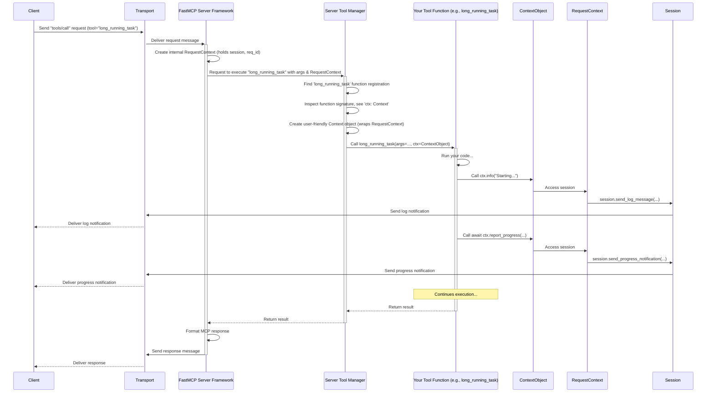

# Chapter 7: FastMCP Context - Your In-Request Toolkit

In the previous chapter, [Transports](06_transports.md), we saw how clients and servers establish communication channels like stdio or SSE to exchange messages. Now, let's focus back on the server side, specifically when using the [FastMCP Server](05_fastmcp_server.md) framework.

Imagine you've built a tool for your FastMCP server, maybe one that performs a complex analysis or generates a large report. This might take a while! Wouldn't it be great if, while your tool function is running, it could:

1.  Tell the client, "Hey, I'm 20% done... now 50%... now 80%..."?
2.  Send status messages back to the client, like "Starting analysis..." or "Fetching data..."?
3.  Maybe even access another piece of data (a [Resource](03_resources.md)) provided by the *same* server to help with its calculation?

How can your simple Python tool function, running inside the server, interact with the ongoing request and the server's capabilities?

## Motivation: Giving Your Tool Function Superpowers

When the [FastMCP Server](05_fastmcp_server.md) framework calls your tool or resource function to handle a client request, it doesn't just call it in isolation. It can provide a special helper object directly to your function. This helper object is called the **FastMCP Context**.

**Think of the FastMCP Context (`Context`) as a special toolkit automatically handed to your tool or resource function when it's called.** This toolkit contains useful utilities relevant to the *current* request and the server session it belongs to.

It's like when you hire a plumber (your tool function); they don't just show up empty-handed. They bring their toolbox (the `Context`) which has tools (like `log`, `report_progress`, `read_resource`) specifically needed for the plumbing job (handling the client request).

## What's in the Toolkit? Using the `Context` Object

The `Context` object gives your function access to several server capabilities during request handling:

1.  **Logging to the Client:** Send log messages (debug, info, warning, error) back to the connected client. This is super useful for debugging or showing status updates.
2.  **Progress Reporting:** If the client initiated the request with a progress token, your function can send updates like "X% complete" back to the client.
3.  **Reading Resources:** Access other [Resources](03_resources.md) defined on the *same* FastMCP server, just as if you were a client calling `session.read_resource()`.
4.  **Accessing Request Info:** Get details about the current request, like its unique ID or the client's identifier (if provided).

## How to Get and Use the Context

Getting access to this toolkit in your function is surprisingly simple: you just ask for it using a type hint!

**1. Requesting the Context in Your Function**

When defining your tool or resource function, simply add a parameter and type-hint it as `Context`. `FastMCP` will automatically see this and pass the `Context` object to your function when it's called.

```python
# server_code.py (inside your FastMCP server file)
from mcp.server.fastmcp import FastMCP, Context # Import Context!

mcp = FastMCP("MyServer")

@mcp.tool()
async def long_running_task(duration: int, ctx: Context): # <-- Request Context here!
    """Performs a task and reports progress."""
    ctx.info(f"Starting task that will take {duration} seconds.") # Use ctx!

    for i in range(duration):
        await asyncio.sleep(1) # Simulate work
        progress = ((i + 1) / duration) * 100
        # Report progress back to the client via the context
        await ctx.report_progress(progress=i + 1, total=duration)
        ctx.debug(f"Progress: {progress:.0f}%") # Send debug log

    result_message = "Task completed successfully!"
    ctx.info(result_message) # Log completion
    return result_message

# You don't *have* to call the parameter 'ctx', any name works
# as long as the type hint is 'Context'.
```

In this example, our `long_running_task` tool function now has a parameter `ctx` hinted as `Context`. When a client calls this tool, `FastMCP` will provide the appropriate `Context` object for that specific request.

**2. Using Context Methods**

Inside the function, you can now use the methods provided by the `ctx` object:

*   **Logging:**
    ```python
    # Inside your tool/resource function:
    ctx.debug("This is detailed debug info.")
    ctx.info("Task phase 1 complete.")
    ctx.warning("Input value looks unusual.")
    ctx.error("Failed to process sub-task XYZ.")
    ```
    These messages are sent as notifications back to the connected client, helping them understand what's happening.

*   **Reporting Progress:**
    ```python
    # Inside your async tool/resource function:
    total_steps = 10
    for step in range(total_steps):
        # ... do work for the step ...
        await ctx.report_progress(progress=step + 1, total=total_steps)
    ```
    If the client supports it, they will receive these progress updates.

*   **Reading Server Resources:**
    ```python
    # Inside your async tool/resource function:
    try:
        config_data_contents = await ctx.read_resource("resource://server-config")
        # Process the config_data_contents (which is like the result of session.read_resource)
        if config_data_contents:
             config_text = config_data_contents[0].content # Assuming text content
             ctx.info(f"Loaded config: {config_text[:30]}...")
    except Exception as e:
        ctx.error(f"Could not read resource 'resource://server-config': {e}")
    ```
    This allows your tool to dynamically fetch data defined elsewhere on the same server.

*   **Getting Request Info:**
    ```python
    # Inside your tool/resource function:
    request_id = ctx.request_id
    client_id = ctx.client_id # Might be None if client didn't provide one
    ctx.info(f"Handling request {request_id} for client {client_id or 'Unknown'}")
    ```
    This can be useful for logging or tracking purposes.

**Important:** Your tool/resource function doesn't *have* to accept the `Context`. If your function doesn't need these capabilities, just define it without a `Context` parameter, and `FastMCP` won't try to pass one.

## Under the Hood: How FastMCP Provides Context

How does `FastMCP` magically inject this `Context` object?

1.  **Request Arrives:** A client sends a request (e.g., `tools/call` for `long_running_task`) to the server via one of the [Transports](06_transports.md).
2.  **Server Receives:** The underlying `MCPServer` receives the request and identifies the target method (e.g., `call_tool`).
3.  **Context Creation:** `FastMCP` (specifically, the `MCPServer` part) creates an internal `RequestContext` object. This object holds information like the `request_id`, details about the specific client `session`, and any shared `lifespan_context` (server-wide state).
4.  **Handler Lookup:** `FastMCP` routes the request to the appropriate handler method (e.g., its internal `call_tool` method).
5.  **Tool Lookup:** The `ToolManager` (part of `FastMCP`) finds the registered Python function for the requested tool (`long_running_task`).
6.  **Signature Inspection:** Before calling your function, the `ToolManager` (using helpers like `func_metadata` from `src/mcp/server/fastmcp/utilities/func_metadata.py`) inspects its signature (the parameters it expects).
7.  **Context Injection:** It sees the `ctx: Context` parameter. `FastMCP` then creates the user-friendly `Context` object, wrapping the internal `RequestContext`.
8.  **Function Call:** The `ToolManager` calls your Python function (`long_running_task`), passing the validated arguments from the client request *and* the newly created `Context` object to the `ctx` parameter.
9.  **Context Usage:** Your function code now runs and can use the methods on the `ctx` object (like `ctx.info`, `ctx.report_progress`). These methods internally use the `RequestContext` to interact with the session (e.g., `session.send_log_message`, `session.send_progress_notification`).

Here’s a simplified view:



**Code Glimpse:**

*   The `Context` class itself is defined in `src/mcp/server/fastmcp/server.py`. It mostly acts as a wrapper around the lower-level `RequestContext` (defined in `src/mcp/shared/context.py`) and the `FastMCP` instance.

    ```python
    # src/mcp/server/fastmcp/server.py (Simplified Context Class)
    class Context(BaseModel, Generic[ServerSessionT, LifespanContextT]):
        _request_context: RequestContext[...] | None
        _fastmcp: FastMCP | None
        # ... (initializer) ...

        @property
        def request_context(self) -> RequestContext[...]:
            # Provides access to the internal context
            # ... (error handling) ...
            return self._request_context

        async def report_progress(self, progress: float, total: float | None = None) -> None:
            # Uses request_context.session to send notification
            progress_token = self.request_context.meta.progressToken # Simplified
            if progress_token:
                await self.request_context.session.send_progress_notification(...)

        async def log(self, level: ..., message: str, ...) -> None:
            # Uses request_context.session to send log message
            await self.request_context.session.send_log_message(...)

        # ... other methods like info(), error(), read_resource() ...
    ```

*   The `Tool` class (in `src/mcp/server/fastmcp/tools/base.py`) stores whether a function expects context (`context_kwarg`). The `ToolManager` (in `src/mcp/server/fastmcp/tools/tool_manager.py`) uses this information when calling the function via `tool.run()`.

    ```python
    # src/mcp/server/fastmcp/tools/base.py (Simplified Tool.run)
    class Tool(BaseModel):
        # ... fields: fn, name, context_kwarg ...

        async def run(self, arguments: dict, context: Context | None = None) -> Any:
            # Prepare kwargs, including context if needed
            extra_kwargs = {}
            if self.context_kwarg is not None and context is not None:
                extra_kwargs[self.context_kwarg] = context

            # Call the actual function with args and context
            return await self.fn_metadata.call_fn_with_arg_validation(
                self.fn, self.is_async, arguments, extra_kwargs
            )
    ```

*   The main `FastMCP` class (`src/mcp/server/fastmcp/server.py`) provides the `get_context()` method which creates the `Context` object when needed, using the currently active `request_context` managed by the underlying `MCPServer`.

You don't need to interact with these internal details directly, but seeing them helps understand that the `Context` isn't magic – it's a well-defined object passed along during request handling by the `FastMCP` framework.

## Conclusion

You've learned about the **FastMCP Context** (`Context`), a powerful object provided to your server-side tool and resource functions.

*   It acts as a **toolkit** giving access to server capabilities *during* request handling.
*   You request it simply by adding a parameter with the `Context` type hint to your function.
*   It allows your function logic to send **logs** and **progress updates** back to the client.
*   It enables your function to **read other resources** from the same server.
*   It provides access to **request-specific information**.

The `Context` object bridges the gap between your isolated function logic and the broader server session, making your FastMCP server tools much more interactive and capable.

We've now covered the main concepts for both clients (`ClientSession`) and servers (`FastMCP`), including the core capabilities (Tools, Resources, Prompts), communication (Transports), and server-side interaction (Context). To round things off, the next chapter will provide a quick reference guide to the key data structures used in the MCP protocol itself: [MCP Protocol Types](08_mcp_protocol_types.md).

---

Generated by [Github LLM Codebase Knowledge Building Summarizer using Openai/Gemini/Claud](https://github.com/tej172/cloud_indv_assignments/tree/main/ass_2)