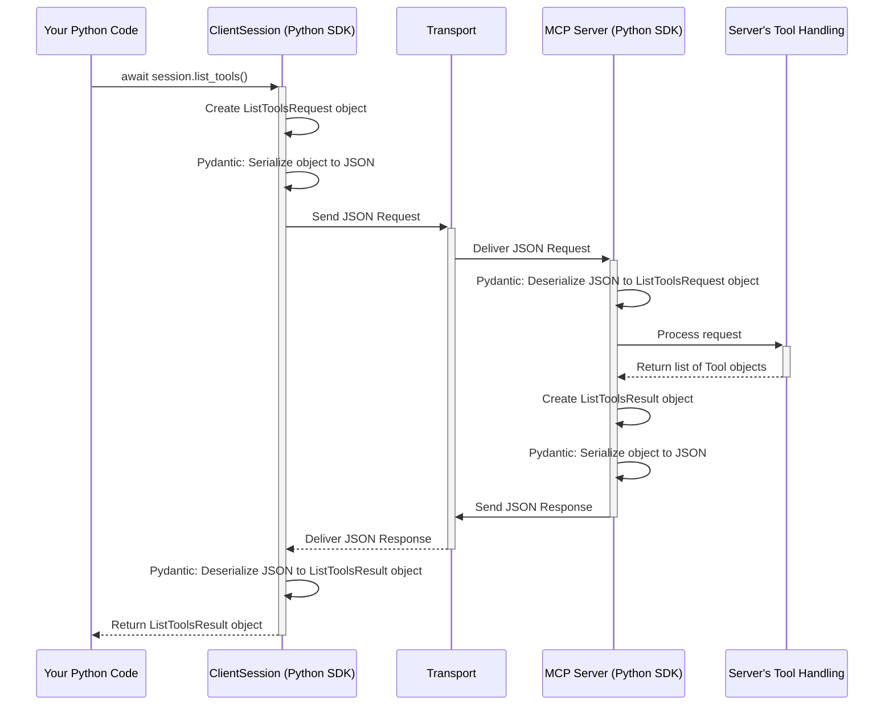

# Chapter 8: MCP Protocol Types - The Shared Language

Welcome to the final core chapter! In [Chapter 7: FastMCP Context](07_fastmcp_context.md), we explored how server-side functions can interact with the ongoing request using the `Context` object. We've covered clients, servers, tools, resources, prompts, transports, and server context.

But how do the client and server *know* exactly what a "list tools request" looks like, or how a "tool call result" should be structured? They need a precisely defined, shared language. This chapter introduces the **MCP Protocol Types**, the fundamental building blocks of that language.

## Motivation: Why Do We Need Defined Types?

Imagine trying to communicate with someone who speaks a different language, and you don't have a shared dictionary or grammar rules. You might say "Get food," but they might expect you to specify *what* food, *where* from, and *how much*. Without agreed-upon structures, communication breaks down.

Similarly, when a `python-sdk` client talks to an MCP server (like one built with [FastMCP Server](05_fastmcp_server.md)), they need to agree on the *exact* format of every message.

*   When the client calls `session.list_tools()`, what information does the server expect? (Nothing, just the request itself).
*   When the server responds, what fields will be in the response? (A list of `Tool` objects).
*   When the client calls `session.call_tool("calculator", {"a": 5, "b": 3})`, how must the arguments `{"a": 5, "b": 3}` be structured?
*   When the server sends back the result `8`, how is that formatted? (As `TextContent` inside a `CallToolResult`).

**MCP Protocol Types define this shared language.** They specify the precise structure of:

1.  **Requests:** Messages asking the other side to do something (e.g., "list tools," "read resource").
2.  **Responses (Results):** The answers to requests (e.g., the list of tools, the resource content).
3.  **Notifications:** One-way messages that don't expect a direct answer (e.g., progress updates, log messages).

Think of them as the strict grammar and vocabulary rules both the client and server *must* follow. This ensures that when the client sends a message, the server knows exactly how to interpret it, and vice-versa. In `python-sdk`, these rules are defined using **Pydantic models**.

## Key Concepts: Requests, Results, and Notifications

The core idea is that every interaction follows a predefined structure. Let's look at the main categories:

1.  **Requests (`*Request`)**:
    *   Sent when one side wants the other to perform an action or provide information.
    *   Always expect a corresponding **Response** (either a Result or an Error).
    *   Examples:
        *   `InitializeRequest`: Sent by the client to start the session.
        *   `ListToolsRequest`: Sent by the client to ask for available tools.
        *   `CallToolRequest`: Sent by the client to execute a tool.
        *   `ReadResourceRequest`: Sent by the client to get resource content.
        *   `GetPromptRequest`: Sent by the client to get a rendered prompt.
        *   `CreateMessageRequest`: Sent by the *server* to ask the *client* to generate text (e.g., via an LLM).

2.  **Responses/Results (`*Result`)**:
    *   Sent in direct reply to a **Request**.
    *   Contain the information requested or confirm an action was taken.
    *   Must match the specific `Request` they are answering.
    *   Examples:
        *   `InitializeResult`: Server's reply to `InitializeRequest`, contains server capabilities.
        *   `ListToolsResult`: Server's reply to `ListToolsRequest`, contains a list of `Tool` objects.
        *   `CallToolResult`: Server's reply to `CallToolRequest`, contains the tool's output (e.g., `TextContent`).
        *   `ReadResourceResult`: Server's reply to `ReadResourceRequest`, contains the resource `contents`.
        *   `GetPromptResult`: Server's reply to `GetPromptRequest`, contains the list of `PromptMessage` objects.
        *   `CreateMessageResult`: Client's reply to `CreateMessageRequest`, contains the generated message.
    *   **Errors:** If a request fails, the response is a `JSONRPCError` containing an `ErrorData` object instead of a `*Result`.

3.  **Notifications (`*Notification`)**:
    *   Sent one-way; they do *not* expect a direct response.
    *   Used for status updates, events, or information that doesn't require an explicit request.
    *   Examples:
        *   `InitializedNotification`: Client tells the server it's ready after initialization.
        *   `ProgressNotification`: Server sends progress updates for a long request.
        *   `LoggingMessageNotification`: Server sends log messages to the client.
        *   `ResourceUpdatedNotification`: Server tells the client a subscribed resource has changed.
        *   `ToolListChangedNotification`: Server tells the client the list of tools has changed.

## Using the Types (Implicitly)

When you use methods like `session.list_tools()` or `session.call_tool()`, you are *implicitly* using these protocol types.

*   When you call `await session.list_tools()`, the `ClientSession` internally creates a `ListToolsRequest` object.
*   It serializes this object into JSON and sends it via the [Transports](06_transports.md).
*   The server receives the JSON, deserializes it back into a `ListToolsRequest` object (using the same Pydantic definition).
*   The server processes the request and prepares a `ListToolsResult` object containing `Tool` objects.
*   The server serializes the `ListToolsResult` to JSON and sends it back.
*   Your `ClientSession` receives the JSON, deserializes it into a `ListToolsResult` object, and returns it to your code.

**Pydantic** is the library that makes this easy. It allows defining these data structures as Python classes with type hints. Pydantic handles:
*   **Validation:** Ensuring incoming data matches the expected structure and types. If a server sends back a malformed `ListToolsResult`, Pydantic will raise an error on the client side during deserialization.
*   **Serialization:** Converting Python objects (like `ListToolsRequest`) into JSON.
*   **Deserialization:** Converting JSON back into Python objects.

Let's look at a simplified example structure:

```python
# Simplified view from mcp.types

from pydantic import BaseModel, Field
from typing import Any, List, Literal

# --- Tool Structures ---
class Tool(BaseModel):
    """Definition for a tool the client can call."""
    name: str
    description: str | None = None
    inputSchema: dict[str, Any] # JSON schema for tool arguments

# --- Request for Listing Tools ---
class ListToolsRequest(BaseModel):
    """Internal representation of a tools/list request"""
    method: Literal["tools/list"] = "tools/list"
    # No specific parameters needed for this request

# --- Result for Listing Tools ---
class ListToolsResult(BaseModel):
    """The server's response to a tools/list request."""
    tools: List[Tool] # Contains a list of Tool objects
```

This shows how `ListToolsRequest` is just a marker for the request, while `ListToolsResult` clearly defines that the response *must* contain a list named `tools`, where each item is a `Tool` object conforming to the `Tool` model.

You can find all these Pydantic models defined in `src/mcp/types.py`. You don't usually need to create these objects manually when using `ClientSession` or `FastMCP`, but understanding their structure helps you know what data to expect.

## Under the Hood: The Journey of a Typed Message

What happens when `ClientSession` sends a request like `list_tools`?

1.  **Python Object Creation:** `ClientSession` creates an instance of the Pydantic model `ListToolsRequest`.
2.  **Serialization (Pydantic):** Pydantic converts the `ListToolsRequest` object into its JSON representation (e.g., `{"jsonrpc": "2.0", "method": "tools/list", "id": 1}`).
3.  **Transport Sending:** The JSON string is sent over the active [Transports](06_transports.md) (e.g., written to stdio, sent via WebSocket).
4.  **Transport Receiving:** The server's transport layer receives the raw JSON bytes/string.
5.  **Deserialization (Pydantic):** The server uses Pydantic to parse the JSON string back into a `ListToolsRequest` Python object. Pydantic validates that the JSON matches the expected structure.
6.  **Server Logic:** The server processes the request.
7.  **Response Object Creation:** The server creates a `ListToolsResult` object containing the list of `Tool` objects.
8.  **Serialization (Pydantic):** Pydantic converts the `ListToolsResult` object into its JSON representation.
9.  **Transport Sending:** The response JSON is sent back to the client.
10. **Transport Receiving:** The client's transport layer receives the response JSON.
11. **Deserialization (Pydantic):** The `ClientSession` uses Pydantic to parse the JSON back into a `ListToolsResult` Python object, again validating the structure.
12. **Return Value:** The validated `ListToolsResult` object is returned by the `await session.list_tools()` call.



The MCP Protocol Types, defined as Pydantic models, are essential at the points where JSON is converted to Python objects and vice-versa, ensuring both sides adhere to the agreed-upon "language".

## Code Glimpse: Where Types are Used

We saw the simplified Pydantic models above. Now let's see how `ClientSession` uses them (simplified from `src/mcp/client/session.py`):

```python
# src/mcp/client/session.py (Simplified Snippet)
import mcp.types as types # Import the protocol types

class ClientSession(...):
    # ... (other methods) ...

    async def list_tools(self) -> types.ListToolsResult: # Declares return type!
        """Send a tools/list request."""
        # 1. Create the specific Request object
        request_obj = types.ClientRequest( # Wrapper for specific requests
            types.ListToolsRequest(        # The actual request type
                method="tools/list",
            )
        )
        # 2. Send it and expect the specific Result type back
        # (internal send_request handles JSON conversion and validation)
        return await self.send_request(
            request_obj,
            types.ListToolsResult, # Tell send_request what Pydantic model to expect
        )
```

Here you can clearly see:
1.  The function signature `-> types.ListToolsResult` explicitly states what type of Pydantic object this method will return.
2.  Inside, it creates a `types.ListToolsRequest` object.
3.  It calls the internal `send_request`, telling it to expect a response that can be validated and parsed into a `types.ListToolsResult`.

The `BaseSession` (which `ClientSession` inherits from) handles the details of using Pydantic for serialization and deserialization within its `_send_response`, `_receive_loop`, and related methods (see `src/mcp/shared/session.py`).

## Conclusion

You've learned about the **MCP Protocol Types**, the precisely defined data structures that form the communication language between MCP clients and servers.

*   They define the exact format for **Requests**, **Responses (Results)**, and **Notifications**.
*   They act like a shared grammar and vocabulary, ensuring mutual understanding.
*   In `python-sdk`, these types are implemented as **Pydantic models** (primarily in `src/mcp/types.py`).
*   Pydantic handles the **validation**, **serialization** (Python object -> JSON), and **deserialization** (JSON -> Python object).
*   While often used implicitly by `ClientSession` and `FastMCP`, understanding these types helps clarify what data is being exchanged.

This chapter concludes our exploration of the core concepts in the `python-sdk`. You now have a solid foundation for understanding how to build clients that interact with MCP servers, how to build servers using `FastMCP`, and the underlying principles of communication and data structures involved. From here, you can dive deeper into specific examples or advanced features!

---

Generated by [Github LLM Codebase Knowledge Building Summarizer using Openai/Gemini/Claud](https://github.com/tej172/cloud_indv_assignments/tree/main/ass_2)