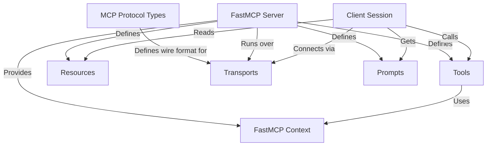

# Tutorial: python-sdk

This project provides a Python implementation for the **Model Context Protocol (MCP)**.
It allows developers to easily build both *MCP servers* and *MCP clients*.
Servers use the framework (especially **FastMCP**) to expose capabilities like remote functions (**Tools**), data access (**Resources**), or LLM instructions (**Prompts**).
Clients can then connect to these servers using different **Transports** (like standard I/O or WebSockets) to interact with those capabilities, often enabling AI models to use external functions and data.

**Source Repository:** [https://github.com/modelcontextprotocol/python-sdk](https://github.com/modelcontextprotocol/python-sdk)

## Chapters

1. [Client Session](01_client_session.md)
2. [Tools](02_tools.md)
3. [Resources](03_resources.md)
4. [Prompts](04_prompts.md)
5. [FastMCP Server](05_fastmcp_server.md)
6. [Transports](06_transports.md)
7. [FastMCP Context](07_fastmcp_context.md)
8. [MCP Protocol Types](08_mcp_protocol_types.md)

---

Generated by [Github LLM Codebase Knowledge Building Summarizer using Openai/Gemini/Claud](https://github.com/tej172/cloud_indv_assignments/tree/main/ass_2)